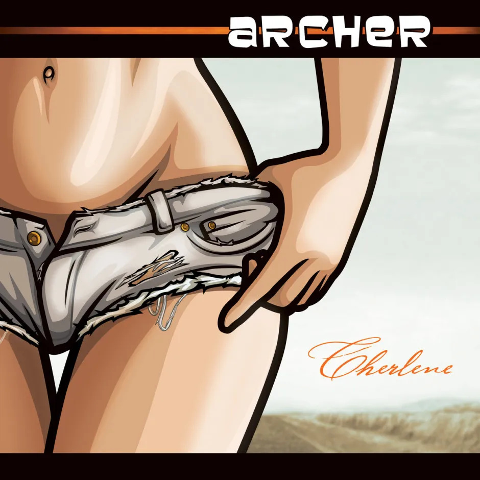

Any fans of the TV series Archer will know that — while the rest of the ex-ISIS agents are figuring out what to do with a literal tonne of cocaine — Cheryl/Carol has renamed herself to Cherlene and is on her way to becoming the star of outlaw country music.

Archer is one of my favourite shows on TV at the moment. As well as this I have been getting into listening to more country music thanks to [this post by Andrew Clarke](https://stuffandnonsense.co.uk/blog/this-englishmans-top-five-country-music-albums-of-2013). So imagine my surprise when I found out that a full album of both original and cover songs sung by Cherlene herself had been recently released for digital purchase. Woooohoooo!

But this isn't just a novelty TV series album filled with parody songs. This is actually a genuinely good country album. The songs are actually sang by country artist Jessy Lynn Martens, who is also classically trained on violin, mandolin and guitar.

The album also features a duet with none other than Kenny Loggins on a country version of Danger Zone — yes, it's _that_ good.

## Cherlene Track Listing

1. Danger Zone feat. Kenny Loggins

3. Swing Shift

5. Midnight Blues

7. 40 Miles of Mountain Road

9. Baby Please Don't Go

11. Cherlene's Broken Hearts and Auto Parts

13. I'll Burn It Down

15. It's All About Me

17. Eastbound and Down

19. Chattahoochee Coochie Man

21. Gypsy Woman

23. Straight To Hell

If you only listen to one song from this album, listen to Danger Zone. But I promise if you do, you'll probably end up listening to the whole album.
