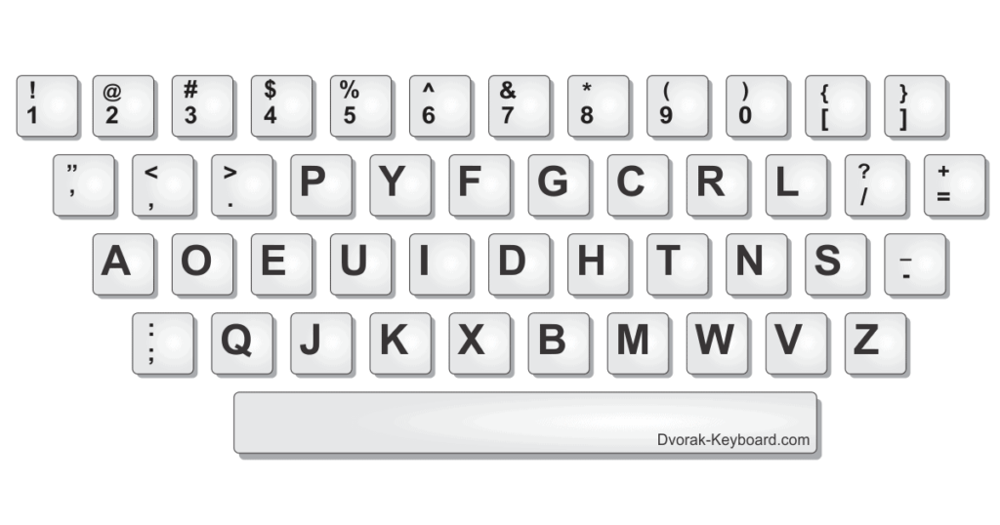

When I took a trip to Paris a few years back, I had to pop into an internet cafe to find the location of a place I was after. Because - it seemed - I was hopelessly ill-prepared.

So I paid my money to the nice man in the corner; sat down; quickly typed my search and hit enter, only to find I had been presented with an empty results page. It seems Google didn't recognise 'me wenith' as a Parisian Live Music Venue. This is how I was introduced to the French keyboard layout.

The Dvorak Keyboard Layout

In telling this story today to a friend, he introduced me to another layout that I had never heard of -  The Dvorak Keyboard (also know as the Simplified Keyboard).

The Dvorak Keyboard was originally patented by Dr. August Dvorak and his brother-in-law, Dr. William Dealey. It was developed to be an improvement over the well-adopted 'qwerty' layout that we still use today. The design of the Dvorak layout was based on much research into how people typed as well as percentages of the time spent typing in varying areas of the keyboard. It was stated that the Dvorak Layout would make it easier to type common words with the minimal of movement and finger strain.

Despite the research and slight adoption of this layout, it never really made it into popular use and so the 'qwerty' layout is still the primary keyboard used on western computers / devices to this day.
