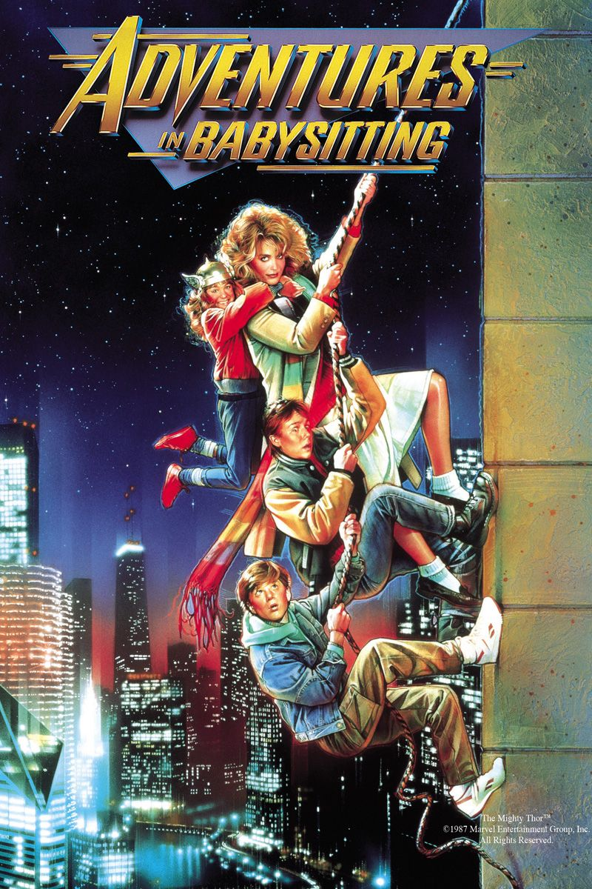

It’s been so long since I’ve seen this, but I highly recommend it. A fun 80s adventure film about a girl — Elisabeth Shue — who while babysitting three kids receives a call from her friend to rescue her from a down town bus stop.

From there there’s a flat tire, a mix up with gangsters and the avoiding of their parents.
