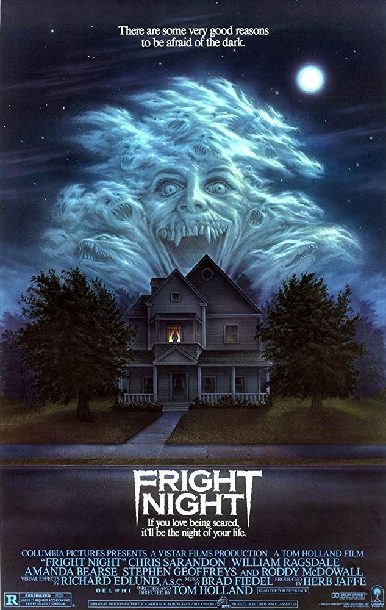

Fright Night is one of my top 10 favourite films of all time. It oozes the 80′s out of its pours and has one of my favourite ever soundtracks. The film stars Chris Sarandon, Roddy McDowall and William Ragsdale and centres around Charlie Brewster — Ragsdale — who believes his new next-door neighbour — Sarandon — is a vampire.

The soundtrack was a mix of half 80′s hidden gems and a score by none other than Brad Fiedel. Fiedel is the composer responsible for the Main Terminator theme.

If you can track this now-rare soundtrack down — or listen on youtube — it will be well worth your while.
