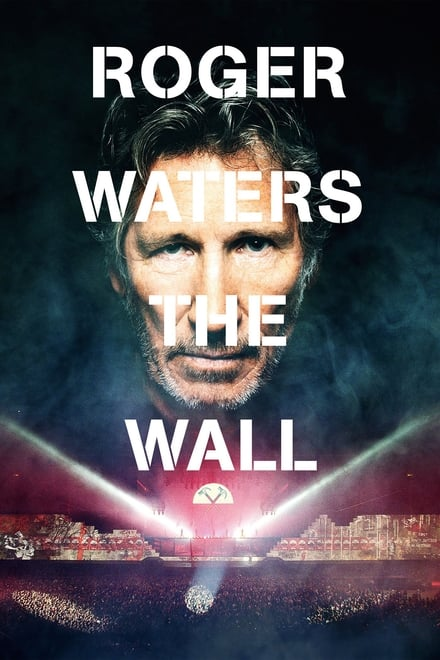

A slow, winding blade of green weaves across the ever-growing familiar white brickwork from the left side of the stage. Then another from the right. They wind slowly across the length of the wall - both to the centre and up - until they blend seamlessly into one of the most iconic animations from The Wall - the flower scene over Empty Spaces.

There are a few albums that have moved me in ways I can still feel: 

\- Radiohead's The Bends;  
\- Lana Del Rey's Ultraviolence;

But the one that has had the greatest effect on me - and still continues to do so - is Pink Floyd's The Wall.

Tonight I went to see the one-off showing of the new film by Waters which was about 80% concert show and 20% pilgrimage by Waters to visit the resting places of his father and grandfather.

The thing as a whole went together beautifully.

One of the songs that continues to get me each time I hear it is Vera - and this time was no exception. I was suprised to hear, in the discussion that followed, that this was Waters' favourite song off the album.

The songs I were looking forward to the most were Comfortably Numb, The Trial and Empty Spaces. I love how the full version of Empty Spaces gets used when performed live.The usage of some of the animations from the 1980s film of the wall were a nice touch too.

All in all it was a great performance of The Wall.
