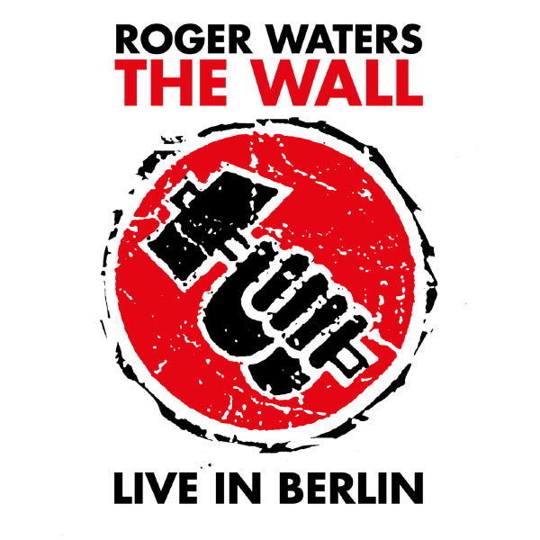

A couple of weeks ago I went to see the one-night-only showing of Roger Waters' The Wall at my local cinema. That performance rekindled my love for that album - indeed Pink Floyd in general.

Yesterday I revisted an older performance of the album, which was given at the Berlin wall at the time when it was being torn down.

Very apt.

This performance of The Wall is unique, in that many of the songs are performed by guest artists. My personal favorites of these perfomances are Bryan Adam's "Young Lust", Paul Carrack's "Hey You" and Van Morrison's "Comfortably Numb".

For any fans of The Wall, this album is a milestone performance and must be experienced.
