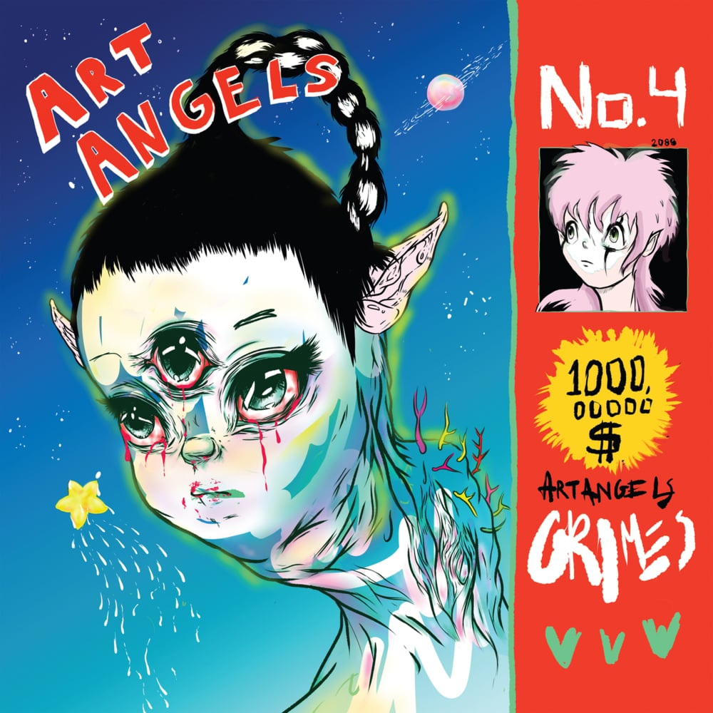

This is the album that made me want to start trying to write about my favourite albums – both old and new.

Grimes is an artist in the truest sense of the word. She reminds me of people like David Bowie, Peter Gabriel and Jack White – she uses whatever instruments or sounds fit the song she happens to be writing.

She's not tied down by any pre-defined musical conventions either: she makes great music, plain and simple.

## Complete creative control

Grimes, alias of Canadian-born Claire Boucher, produces all of her own music. After watching a recent interview with her it's obvious that her passion for music as a whole – as well as her own – runs deep.

Her previous album, 'Visions', was produced – solely by herself – on a minimal budget in Garage Band. 'Art Angels' feels like it has stemmed out of that creative freedom and control, learned from the making of 'Visions', and taken one step further.

She holds the reigns tightly on her own stuff – anyone who wants to meddle can f\*\*k off.

## Eclectic and Focussed

Grimes' music probably isn't like anything you'd have heard before.

Each song on this album is unique. In one moment she's punching out some of the best foot-stomping, head nodding pop beats you can imagine – see the song 'Flesh Without Blood', the next she's literally screaming a chorus between Taiwanese rapper, Aristophanes singing on the aptly-named song, 'SCREAM'.

Despite the eclectic nature of the album, Art Angels feels completely focussed, and not just being eclectic for the sake of it.

## A versatile voice

As mentioned before, the songs on this album are eclectic, and so to is her voice.

Sometimes she'll be screaming, while at other times she'll be singing softly accompanied by hand-picked guitar – see the album's penultimate song 'Life in the vivid dream'.

You can hear her eclectic range of styles well on my favourite song from the album – Kill V Maim. In this one she'll jump into screaming the end of a verse, followed by a verse sang cheerleader-style, which then drops into a party-anthem-esque thumping chorus.

## God knows she's good

At the end of it all, Grimes is simply a great artist.

From writing, producing and performing live all of her own original material; to drawing all of her own album artwork; to showing a genuine love – and depth of influences – of a large range of musical styles.

When we look back, in the future, at artists who have had a positive impact on the path that popular music has taken – in both style and production – I strongly believe that Grimes will be up there.
