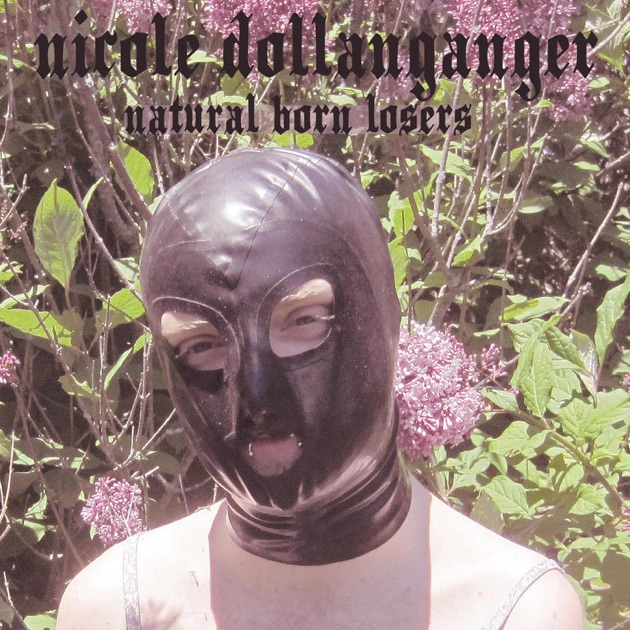

This week's episode of "The Walking Dead" was quite an emotional one. One of the more likeable, newer characters got a good amount of screen time for some interesting character development. That was just before that person was shot in the back of the head with an arrow. When carrying her body back to the home base, the remaining characters were backed musically, by one of my favourite artists at the moment – "Nicole Dollanganger" with her song "Chapel".

## Contrast

Art, whether it be film; tv; or music, is always more interesting when two or more contrasting ideas are brought together to form something that wouldn't have been thought possible before.

Like when Quentin Tarantino had "Stuck In The Middle With You" by "Stealer's Wheel" playing over the famous ear-cutting scene in "Reservoir Dogs". Or when we see Hannibal preparing a beautiful meal only to know that it was made from human flesh.

Nicole Dollanganger's music fits into this idea of stark contrast perfectly, and is one of – if not the – most beautiful joining of acoustic guitar and a female voice I've ever heard.

## She is a siren

The opening to the album, "Natural Born Losers", tells you straight away what Nicole is all about stylistically – although not what she is limited to. Poacher's Pride opens with a sweet, innocent-sounding voice singing the follow words:

> I shot an angel with my father's rifle  
> I should have set it free, but I let it bleed  
> Made it into taxidermy, hung it on my wall  
> On my wall
> 
> Poacher's Pride, Natural Born Losers

Straight away you get the beautiful sound of Nicole's haunting voice along with the dark lyrics – a siren enticing you in to experience this darkness with her. And you wont be able to deny her.

That song – and the rest of the album – conjured up imagery and feelings to me, of my watching the first series of the aforementioned TV series, "Hannibal". For those who haven't seen it, it's that dark feeling of beauty in death, and innocence that can be found in the darkest places.

## The Style of the Album

Her voice, when I first heard her, immediately made me think of a slightly-introverted, young girl sat in the corner of a pub on open-mike-night, performing to herself, with everyone else there as extras. Her lyrics however reveal anything but an introverted artist – she is telling stories about, and based on, some dark, hard subject matters.

The album's instruments are often minimal and range from acoustic guitar, to thundering bass-heavy kick drums that you will feel more than hear, as in the song "Executioner". Occasionally the guitars are used to give a drone, pedal-tone effect, but then out of that darkness a heavily-distorted, almost smothered, electric guitar will stalk towards you. You can hear this in the album's mid-way song, "Alligator Blood" – one of the album's heaviest-sounding songs, along with "Executioner".

## From out of the darkest places.

"In the Land" is one of my favourite songs on "Natural Born Losers", and is a beautiful sounding song with the most horrifying inspiration for a song I've ever come across. As I read on a comment for the song, it was apparently partly inspired by an american serial torturer called David Parker Ray, whose story I wont repeat here.

> Give it up for the milk carton angel  
> Soaked in vomit, tied up at the kitchen table  
> Choking on the chicken bones, a plate of mashed potatoes  
> Her momma screaming "come on, bitch, chew and swallow"  
> When she's done she will give her to the earth
> 
> In the Land, Natural Born Losers

In fact a lot of the album seems to have dark inspirations, which is in stark contrast to the result that her songs have. These are some of the most beautiful, emotive songs I've heard in a long while and often have her music on repeat when at work.

## In Closing

I have tried to give as honest as possible a review of this album and really hope that people reading this don't see this album's darkness as something to be avoided. As humans it is important that we experience a wide range of emotions from art and music – even if it sometimes makes us feel uncomfortable – for only when we experience those feelings can we truly grow.

It is artists like Nicole that deserve to be, and need to be, heard. She is one of the few people who dare to look into the darkest reaches of human experience, and sometimes depravity, and come out with some of the best music I've heard in a while.

And thank you to Grimes who put Nicole's album "Natural Born Losers" out on her purposely-formed company in order to get more people to hear this unique artist. Nicole had already recorded many albums by herself at home before this album came out, which are just as good as this album. Its great that she has now been introduced to many more people who can themselves now investigate her amazing back catalogue.

What are your thoughts on "Natural Born Losers", or on Nicole Dollanganger's music in general? Leave your comments below and let's talk.
