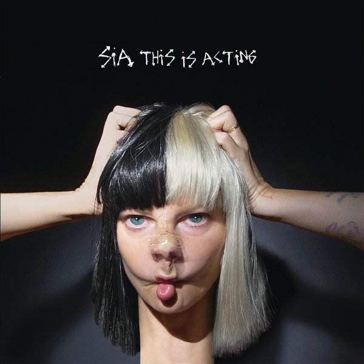

As soon as the opening song's first chorus hit my eardrum, it just blew me away. The song felt familiar and yet still fresh. As I continued through the rest of the album I kept getting that same thought. It didn't take many listens before this album quickly became one of my go-to albums when I'm quickly thinking of an album to switch to when the traffic lights are on red.

## Prologue

With "1000 forms of fear", Sia's previous album, it was the videos for the album's singles that got me interested in her music. Even when I hear those songs now I can't help but think of those great videos. With this album the first time I heard the songs was from the album alone. In fact, at the time of writing, I still haven't seen the videos for this album.

The first thing that is apparent on this album is Sia's idiosyncratic singing style. Her often-powerful, sometimes-breaking voice pulls you through some of the most air-drum-inducing songs I've heard for a while.

## Some Key Plot Points

"Bird Set Free", as already mentioned, is the album's opening song and it feels huge. And it's her voice that's doing the line's share of the work in creating that vast audible sound scape. Of course, there are still instruments you would expect from her music – strings; piano; drums; but it's her soaring voice that lifts the song into the stratosphere and – if you're not expecting it – will give you a swift kick up the arse when the chorus hits.

"Move your body" is a lot more dancier than I am now used to hearing from Sia, and even though I'm not much of a dance fan, here it works. I've not been to many dance clubs but I can picture this playing with torch beams and glow sticks going mental in the chorus. Hell, when this comes on when I'm on the train I wanna just go mental myself if only just to shake of the lethargy of commuting.

One of my favourite songs on "This Is Acting" is "House of fire" – a song with a simple backing, and my favourite chord progression on the album. I realise how that may sound, but it really is. I have marked the point in which it happens in the lyrics excerpt beneath with an asterisk (\*).

> Babe I want to drink you in  
> Like oxygen, like oxygen  
> Baby I'm a house on fire  
> And I want to keep burning  
> I'm going on up in flames  
> And you're to blame  
> Yeah, you're to blame  
> Baby I'm a house on fire  
> And I want to keep burning  
> I want to keep burning\*  
> I want to keep burning  
> I want to keep burning  
> Baby I'm a house on fire
> 
> House on Fire — track 8

"House on fire" is also the first song on the album whose lyrics stuck out to me as being particular poetic, hence why I've included them above. That's not to say her other lyrics aren't – I just remember these ones being particularly memorable on the first listen.

"Sweet design" took a complete left turn from the style set up by the preceeding two songs. Here she is singing samples from other well known pop songs and mashing them together into some kind of mad, fun frankenpopsong. I really like this one and it really makes me want to try body popping when I hear it.

"Broken Glass" brings us back to those huge-sounding choruses with a voice that just keeps building and building, seemingly more powerful with each verse. This woman sure has got a good set of lungs on her.

The final song, "Space Between", is a minimal slow bass groove that gives Sia's voice complete space to really shine – but a lot more void of other instruments than the previous 11 songs. I think this song would be equally as effective if sang completely a cappella. Saying that, the backing does give the song some extra depth – as though floating through the blackness of space itself.

## Curtain Call

Overall the album does well in showcasing Sia's talents as both a songwriter and an amazing vocalist.

So many feelings are invoked by this album. From the powerful, fist-pumping chrous anthems, "Unstoppable"; "Bird Set Free"; to the slow poetic love letter of "House on Fire", to the frantic get-up-and-jives of "Cheap Thrills" and "Sweet Design".

This album is varied enough whilst still being anchored to a commanding control over one of the greatest female voices of our time.
