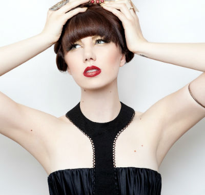

This week I had the pleasure of not only publishing my first interview, but also to have interviewed one of my favourite artists at the moment – London-based, electronic royalty, [Queen of Hearts](http://www.iamqueenofhearts.com/) – real name Liz Morphew. Her debut album, Cocoon, is currently getting a daily playing on my headphones and you should check it out too! You can read an earlier recommendation of this album that I posted a while back.

I also found out on her Facebook page, that Liz is doing the London Marathon next month. If you’ve got a spare moment, [head over to her donation page and help her reach her target](http://uk.virginmoneygiving.com/fundraiser-web/fundraiser/showFundraiserProfilePage.action?userUrl=RunLizzyRUN).

Please tell us about yourself in as many or as little words as you like.

Wears heart on sleeve, dances until the early hours, writer, dreamer, spiritual, thrill seeker.

Growing up, who were your heroes in music?

Michael Jackson, The Spice Girls, Marvin Gaye, The Thompson Twins, Wham, Prince.

Growing up, who were your heroes outside of music?

My Grandad and my mum

What was the first album you remember buying?

Natalie Imbruglia or maybe one of the “Now” albums. I also had “heal the world” on cassette which was bought for me and played on repeat until the foil stuff came out – a sad day haha!

Was there any defining moment in your life when you knew that you wanted to write, record and perform music?

I wrote with my friends when we were kids but just stupid stuff. We didn’t care, we loved creating stories and playing out a part. I studied musical theatre and was classically trained but never felt a pull toward that, I think I knew I always wanted to create & experiment rather than sing other people’s songs. Moving to London changed my life and I was fortunate to meet and write with some incredible people – everything grew from there really.

Who is your biggest influence in how you approach what you do today?

In terms of song writing Sia, Max Martin, Brian Higgins and Ryan Tedder. Musically, I listen to so much I suppose I take inspiration from bits here and there, I know what I like but also keep open minded and try to push myself both writing and who I choose to listen to/ see live / buy records

What is the proudest moment of your career so far?

Probably releasing my debut album ‘Cocoon’ and performing at the BT London Live for the Olympics in 2012. Although I’ve done so much I never thought I would achieve, there are so many other moments too!

What is your Favourite Book?

The Alchemist

What is your Favourite Album?

Lucid Dreaming – Say Lou Lou or Hurts Happiness – they both remind me of certain times in my life and I think music should evoke emotion – good or bad. Also Robyn Body Talk is a badass album.

What is your Favourite Film?

When Harry met Sally

What is your Favourite TV Show?

Breaking Bad or Game of Thrones. I love the undateables for comfort tv, it warms my heart.

Do you have a favourite film/tv/musical soundtrack?

Probably Tron (daft punk) or the Despicable Me films as they were done by Pharrell Williams. 50 shades of Grey had an amaaaazing soundtrack but we won’t talk about the quality of the film

Are there any new albums you are binge listening to at the moment?

Coasts (self titled album) and Jamie XX in colour, oh and a lot of Carly Rae Jepsen E.MO.TION – so underrated

You’re walking somewhere and your mp3 player has only a little battery left; You’ve only got time for one more song. What song do you play?

Skip & Die – Love Jihad – literally the greatest song on my iPod

What advice would you give to your younger self?

Have more confidence to be you.

If you could ask any person – living or passed – any question, who would it be and what would you ask them?

I’d quite like to have a general conversation about life with Eckhart Tolle or Professor Steve Peters – I’m pretty obsessed with theories of the mind and spirituality.

Could you tell us a joke?

Who is a penguin’s favourite pop star — Seal (I’m not great at jokes- don’t judge.)

## Thank you, Liz

A big thank you to Liz for taking the time to answer those questions. I remember The Alchemist being the book I happened to read that got me into reading regularly. And Say Lou Lou – love that album. I love their single “Better in the Dark” too.

Also a great joke – music-related too! You could say it was a ‘Killer’ joke!
