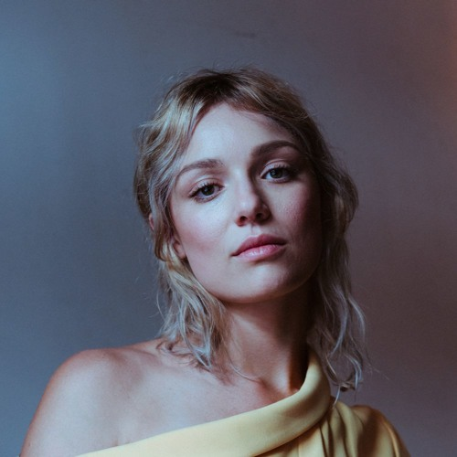

One of my favourite bands at the moment is Florida-based duo "[Priest](http://priestofficial.com/)", whose album [I previously wrote about here](https://davidpeach.co.uk/2015/12/23/priest-by-priest/). I have recently had the awesome pleasure of being able to interview Madeline from "Priest" about herself, what inspires her and some of her interests.

Check out the interview below.

Please tell us about yourself in as many or as little words as you like.

I'm a Florida Native. I grew up a dancer and have always been involved in music as well. In my free time I like to be outside with my dog, preferably near water, and read books by Carl Hiaasen or Michael Crichton.

Growing up, who were your heroes in music?

My earliest memories are of Spice Girls, Sade, Madonna, Queen, and Andrew Lloyd Webber's Phantom of the Opera soundtrack. I was a dancer growing up so I was exposed to a bit of everything over the years. Debbie Harry, Gwen Stefani, Kate Bush strong female artists have always inspired me.

Growing up, who were your heroes outside of music?

Pippi Longstocking and Han Solo.

What was the first album you remember buying?

In all honesty, it may have been Backstreet Boys Millennium. Got the poster and everything. I still have both haha.

Was there any defining moment in your life when you knew that you wanted to write, record and perform music?

I don't really think I had a defining moment- singing and dancing were part of my life for as long as I can remember. My mom tells me I was singing before I spoke real sentences. I took dance my whole life, and music is such a huge part of that. One of my best friends and I would make shitty recordings on my old laptop. I was in a band with friends in high school. So when Dave approached me for this project I was pretty excited.

Who is your biggest influence in how you approach what you do today?

It's kind of hard to pinpoint. I've had a lot of great people guide me over the years, from voice teachers to Dave and his wife Liz.

What is the proudest moment of your career so far?

Releasing our full length record Priest last May.

What is your favourite Book?

The Hobbit.

What is your favourite Album?

That's a tough one, it changes a lot. But Dark Side of the Moon would definitely be one. And my comfort album is Highway Companion by Tom Petty.

What is your favourite Film?

Star Wars.

What is your favourite TV Show?

So many! Game of Thrones, The Walking Dead, Curb Your Enthusiasm, 30 Rock, It's Always Sunny in Philadelphia , to name a few.

Do you have a favourite film/tv/musical soundtrack?

I love the Pulp Fiction Soundtrack.

Are there any new albums you are binge listening to at the moment?

Not super new but I still am super into CHVRCHES' Every Open Eye, Art Angels by Grimes, and Big Grams.

You're walking somewhere and your mp3 player has only a little battery left; You've only got time for one more song. What song do you play?

Bitch Better Have My Money by Rihanna. lol.

What advice would you give to your younger self?

Don't try to grow up so fast. Take it easy. Invest your time and talents in people who value you. Work for what you want.

If you could ask any person - living or passed - any question, who would it be and what would you ask them?

I think I'd want to ask my Grandma, who died before I was born, for any life advice. Everyone says she was an awesome lady, and I wish I could have known her.

Could you tell us a joke?

The Republican Presidential candidates. lol.

## Thank you, Madeline

A big thank you to Madeline for taking the time to answer those - some really great answers there. Please do check out Priest's album - [check out my review of it](https://davidpeach.co.uk/2015/12/23/priest-by-priest/) if you need convincing. Here are links for buying their first full-length album on Google Play and iTunes.
