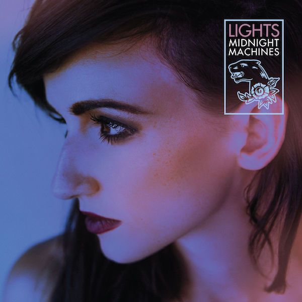

Over the past few years I've been noticing how things have more of an affect on me than they did when I was younger. Films that touch on the human condition move me more than they did; songs about a loved one have a greater affect as I imagine myself and my girlfriend in place of song characters.

Lights' music on "Midnight Machines" has this affect on me too. An album that I probably would have dismissed a few years ago, is now one of my favourites of this year so far.

Midnight Machines opens with a slow, finger-picked guitar piece called "Up We Go" and gives a good taste as to the pace and mood of what's to come on the album. The soft guitar and quiet kick drum that enters later serve well the almost-husky voice of Valerie Poxleitner, the real name of the artist "Lights".

All of the songs on the album are routed in soft acoustic guitar, minimal percussive arrangement and a voice that remains consistently heart-warming throughout. Occasionally, new instrument sounds will weave into the compositions in a way that helps keep you hooked on her words. The album is built on a foundation of strong lyrics.

"Same Sea", the second song on "Midnight Machines", opens with the familiar soft finger-picking but now backed with low piano chords and later a low-played string instrument - cello perhaps. No matter what instrumental arrangement is backing her up, the harmonies produced along with Valerie's voice are always very moving and very personal.

For me the fourth song "Meteorites" is the best example to showcase her abilities as a vocalist and how beautiful her voice sounds with these awesome harmonies. That's not to say that other songs on the album are weaker - far from it - this is just the one that particularly struck out to me.

My favourite songs on "Midnight Machines" are the ones where her lyrics are the most personal. In "Don't Go Home Without Me" she sings a beautiful, reflective song where she perfectly puts herself into the shoes of her future self, reflecting back on a life well-spent with her partner and how she'll be with them till the very end, and how she is grateful for them having stayed with her.

> This is the song I will sing to you when you're old and tired  
> I will sing it to remind you that I'm old beside you  
> And if you're tired of hearing my voice  
> I'm gonna sing it to you anyway  
> 'Cause I know that if we made it this far  
> Those differences I would put away
> 
> Don't Go Home Without Me from Midnight Machines

When the next song begins it really shows off the great pacing on both the songs and the album as a whole. "Running With The Boys" is possibly my favourite song on the album, and is the one that stands out the most to me for being the more upbeat and faster-paced of the album's songs.

Throughout the album, she tends to keep her voice at a calm, soothing level. Occasionally when she does raise her vocals up at particularly emotional points, it's done to great effect.

When I think of this album, I think of it as a warm blanket that I like to wrap myself up in at least once a week. Next time you want an album you can relax to - and enter a calm, reflective mood to - check out "Midnight Machines" by Lights.
