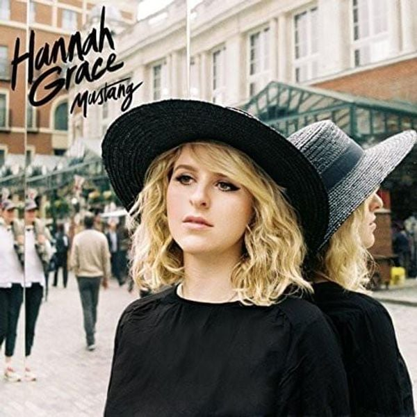

This E.p. just exploded into my ears in a way that reminded me of later-era White Stripes. The opening song is hugely-energetic that doesn't let up for a second. It's labelled as "pop" on my music subscription but I don't think that does this E.P. justice. It's got a chugging, powerful groove that would strangle the life from most modern "pop".

"Keep your love", the E.P's second song starts calmer than it's predecessor, but soon builds into a big chorus and fuzz-like-effect riffs. I am loving this E.P. already and am already thinking four songs isn't enough for my newly-acquired thirst for this music.

The third song, "Blue with you", really slows thing down into a comfortable groove that gives more room for Hannah's voice to come through the song, and a cracking voice it is too. She weaves this blues-style song with an ease of command. This is another one too that builds up to a belter of a climax and she really does give it some whelly with her voice before bringing it back down to the ground before the final song, "Hey You".

"Hey You" is a lovely, stripped back acoustic number that shows Hannah Grace is great-sounding with or without her huge arrangements backing her up. As much as she opened the E.P. with force, she closes it with a calm, soothing nature.

Hannah Grace is an artist I'm going to be keeping an eye on over the coming years.
