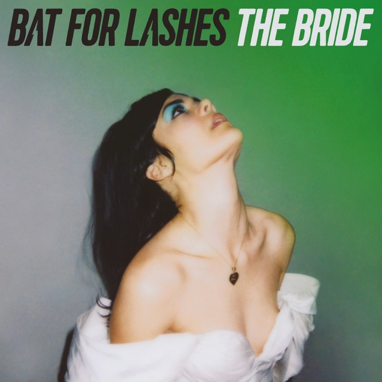

On June the 25th, 2008 I went with some friends of mine to watch Radiohead play in Victoria Park in London. The were touring in support of their album "In Rainbows", and in support of them was a then little-known artist called Bat for Lashes.

It is a huge regret of mine now that I didn't pay more attention to her during her set. At the time I think she was still yet to release her first full-length album so in retrospect this seems to have been a really special show.

Since that day I have re-discovered her through her first two albums, "Fur and Gold" and "Two Suns", and then her following album "The Haunted Man". But it is her latest offering, the recently released "The Bride", that I am now writing about.

## Dark Hymns

The songs on this gorgeous album feel like dark hymns - dark and beautiful. They mesmerized me from the get go and I don't think they'll be letting go any time soon.

When singing, her voice reminds me of the late Sandy Denny; while in the spoken poem "Widow's Peak", she sparks memories of one of Nico's first albums. These attributes of her's plant her firmly in a position that is highly unique in today's popular music scene.

## More than a concept album

Indeed this is a concept album. Taken from wikipedia:

> According to The Bride's press release, the work is a concept album that follows the story of a woman, whose fiancé dies in a car crash on the way to their wedding. The album follows her as she decides to go on the honeymoon alone and her emotions as she deals with the tragedy.\[5\] Khan commented "the trauma and the grief from the death of Joe, the groom, ... \[is\] ... more of a metaphor and it allows me to explore the concept of love in general, which requires a death of sorts."
> 
> Wikipedia

But not only is it a concept album, but the concept as a whole has been taken beyond the recorded medium. During initial tour dates in promotion of the album she performed within churches and asked her audience to come dressed in formal wear. This idea of taking a musical idea beyond simply the album has always interested me, since first hearing and seeing "The Wall" by "Pink Floyd".

## Song by Song

The album opens with the optimistic "I do", which is where we meet our heroine, "The bride". "I do" conjures up imagery of a bride singing to herself with an accompanying harp - the main instrument in the song. However we do get a subtle low string in there which gives that sense of foreboding of the tragedy that is pending.

The next chapter in the tale is "Joe's Dream", which starts us down the dark sound of the album with a sinister 3-note guitar riff and a distant thundering marching-like drum sound. These songs are soundscapes that you can close your eyes and escape into.

"In god's house" just keeps upping the stunning arrangements that this album seems to keep presenting. Bat for Lashes always seems to create such unique soundscapes with her music and hearing this third song on the album reassured me that she still has the touch.

> In God's house I do wait  
> For my love on our wedding day  
> Dewy eyes and lashes long for my love  
> But I'm feeling something's wrong
> 
> What's this I see?  
> My baby's hand on the wheel  
> What's this I see?  
> Fire  
> Fire
> 
> "In God's House" from the album "The Bride"

The albums fifth song, "Sunday Love", takes a slight left turn stylistically. I mentioned earlier about the Radiohead concert I first saw her supporting - well this song's opening reminded me of something you might hear from Radiohead in their "Amnesiac" / "Kid A" days. Although by this point I am in love with this album's tone and mythology, this change in pace and sound was a refreshing minor detour.

The faster pacing of "Sunday Love" brings us perfectly into "Never Forgive The Angels" and "Close Encounters" and their slower paces. The latter of the two has a great display of Natasha Khan's ability to bring an uplifting feeling out of the Bride's mourning.

Two thirds into the album and we come to the spoken word "Widow's Peak" as mentioned earlier. This choice of having a spoken word section was something I also loved on [Lana Del Rey's album Honeymoon](/2015/12/honeymoon-by-lana-del-rey/) too. This song has one of my favourite pieces of imagery in the album too, the last line of the following:

> There's a demon loose, a demon loose  
> I can't get home, I can't get home  
> For the road is a snake of mist  
> And the shadow of a rebel's fist  
> His jacket on my back, his bones on the shore  
> But the secret of dreams is to dream up a door  
> A portrait of him, a picture of her  
> A keyhole in a Douglas fir
> 
> "Widow's Peak" from the album "The Bride"

By the time we get to the closing three songs of the album, our heroine is becoming optimistic about the future with the song "I Will Love Again" and the uplifting feel of the penultimate song "In Your Bed".

## The Perfect Marriage

Through writing about this album it has forced me to look deeper into it; into its songs and their words. I am so glad I did choose this album to write about next. "The Bride" is a grand accomplishment and does so much in its 13 songs. At a little under an hour long, this album is the perfect story to listen to when you want to experience more from music than simply the music you hear. If you want to be taken on a story across one woman's emotional journey from dark beginnings to her destination of acceptance and optimism for the future, then this album is for you.

"The Bride" is the perfect marriage of storytelling, emotion and great song writing.
