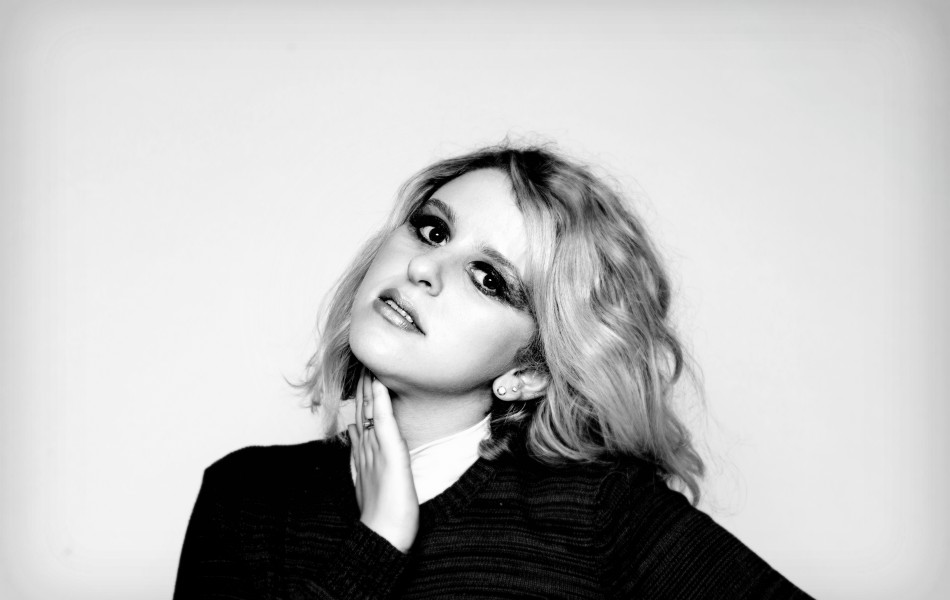

One of my favourite E.Ps to come out so far has been [Hannah Grace's Mustang](https://davidpeach.co.uk/2016/07/28/mustang-e-p-hannah-grace/). Such great music - and with a good variety in its four songs. I am really looking forward to a full length album by her in the near future.

I have been lucky enough to be able to interview Hannah about herself, her origins and her influences. You can read the answers to some questions I asked her just below.

## Interview with Hannah Grace

Please tell us about yourself in as many or as little words as you like.

My name is Hannah Grace, I am 23 years old and from Wales! I love singing and writing songs and I also love cats...

Growing up, who were your heroes in music?

My first hero was definitely Eva Cassidy, from as early as I can remember I just couldn't stop listening to her. Her voice just connected with me and I have always looked up to her. She is definitely one of the main reasons I started to sing.

Growing up, who were your heroes outside of music?

My parents. I'm so lucky to have such a great parents, they introduced me to so much amazing music over the years, from Fleetwood Mac, to Joni Mitchell, Neil Young and Ella Fitzgerald. All of their encouragement and support has been crucial to my confidence and development as a musician.

What was the first album you remember buying?

Oh dear. Well I'm pretty sure it was Britney Spears or something. But the first CD I owned was a present and that was Eva Cassidy's "Songbird".

Was there any defining moment in your life when you knew that you wanted to write, record and perform music?

I always knew I wanted to sing, as it is something that i've just always done. But I felt like I really really wanted to write, record and perform my own material when I started listening to songs that I'd wish I'd written. Songs like "A case of you" by Joni, or "Songbird" by Christine McVie - I definitely had a moment of "maybe I could do that" and I've found as a singer when you perform your own songs with your own words it can be much more rewarding somehow.

Who is your biggest influence in how you approach what you do today?

There are so many people that influence me today. I'm still inspired by my first loves, like Eva, Joni and Ella. But I'm also influenced by artists like Hozier, Paulo Nutini and Florence and the Machine. I feel like their music is exciting and new but also real, it isn't too contrived. I am also influenced by friends I have that also do music such as Gabrielle Aplin and Hudson Taylor. We've all been friends for a long time, and I admire their music and their attitude and commitment inspires me all the time.

What is the proudest moment of your career so far?

So far I would say releasing my most recent EP 'Mustang' has been my proudest. I'm so pleased with how it turned out and I really think that it honestly shows where I am as an artist, both as a songwriter and a singer.

What is your favourite Book?

It's a very sad story but I love "A Thousand Splendid Suns" - it is such a powerful story - especially for women in the world we live in today. Its a story that crossed my mind a lot and helps me appreciate my own life.

What is your favourite Album?

I have so many! At the moment I am still loving Paulo Nutini's "Caustic Love" - I love the songs and the production, it's just amazing. I actually got the opportunity to meet Paolo recently and he was lovely!

What is your favourite Film?

Again, I have so many! I watched Notting Hill recently, and it always leaves me feeling warm and fuzzy - and the soundtrack is really great too!

What is your favourite TV Show?

It has to definitely be Friends. I have seen every episode 100 times.

Do you have a favourite film/tv/musical soundtrack?

I don't know whether I have a favourite - lots of British films often have good soundtracks, like Notting hill and Love actually. There’s a French film called The Untouchables and the entire soundtrack was written by Ludovico Einaudi which was beautiful.

## Thank you Hannah

A big thank you to Hannah for taking the time out to answer those quesitons and to give us an insight into herself and where she has gained her musical roots and inspirations. Like I said before I am really looking forward to her debut album, and I'm sure anybody else who listens to "Mustang" will be to.
