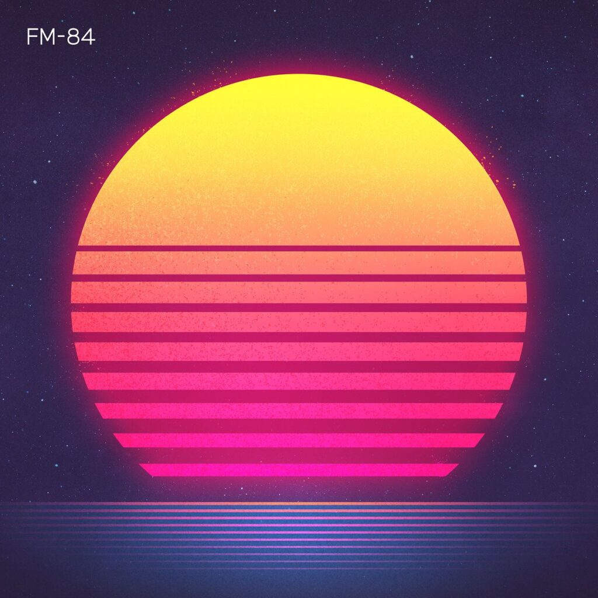

FM-84 is one of the first artists I heard from out of the [New Retro Wave](https://www.reddit.com/r/newretrowave/) genre of music. And his debut album, [Atlas](https://soundcloud.com/fm84/sets/atlas), is already a crowning achievement in his relatively new career.

Every song has the perfect feel of 80's Americana, or at least this Englishman's idea of what that is. Of course my only real notions of 80's America come from the films and music I grew up on.

> I write sun-soaked 80s inspired cinematic dreamwave and synth pop.FM-84's Bio from SoundCloud
> 
> FM-84's Bio from SoundCloud

Hearing Atlas by FM-84 is like hearing a soundtrack to the best 80's film I've never seen.

## Consistently great feelings track to track

The album opens with what I can only describe as being similar to those expensive keyboard drumbeats I remember experimenting with when I was at school - only a lot more professional sounding. The drum is clean, hefty and has a fever-inducing beat that makes me imagine what it might be like to drive parallel to the ocean in Los Angeles at sunset.

Like the opening song "Everything", half of the songs on this album are electronic instrumentals. Those that do feature vocals are some of the best soundtracks for my own personal montages when I'm driving around.

Yes I have driven around listening to Atlas, whilst imagining I'm in a similar scene to Rocky Balboa's flashback montage in Rocky IV.

Pardon the swearing, but "Running In The Night" is one of the best fecking songs I've heard this year. It has everything I love in a song - passion in the vocals; awesome instrumentation and arrangement and the ability for me to pretend I'm in a film's montage. It's _that_ good. Also the featured vocalist and co-writer on this song, "[Ollie Wride](https://soundcloud.com/olliewride)", has the best sounding voice for this style of music that I've heard.

"Let's Talk", another of the albums vocal-led songs - this time provided by [Josh Dally](https://soundcloud.com/josh_dally), is so powerfully performed. The singing is delivered with a passion you just have to experience. It feel's like the end credits song to a John Hughes film.

Each and every one of the songs on Atlas are simply great - they provide a good variety as well as being really well paced. Even the closing song, "Goodbye", actually sounds like a closing song with it's slower more reflective words and sound.

> As summer fades away  
> Lost in a cloudless haze  
> Just hold me and touch a wave  
> There’s no more we need to say
> 
> Yet I don’t want to say goodbye  
> And I don’t want to see you cry
> 
> Goodbye (feat. Clive Farrington) from Atlas by FM-84

It's obvious when listening to Atlas that FM-84 has a deep appreciation for the era he is harking back to. And it shows with every single second of this Album. There isn't a single song that begs a skip past - instead every song demands multiple listens, each time louder than the last.

## Racing towards the sunset

Atlas by FM-84 was a complete departure from what I had been listening to up till this point. I don't even know how to explain how I got on without knowing about this whole musical genre, let alone Atlas.

I also want to say a huge thank you to FM-84 for making this whole album available on SoundCloud. However you should also be buying it from one of the retailers listed on [this page](https://soundcloud.com/fm84/sets/atlas).

I don't think we realise just how lucky we are when someone like FM-84 comes along with such a passion for a musical / artistic era, and manages to create something completely fresh and reinvigorating with it. This is both one of my favourite albums of the 80s as well as today.
