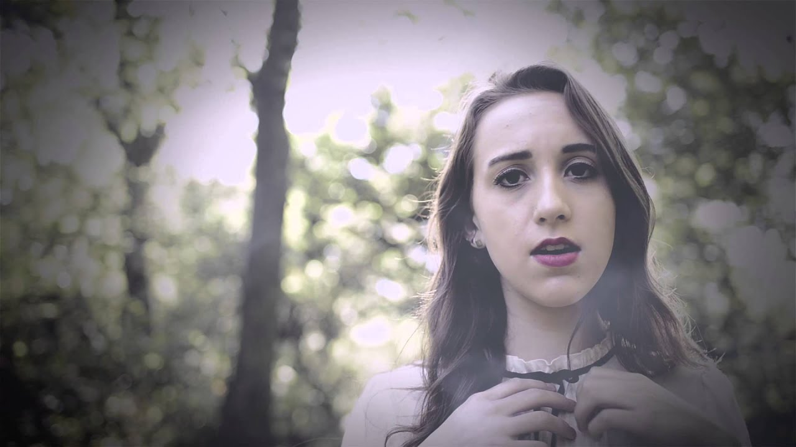

I get really excited when I find a new artist, whose music I can obsess over. I discovered Scarlett Taylor's music on Soundcloud as part of a playlist. Specifically it was the song "[Fucked Up](https://soundcloud.com/scarlett-taylor-4/fucked-up)" that grabbed me.

As soon as I had listened to the song, along with it's album, "[Churches](https://soundcloud.com/scarlett-taylor-4/sets/churches-2)", I immediately wanted to know more about the artist behind the music.

Imagine my complete surprise, and excitement, when Scarlett accepted my request to ask her some questions about herself and her music.

You can listen to Scarlett's music on [her Soundcloud page](https://soundcloud.com/scarlett-taylor-4).

## The Interview

Please tell us about yourself in as many or as little words as you like.

Why are the easiest questions always the hardest to answer!

Well I guess I'm in love with music and I have been singing even since before I could talk. I also started writing songs early in my life. I am a highly emotional individual, which is in favor with music because being emotional allows me to tap into deeper feelings and assists me in writing.

I love everything music has to offer, and how performing and recording can take me to a completely different place. There's really nothing better to me than that.

Growing up, who were your heroes in music?

I didn't really have a specific person or group that was my hero, but growing up I listened to a variety of different genres of music and artists.

I remember listening to quite a bit of male rock groups, but I also listened to everything in between. One day I'd be listening to The Deftones and the next I'd be listening to opera! I was also heavily influenced by female singers such as Sia, Amy Winehouse, and Stevie Nicks.

What was the first album you remember buying?

I remember the first album I bought was actually Sia - Color The Small One. I remember hearing "Breathe Me" when I was in grade school and was completely entranced. I would listen to that album quite often.

Was there any defining moment in your life when you knew that you wanted to write, record and perform music?

I always knew I was meant to do something artistic. I was heavily involved with theatre throughout school, a total of 8 years. I would always be writing music. In high school, I was very involved with choir and extra-curricular choir groups including jazz singers.

I think I always knew I wanted to sing. It was my senior year of high school when I was involved with a production and sang "School's Out" that I realised just how powerful my voice was. Around the same time, I had met my current producer by chance at my part-time job. I think it really all came together at once, during some of the first couple sessions I had at my producer's studio - I realised I wanted to sing, perform, write, and record more than I've ever wanted to do anything.

More recently I withdrew from college because I knew I didn't want to do anything else but music.

Who is your biggest influence in how you approach what you do today?

I would say I'm actually very influenced by other musicians! I am a very observant person and I love learning new things and approaches to doing music, writing, etc. I love to read about other musicians and their stories and how they go about doing things. I watch at least one live performance or interview of another musician every other day.

What is the proudest moment of your career so far?

I would say I have a lot of moments where I've been extremely grateful.

I performed at 7th Street Entry on First Avenue a couple nights ago and that was a very memorable experience; being in the same area that a lot of talented musicians have been.

Any time I perform, whether it be at an open mic or bigger venue, I am extremely grateful I get to do what I love and share my music and soul with other people.

I would say one of the proudest moments would be receiving a message from someone telling me I saved their life with my music. That was so rewarding.

What is your favourite Album?

There are so many - I wouldn't be able to pick just one if I tried!

What is your favourite Film?

The Shining - that movie will never get old to me; I love the suspense and overall concept.The end still gets me every time!

What is your favourite TV Show?

I don't watch a lot of TV, but I was really into American Horror Story and The Walking Dead for a while.

Are there any new albums you are binge listening to at the moment?

Yes, Honeymoon by Lana Del Rey (2015), and bits of "The Altar" from Banks - I'm impatiently waiting for the full release!

You’re walking somewhere and your mp3 player has only a little battery left; You’ve only got time for one more song. What song do you play?

I'm too indecisive! I'd probably just let the battery die and sing a song (-:

What advice would you give to your younger self?

I would tell myself not to let anyone talk me out of following my dreams.

So often in my life, I'd have people try to put me down or tell me that I couldn't amount to something big. I remember starting to not believe in myself but soon regained my strength when I started to push myself during high school. Whether it be in theatre or choir; I would push myself to work harder so I could be the best I could possibly be.

I am now a very determined individual because of that. I would tell myself to keep working because it is going to pay off! I would also tell myself to learn a ton of instruments!

If you could ask any person – living or passed – any question, who would it be and what would you ask them?

There's too many options for that! But I often wish I could ask Amy Winehouse to duet with me and have Nina Simone accompany me on piano. That'd be groovy!

Could you tell us a joke?

My taste in music ranges from "you need to listen to this" to "I know, please do not judge me."

## A big thank you to Scarlett

Thank you very much to Scarlett for sharing those insights into herself and her music. I feel privileged to have discovered her music and I think you will too.
