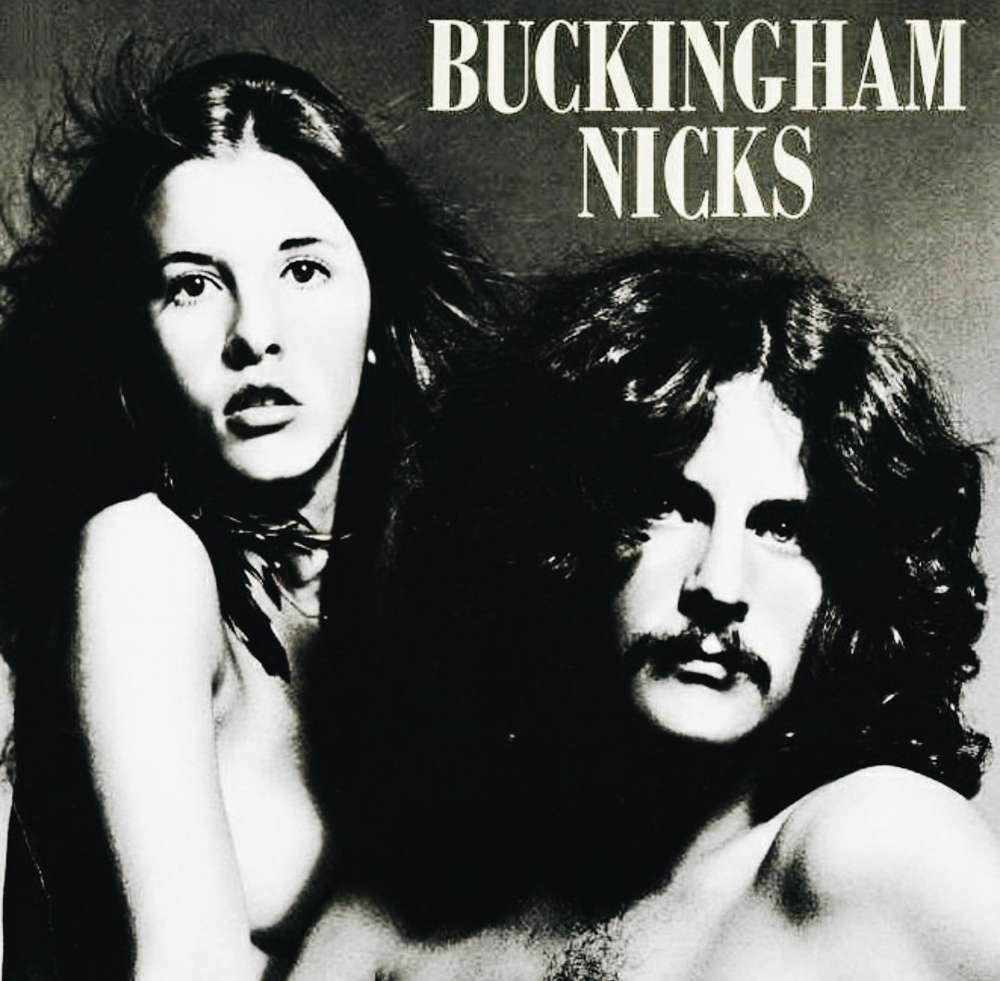

## Buckingham Nicks by Lindsey Buckingham and Stevie Nicks

Buckingham Nicks by Lindsey Buckingham and Stevie Nicks

Lindsey Buckingham and Stevie Nicks joined Fleetwood Mac in 1974 to make its ninth, and most well-known, line up. But just the year before, the two had recorded an album together called "Buckingham Nicks". As a guitar player I was hugely inspired by Lindsey Buckingham, so when I found out about this album it felt like I'd struck gold.

Some of my favourite songs from them both appear on this album. "Frozen Love" has one of my favourite guitar moments from Lindsey; and Stevie's Voice sounds so great on "Races are Run" and "Long Distance Winner".

The harmonies that these two manage to produce together are simply phenomenal. 

## Light Me Up by The Pretty Reckless

Light Me Up by The Pretty Reckless

In a time when I was a little bored with the contemporary rock music coming out, and was just discovering Lorde; Lana Del Rey et al, I heard a song on the radio called "Heaven Knows". The big sound of the band and heavy vocals of Taylor Momsen had me instantly hooked. From that song I immediately sought out the album, "Going To Hell", which naturally led me to their previous - and debut - album "Light Me Up".

"Light Me Up" is such a great rock album. It has everything from super-catchy heavy romps to the stripped-back and beautiful closing "You". This is album would definitely be a desert island disc for me. 

## Pure Heroine by Lorde

Pure Heroine by Lorde

Lorde - the lady who absolutely blew everyone away with her powerful tribute to David Bowie following his passing. She is definitely one of the few truly unique artists of recent times. She has a style that is so uniquely her own and her stunning debut "Pure Heroine" is a testiment to that.

The biggest hit off the album is undoubtedly "Royals", which is where I had my first taste. Well, to be more precise it was Weird Al Yankovic's parody cover "Foil" which led to my looking for the origin of the song.

As soon as I pressed play and heard the absolutely stunner "Tennis Court" I was an immediate fan boy; I was obssessed with the album - to some degree I still am. 

## Same Trailer Different Park by Kacey Musgraves

Same Trailer Different Park by Kacey Musgraves

When it comes to country music I am mostly in the dark. Except for my being a big fan of Kris Kristofferson, and of course Johnny Cash, I never really sought out any new country music. That was until I was introduced to Kacey Musgraves by web designer [Andy Clarke](https://stuffandnonsense.co.uk/) in [his album review](https://stuffandnonsense.co.uk/blog/about/this-englishmans-top-five-country-music-albums-of-2013).

Since first hearing it I played it every morning on my drive into work. I would even intentionally drive slower so that I could hear the whole album before arriving. The opening, "Silver Lining", is one of the most welcoming songs I've heard on an album.

Every corner of "Same Trailer Different Park" is as genuine a country album we could ever hope to hear.

## Atlas by FM-84

Atlas by FM-84

Over the past 12 months I have been diving into a few new genres than what I was used to. There's been grime; pop; and there's been synth wave. Synth wave is as cool as it sounds. It's a style of music with the intentional sound and aesthetics of 80s film / game soundtracks. Think John Carpenter; Tron et al.

The first artist of Synth wave I heard was an artist called 'FM-84', real name Colin Bennett. His song "Running In The Night", co-written with Ollie Wride, absolute blew me away and made me wish I had become self-aware in the 80s. The whole album feels like it was both made in the 80s and is an ultimate _tribute_ to the 80s. Every song on "Atlas" is a complete joy to listen to.
