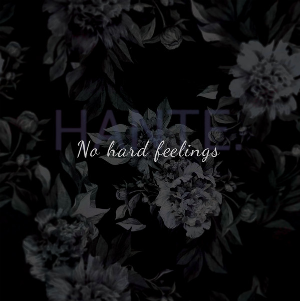

Listening to No Hard Feelings by Hante makes me feel a lot more cultured than I am.

Hante is a hugely talented Electronic / Synthwave / Darkwave artist hailing from Paris, France. Her music is darkly melancholic that completely envelopes you when you listen.

I always imagine myself sat in some smokey underground Parisian nightclub when I hear it.

The E.P. has five songs and each one is golden. The first one I heard was actually the second song, "À Contrecoeur", which Google tells me is French for "Unwillingly". Everything about this song oozes cool. The opening twangy lick on what I think is an electric guitar; The main awesome synth attack melody that comes in at about the thirty one second mark; Hante's haunting vocals mixed with the awesome wall of sound that she has created. The song, and indeed the entire E.P., is an amazingly powerful, dark electronic experience.

> Nothing’s gonna happen  
> I’m sinking in a fantasy  
> If we love each other  
> Why can’t we be dreaming together?
> 
> Living in a French Movie by Hante

"Une Nuit Avec Mon Ennemi", the third song, has yet more catchy, dark heavy synth melodies arranged with her ghostly delivery. This is how dark synth should be - dark but not depressing.

In "Quiet Violence" Hante seems to push herself further with her vocals. She sounds bigger; more commanding in the delivery and the song is one of the E.P.'s biggest-sounding as a result.

On the whole this music is some of the most interesting I've heard in a long while. While I love all the music I write about, "No Hard Feelings" by Hante is in a small collection of exceptional recordings that are completely fresh to my ears.

Anybody looking to broaden their own musical tastes and need a tip on where to look - look no further than Hante.

**Please head over to [Hante's Bandcamp](https://hante.bandcamp.com/) page and buy her music**.
