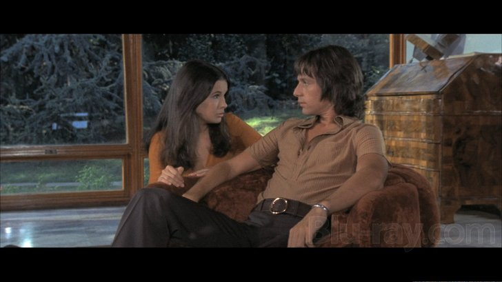

Since I first heard the song "[Fast Moving Cars](/2016/07/fast-moving-cars-carla-dal-forno/)", the album "You Know What It's Like" by Carla Dal Forno has been on my radar ever since. When the album was released on October 15th, it both was and wasn't what I was expecting.

It was, insofar as it being rooted in a consistent feeling of ambience that I came to expect from "Fast Moving Cars", and the second single "What You Gonna Do Now".

It wasn't, in that I had half-expected the album to be samey throughout. However I am happy to say that the album had enough variety within, without becoming disjointed.

One thing is certain; with "You Know What It's Like" you will be taken on a journey around some of the darker reaches of music.

You can buy "[You Know What It's Like](https://blackesteverblack.bandcamp.com/album/you-know-what-its-like)" from Bandcamp.

## Carla walks us into the void

Carla brings an eeriness to music that for me, has many distant echos back to albums like "The Marble Index" by Nico.

The opening song, an instrumental called "Italian Cinema" is possibly the strangest album intro I've heard in a long time. The title "Italian Cinema" is apt, being that it made me conjure up images of old Italian Giallo films. It starts with a strange warbling effect and merges into what I could only imagine as a demonic playground melody.

Following "Italian Cinema" was the now-familiar crack of thunder, ushering in one of my favourite songs of the year, "Fast Moving Cars". The song doesn't seem to really go anywhere as such. It's almost like a Wican chant set to a repeated base tone and minimal synthesizer. But that is precisely what I love about Carla Dal Forno's music - her ethereal, often haunting, aesthetics.

"DB Rip" steps in as the third song on the album and brings a slightly more aggressive edge. With its punchier beat and sharper synths, it will either shake you free from the album's trace-inducing charm, or take you deeper. I was taken deeper, so it was only fitting that the next song's lyrics opened with the following:

> What you gonna do now,  
> that the night's come and it surrounds you?  
> What you gonna do now,  
> that the night's come and it surrounds you?  
> You could wait for the day,  
> Though I don't think it'll make a difference
> 
> What you gonna do now by Carla Dal Forno

## Seduced by the darkness

This album has a darkness to it that is inviting, not off-putting. I can only liken it to the feelings I got during the end of this years film "The Witch". I won't spoil it for those who haven't seen it, but let me just say it involves an inevitable pull into the comforting arms of darkness.

Out of the album's eight songs, the division of instrumental and vocal-led songs is evenly spilt. At first seeing that the album clocked in at only 29 minutes, I can't pretend that I wasn't disappointed. However, now that I have listened to "You Know What It's Like" a few times, this now actually seems like a perfect length. And the fact that half of the album is instrumental - and experimentally so - gives the album a diversity that stops you getting bored from it's surreal soundscapes.

This is an album I will be listening to either in bed or on the train when I want to zone out for my morning commute.
