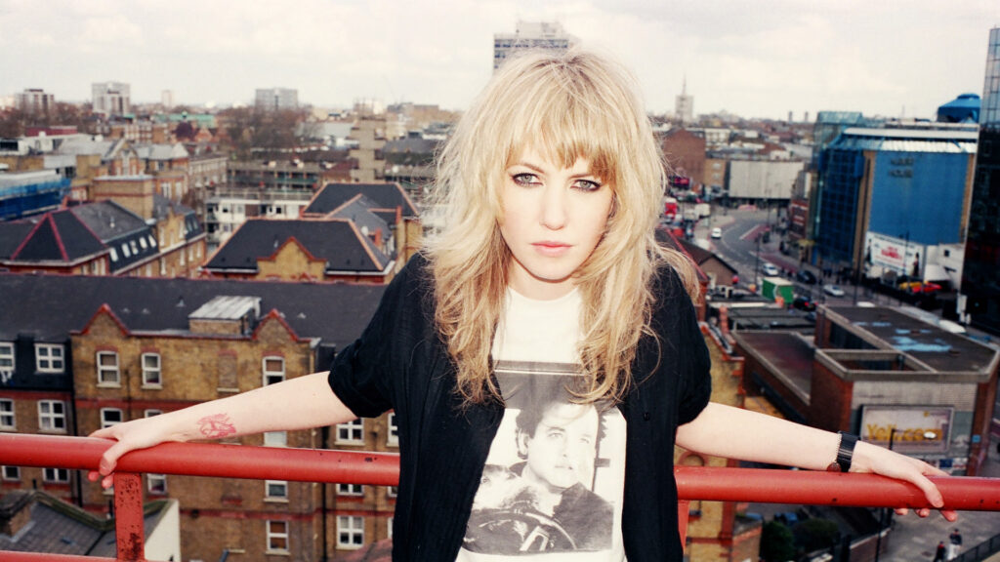

It was 6:35pm and I was stood fourth in line in the freezing cold winter. I was waiting for one of my most anticipated gigs of the year - [Ladyhawke](http://www.ladyhawkemusic.com/) live at O2 Institute in Birmingham. This was the gig I'd been waiting for since late last year and I couldn't quite believe it was finally here.

I had been to the O2 Institute before and so was aware of what to expect from the mid-sized venue, or so I thought. It turned out that the venue was in the lower level of the institute in a very intimately-sized bar. This was even better than I had expected.

As soon as I entered I emptied my bladder, got a coke and took my place front row, center of the all-standing crowd.

## Support Band: Isle

I hadn't heard of [Isle](https://twitter.com/thisisisle) before, but liked them as soon as I heard them play. They were just two guys - One on guitars / vocals / synth pads; the other on drums and backing vocals. They packed a lot of punch into their thirty minute support set and got the crowd revved up well for the main act. I kind of felt sorry for the front man when he asked if we "Manchester" were doing well. But he did soon apologize and was noticeably bashful over it.

Isle's set was sometimes ethereal in sound, which often broke out into frantic, energetic bursts with powerful performances from both. Mixed in there were some effective uses of synthesizers and pads too.

Between the support set and the main act to come, we were treated to a thirty minute selection of Prince songs followed by "Fashion" by David Bowie. This only helped build up my anticipation of what was to come.

## Main Act: Ladyhawke

When Pip and band walked out I couldn't quite believe the wait was over. After listening to her music so much after only discovering her about 10 months previous, the moment was finally here. In fact I think it took about three songs until I could actually believe that Pip and band were actually stood there, about eight feet away, performing the songs I have come to love.

Some of the songs they performed came across heavier live than on the new album "[Wild Things](/2016/06/30/wild-things-by-ladyhawke/)". "Let It Roll" was one that stood out as sounding particularly heavier. This was specifically due to the heavier drum sound, which isn't surprising considering I was within spitting distance of the bass drum. My only issue with standing so close, was that for me the drums tended to drown out Pip's vocals a bit on some verses.

Pip came across as very reserved on stage, seeming almost shy at times. This only added to her endearing charm and when it came time to blast out the songs, which the whole band did with gusto, she soon opened up and didn't disappoint.

I think my favorite song they performed was the title song from the new album "Wild Things". This song, performed live right in front of me, gave me goosebumps just like I knew it would. It is by far my favorite song on the new album, and one of my top five of her's overall, and she nailed it.

Although Ladyhawke are a band recognized worldwide, they still felt very much to be the kind of band you'd see at your local bar on a Friday night. They came across as a very down to earth band who weren't afraid to perform within arms reach of their adoring fans. Each and every song was performed with precision and is a band I would definitely see on their next tour - albeit not so close to the drum kit next time.
