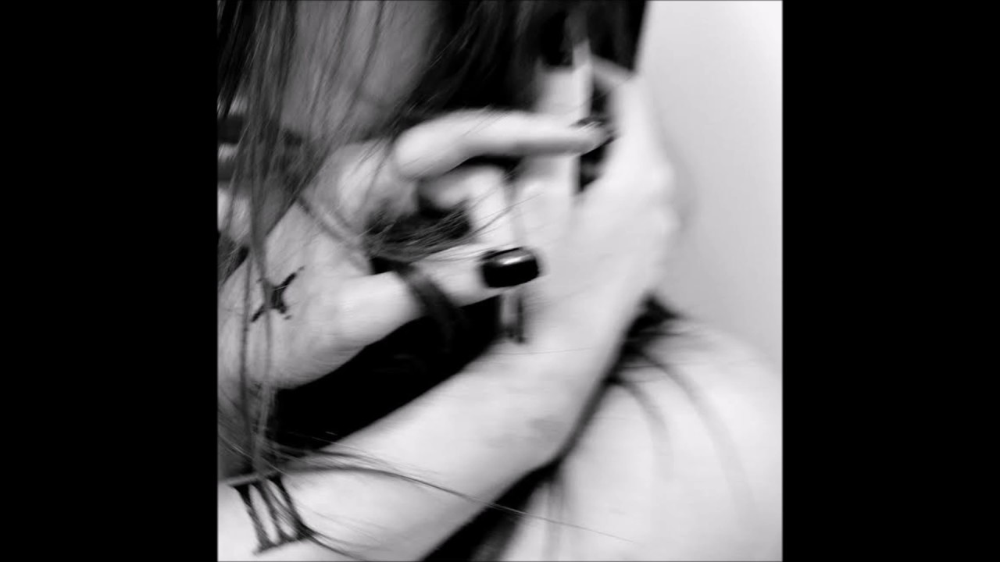

One of my favourite meloncholic artists, [Scarlett Taylor](/2016/09/interview-scarlett-taylor/), is back with her latest E.P. ‘3’.

All of her previous releases have been great. So my biggest fear with writing about this one was that I would end up repeating myself.

You see, if Scarlett had released similar songs to her previous album, ‘[Churches](/2016/09/churches-by-scarlett-taylor/)’, although I’d have been perfectly content, I’d have nothing new to say. Luckily for me, she has tried new things with this E.P. which not only expands the variety in her music, but also gives me new ways of discussing it.

In ‘3’ she has gone down a darker path - even occasionally dipping into some more electronic styles. These new ideas of hers don’t create a completely new sound for her, instead they allow her to take her signature style and enrich it even further.

Anybody familiar with her music will know it’s not the most light-hearted of sounds, and with her experimentation on this E.P. she has given herself fresh ways of exploring the darkness.

Her experimentation has allowed her to bring fresh dimensions to her music, further imprinting herself into the very soundwaves she creates.
