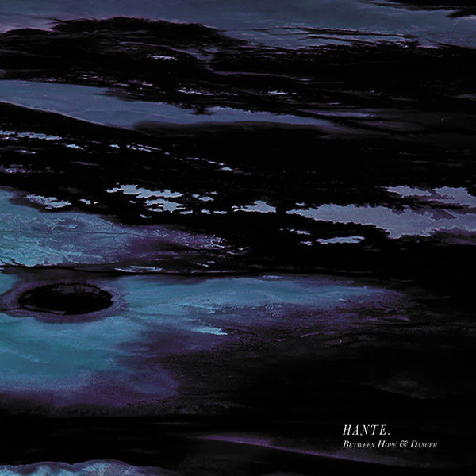

Hante's music is always a dark, dreamy escape that I am addicted to getting lost into. As soon as I learned of her new release, 'Between Hope and Danger’, I immediately had to listen to it. From the get go it contained everything I love about her music - mystery-entrenched soundscapes of unapologetic synth. That and her haunting, echo chamber style vocals.

The opening, "Le Point de Non-Retour", was a dark choice with a Gothic choir accompaniment and a buzzsaw-style style. Characteristic of a relatively new style of music I've discovered called "Witch House".

"Lies // Light" sounds like she’s experimenting with a typical Synthwave / Outrun style, but still in keeping with her own aesthetic. At times this song has sounds that remind me of old-skool Sega MegaDrive games. This is only going to be a good thing.

To my ears, she is at her darkest during the song “Eternite”. A sweeping, eerie synth is met by a devil's organ and married by her wistful voice.

In the titular song, “Between hope and danger”, I might be mad, but I can hear references to both John Carpenter - who is par for the course in modern electronic music - and Angelo Badalamenti. For those who aren't familiar with Angelo, he is the man responsible for many of David Lynch's film scores. “Between hope and Danger” had echoes for me back to his main theme for Mulholland Drive.

All in all this album is a terrific addition to an already impressive body of work.

P.S. If you'd like to get to know the lady behind this great music, you can read my [interview with Hante](/2016/11/interview-french-electronic-artist-hante/).

\[soundcloud url="https://api.soundcloud.com/tracks/324241941" params="color=ff5500&auto\_play=false&hide\_related=false&show\_comments=true&show\_user=true&show\_reposts=false" width="100%" height="166" iframe="true" /\]
