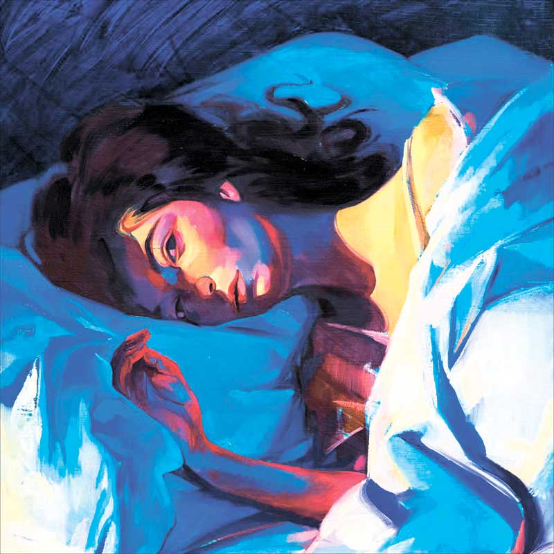

Melodrama by Lorde is an album I have been waiting for with baited breath, being one of my favourite artists over the past ten years.

I was a little worried by the sound of the album's first single ‘Green Light’.  I liked the song well enough, however, it didn't seem to me to have that idiosyncratic sound of Lorde’s. When compared, for example, with Tennis Court from her first album.

That was my initial thought. However, now I have come to listen to the entirety of Melodrama, every song on it is growing on me.

I loved how on this new album she seems to be bringing in a wider array of sounds and styles into her music. It feels somewhat lighter this time around, with the songs feeling much more unified across the album - feeling like a complete arrangement start to finish.

Even on first listening, some songs jumped straight up at me. ‘Writer in the Dark’ is as bare and as beautiful as they come. Her voice climbs higher than I had previously been used to hearing from her and it is glorious. She seemed to me to be channeling the essence of Kate Bush at times in this song.

I think with the huge popularity of ‘Pure Heroine’, her first album, it was always going to be a tough one to follow. There was a worry for me that she would end up pigeonholing herself into the niche that she created. She could have either given us more of the same - playing it safe and giving her fans what they loved, or tried out new things and expanded the boundaries of her sound even further. Her choosing the latter made me very happy and very relieved.

Melodrama has the hallmarks of an instant classic for me. She has taken her signature sound and style, and moved up a level; pushing her sound and our perception of what she is capable of.

You can [buy Lorde's new album on Amazon](https://www.amazon.co.uk/gp/product/B06XH924LG/ref=as_li_qf_sp_asin_il_tl?ie=UTF8&tag=chegalabonga-21&camp=1634&creative=6738&linkCode=as2&creativeASIN=B06XH924LG&linkId=b4a32c01396e42db2dd9a361e5065b85) today.
