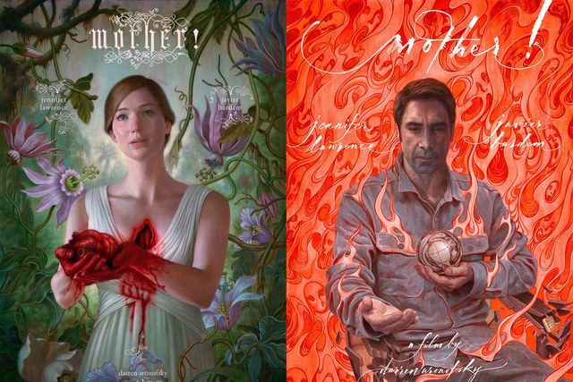

I had zero knowledge of ‘mother!’ when I went in to see it, other than it was directed by the same guy who had made Black Swan (which I love). This is always my preferred way of experiencing a film - without knowing what it's about. Little did I know I would be led down the garden path into the ever-increasing darkness.

Mother! is a film that I find defies classification. I think if you’re going into it expecting a horror film, as some have, you may be disappointed. Similarly if you go in expecting romance, or thriller, you may also be disappointed. Instead, remain open-minded; think of 'mother!' as being a unique story that slowly unravels; keeping its cards close to its chest.

Mother! Posters

When I watched it I didn't quite know what I was seeing. I mean, yes it's a seemingly straight forward narrative about a couple in the early stages of dissolution of their relationship, but the narrative is a veneer for a whole slew of metaphors - I'm just not smart enough to have spotted them. All I know is that I enjoyed the journey I was taken on, the mixed feelings it conjured up, and the challenges it often presented me.

There were some moments in the film that were quite difficult to watch, with the mother having an increasingly bad time as the story progresses. But I think that's what films should do - challenge us; confront us with things we wouldn't normally experience; shock us out of the rhythm of everyday life and give our brains something new to process.

It's great that we live in a world with directors like Daron Aronofsky, who just have a story and they tell it, staying true to the original kernel of the idea. They don't pander to any pre-decided notions of what a particular story should or shouldn’t be, or even what a _story_ should be, they just do their thing; everyone else is just along for the ride.

If you are looking for something different and are open-minded to be taken on a different kind of journey, you should check out mother!
