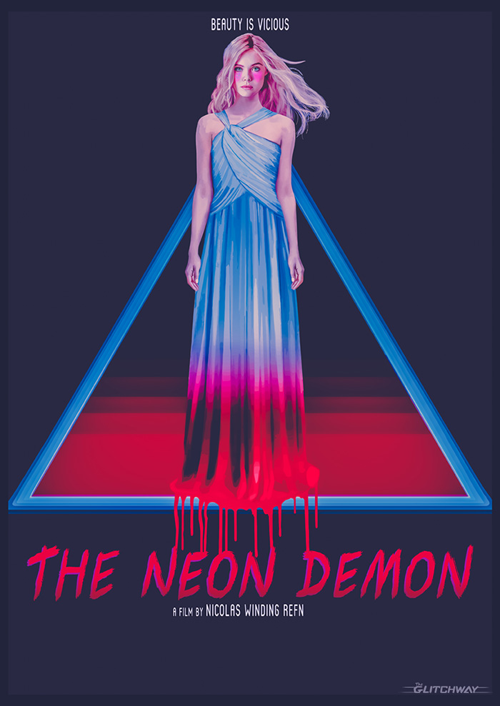
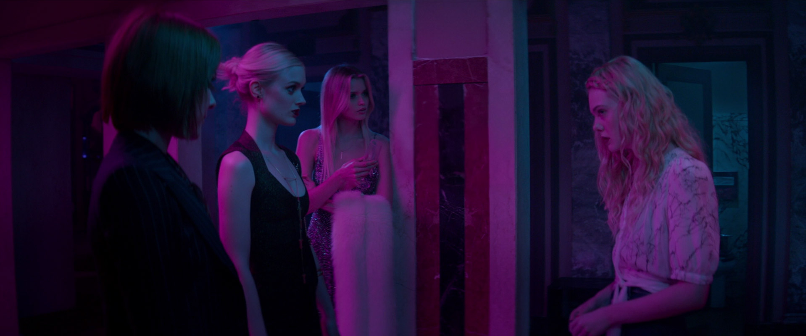

With its gorgeous visuals and pulsing soundtrack, Neon Demon is a film that I won’t be forgetting in a hurry. The majority of the story felt to me like it was floating in and out of the conscious mind, with an increasing level of abstract as it went on.

## What's The Neon Demon about?

The Neon Demon follows fresh-faced, 16-year-old model Jesse, played by Elle Fanning, as she enters the harsh world of fashion modelling. We follow her from her first demo photos - featured in the poster above - to her quick rise to fame. With her sudden rise she attracts enemies within the business and even some avid admirers.

By the film's final scenes I found myself slack-jawed, not quite believing what I was seeing; you could say it left me slightly haunted.

Elle Fanning in Neon Demon

## Bold and beautiful visuals

The fact that this film has such an easy to follow story, allowed me to get completely caught up in the rich atmospheres that the director, Nicolas Winding Refn, put together. Neon Demon felt almost like a dream for the most part. In fact even some moments that _were_ grounded had elements of a dream / nightmare in them (the scene with the mountain lion for example). The colours throughout were so refreshing to me as well. The vibrant purples and blood reds gave my eyes a real treat with the bold shots they created.

The film reminded me quite a bit of italian giallo films - those ones that are really unsettling to watch - like “Suspiria” or “Cat O’ Nine Tails”. Just something about them isn’t quite right - some kind of horror that is sitting just beneath the film's surface. The music only served to enforce this for me and felt somewhere between Giallo and Synthwave - a great combination.

Bathroom scene in Neon Demon

## In Closing

As with [Mother!](https://davidpeach.co.uk/2017/09/thoughts-film-mother/) from last week, Neon Demon is another one of those films that defies an easy grouping. There are elements of horror, thriller, very black comedy and even touching on very \*taboo subjects. However, those elements are woven into the fabric of the film to create a single, altogether unique viewing experience.

I was thinking about this film still days after I'd watched it. Proceed with caution and an open mind.

**\*(I can’t really mention the taboo subjects without giving away key events. What I can say is that they aren't for the faint of heart.)**
