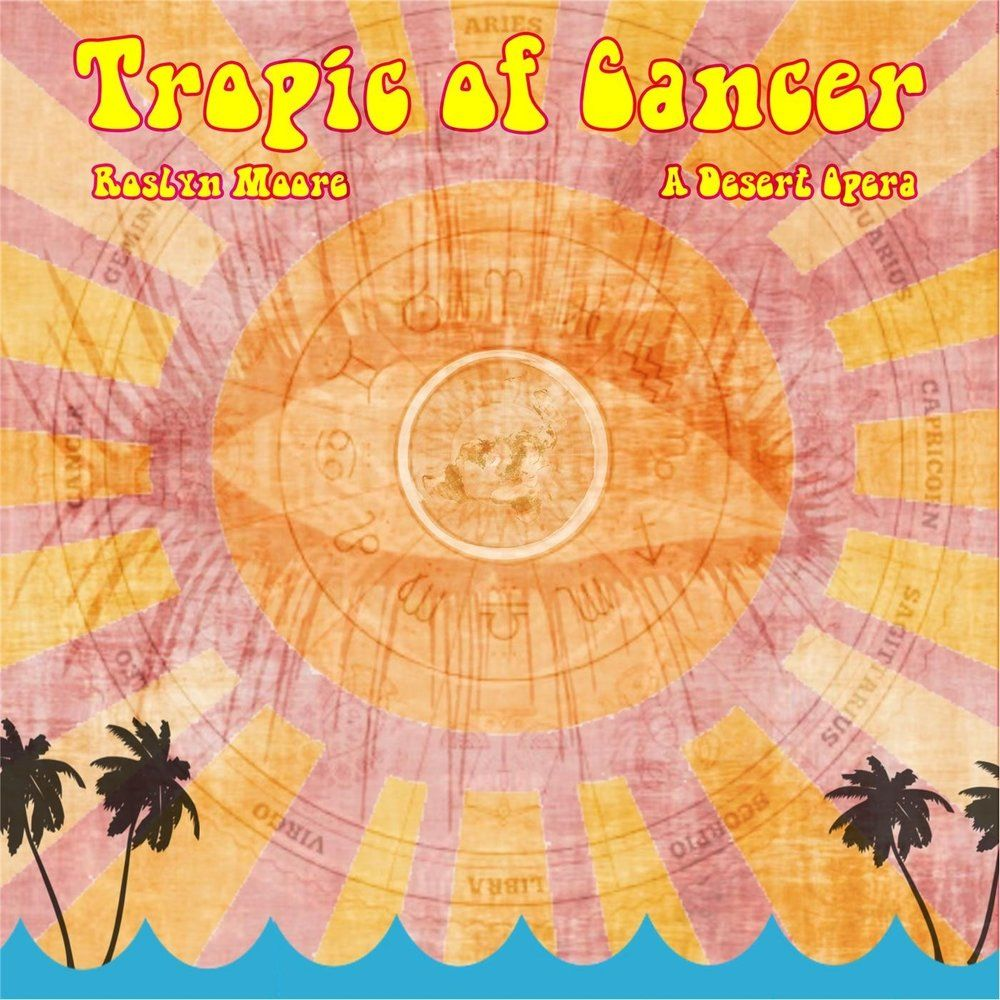

Roslyn Moore is back with her second desert opera, Tropic of Cancer.

I was an immediate fan of Roslyn's as soon as I first heard her stuff on [Soundcloud](https://soundcloud.com/roslyn-moore/) over a year ago. So the announcement of this new album did get me excited.

## Evolution of the desert opera.

Tropic of Cancer is the new album by Roslyn Moore, which builds upon the material from [her previous album Hazy](https://davidpeach.co.uk/2016/09/hazy-a-desert-opera-by-roslyn-moore/). Those older songs - some of which have a different sound to them, coupled with 9 new songs - make for a deeper and darker Roslyn Moore experience on this album.

I'll first address the elephant in the room. Yes, all of her songs from Hazy are on this new album but what you have to remember is, is that these songs have been available for free on Soundcloud since their release. With this, I tend to think more that she is working out her sound and albums in the public space. Kind of like if a painter uploaded her pictures in stages as she was painting them. The same emotional and ideological core, but each iteration building on the last into a stronger end piece.

## Some hand-picked favourites

There were a few songs that immediately stuck with me from Tropic of Cancer. These tended to be ones that sounded like she was experimenting with her sound.

Starting with the ebbing and flowing of quiet percussion, **The Great Escape/15 Rounds** was refreshing to hear from Roslyn. The percussion starts and stops with her spoken lyrics continuing, giving it a 50/50 mix of accapella and accompaniment. It gives the song a really interesting sound that is unlike anything Roslyn has done before.

Speaking of things she hasn't done before - scaring the hell out of me is one of them. The last quarter of **Hazy/Agents At The Ferris Wheel** took a complete left turn into what I can only describe as a drug-induced, Industrial nightmare. I was nodding off to her calming vocals and this thing just hit me off guard.

It scared the absolute living shit out of me. Good job.

Probably my favourite on the album is a song called **Coke&Weed**. With its marching-band / jazzy / guitar-kissed infusion, this song has so many interesting parts to it that I keep going back for more. This song would sound so fucking awesome played live in the Road House on Twin Peaks.

## In closing

You should think of Tropic of Cancer as more of a transformation from her previous album. All of the songs from her previous album, Hazy, are on here - but so too are 9 new songs. Not only that but some of her previous songs sound like they have been redone / remixed.

I love that Roslyn is still pushing her music forward, experimenting with new ideas, whilst still remaining true to her emotional centre. These songs are still soaked in a dark melancholy, only this time she's coming at it from new angles and with new styles.
