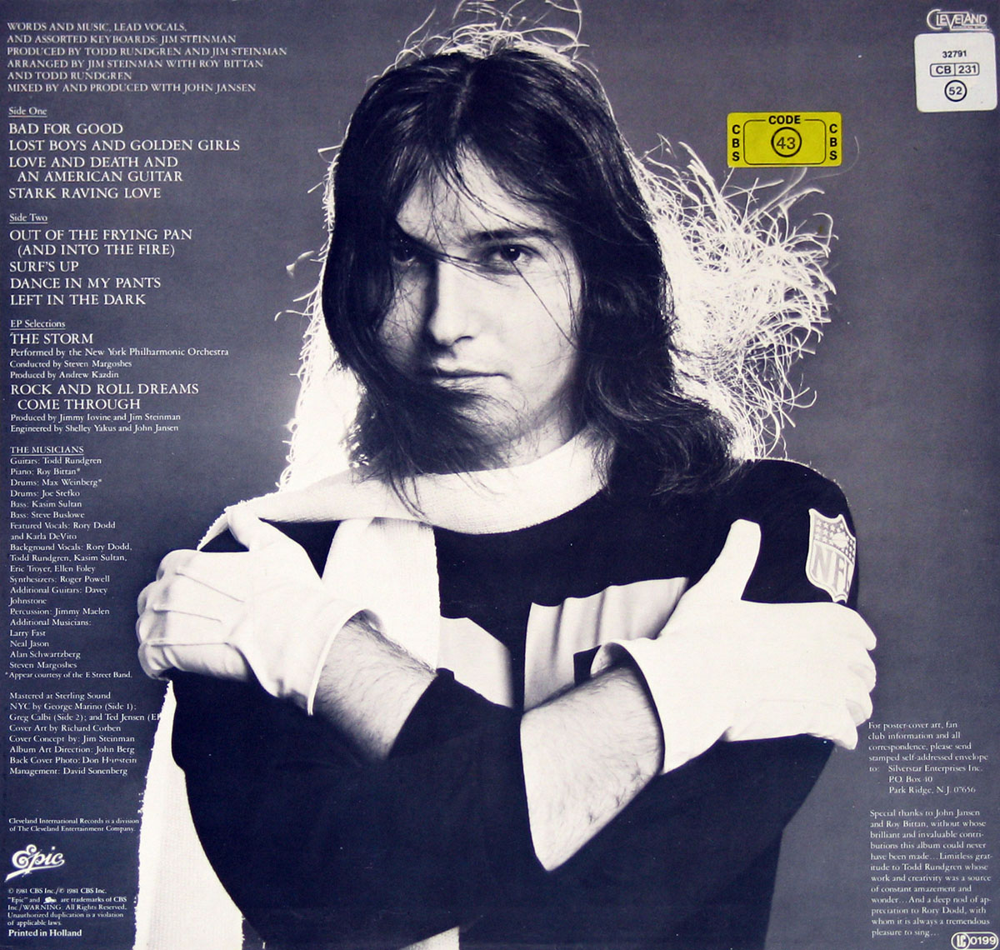

Bad for Good by Jim Steinman is one of my all time favourite albums. Less is known about his only solo album than his collaborations with Meat Loaf.

It's a crime that more people aren't aware of this album. I absolutely adore every song on here and if I had to choose some desert island discs, this would be on there. Other artists, who have worked with Steinman, have been able to do versions of some of these songs. But for me nothing comes close to this grand, hugely personal collection.

## Bad for Good by Jim Steinman

Bad for Good, the eponymous opening song, kicks the album off with pure fire. It encapsulates the things that Jim is so great at: intense, energetic musical passages; huge, expertly-woven orchestrations; lyrics that paint epic pictures of passion, power and love. His lyrics read like poetry and are delivered with great conviction and authority. The speed change half way in, with the verse that follows it, is one of my favourite moments on the whole album. The whole song plays like its own self-contained, nine-minute opera.

Visit my website https://vinyl-records.nl for complete album information and thousands of album cover photos

'Lost Boys and Golden Girls' is a much calmer piece, which I think is needed after that opener. Meat Loaf's Bat Out of Hell 2 album used another version of this song in 1993. However, Jim's version feels much more personal and stripped back to me. I love both versions but something about Jim's rendition just pips Meat Loaf's to the post.

'Love And Death And An American Guitar' is another track that was reused on Bat Out of Hell 2. Again, as with the previous song, this version is a lot more stripped back - with nice synth fills used to dramatic effect. It's actually a spoken word piece that acts as an intro to the song that follows, 'Stark Raving Love'.

'Stark Raving Love' and 'Out of the Frying Pan (And into the Fire)' both keep the energy riding high. As does a later song called 'Dance in my pants', a fun duet with [Karla DeVito](http://www.karladevito.com/) in a similar vein to Meat Loaf's song 'Dead Ringer For Love' (also written by steinman).

## Big energy and wide diversity

Jim Steinman's music has such energy and diversity to it and Bad For Good is the best possible showcase for those qualities. These songs never fit into a simple groove and just plod along. They are either melting your face off from fifteen different directions or are ripping your heart strings out with their gorgeous melodies and melancholic lyrics.

'Surf's up' and 'Left in the Dark', two songs that slow the pace somewhat are such beautiful ballads. The latter is a heartbreaking, often angry ballad about a man aware of his lover's infidelity. These lyrics taken from the song say so much more than I could by describing it to you:

> But don't tell me now, I don't need any answers tonight  
> I just need some love so turn out the lights  
> And I'll be left in the dark again
> 
> Left in the Dark, Jim Steinman (from Bad for Good - 1981)

The album closes with the huge-sounding orchestral instrumental, 'The Storm'. This piece wouldn't be out of place as an overture for a huge opera production. And it serves further show just _how_ diverse this man's music is. It's moments like this that make me wish that Jim Steinman was a prolific film composer. His operatic and, quite frankly, epic visions for music would do cinema so must good.

Meat Loaf (left) and Jim Steinman (right)

## A gem of an album

Bad for Good is a golden nugget of an album. It's not very well known, even by many rock fans I've met, which is a shame. Whilst many may recognise his name from the front of Meat Loaf's biggest albums, many more may not be aware of this solo album of his. I'm going to go on record and say that I believe this album is a cult classic - it demands to be listened to and appreciated by all.
