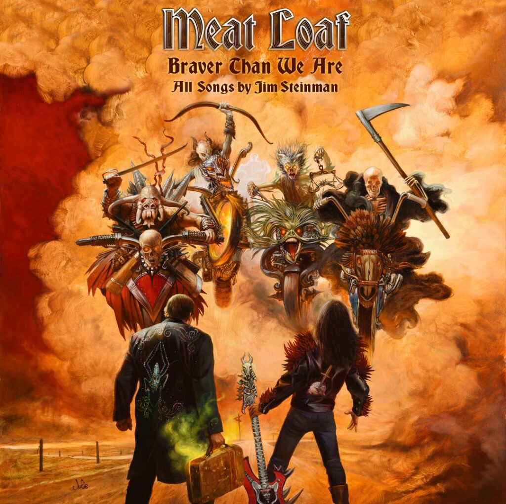
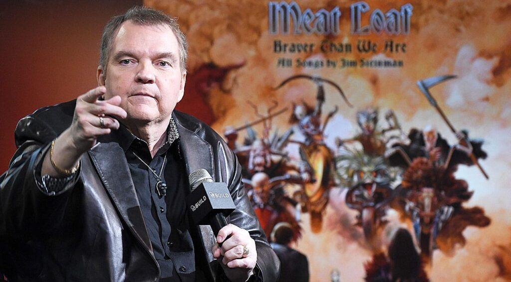
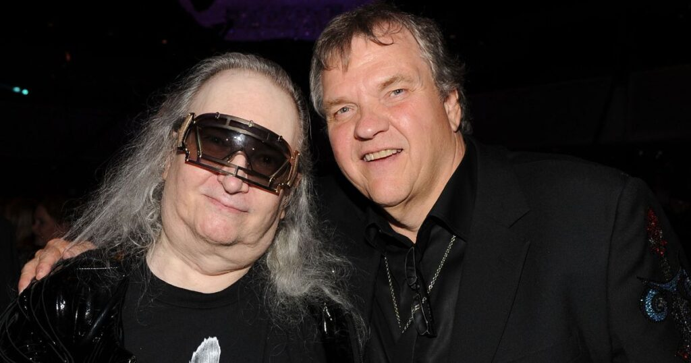
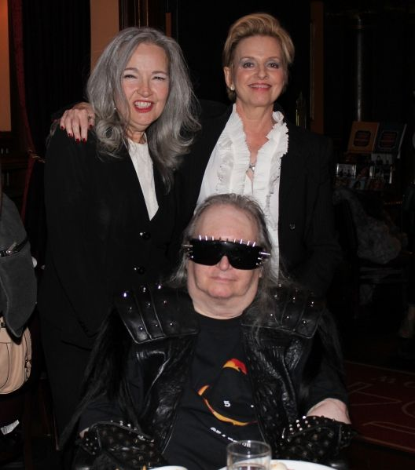

I am a huge fan of both [Meat Loaf](http://meatloaf.net/) and [Jim Steinman](http://www.jimsteinman.com/). Their music, whether separate or in collaboration, has a special place in my heart. From the Bat albums to Welcome to the Neighbourhood; from Bad Attitude to Blind before I stop. Although the Steinman-penned albums are in a league of their own, I still enjoy Meat Loaf in his own right throughout his career.

Apparently there is a photograph somewhere of me singing along to Bat out of Hell when I was about four years old. In the photo I am seen sporting my own red hanky as seen in the music video. Rocking from an early age!

I am ashamed to admit that it has taken me a year from its release to actually listen to ‘Braver than we are’ in full. The reason for this is because on first hearing the album’s opener, ‘Who needs the young’, it just didn’t have that unique aesthetic I was expecting. After revisiting Steinman’s only solo album, ‘[Bad for Good](https://davidpeach.co.uk/2017/11/bad-for-good-by-jim-steinman/)’ recently, I also decided to give this album another try - and I’m so glad I did. I didn’t give this album the time it deserved right off the bat (no pun intended).

I now present my thoughts on the album.

## Braver than we are

Meat Loaf has had full collaboration with Jim Steinman on four of his thirteen albums to date. The first, and most famous was Bat out of Hell from 1977. The album 'Deadringer' following in 1981 and is so underrated if you ask me. Then came Bat out of Hell 2 in 1993, which is an album that got me through my years at high school.

Meat Loaf promoting Braver than we are

Now, twenty-four years later, I am discovering their fourth collaboration - the unashamedly epic ‘Braver than we are’. As soon as I heard the news that Steinman and Meat Loaf were working together again I got all giddy like a school boy. And although it’s taken some time for me to ‘get it’ I’m now glad that I do.

The only thing more scary than a literal Bat out of Hell is the ongoing march of time. These two accept time’s weathering effects and embrace it completely in the music that they have created here. They made the conscious decision to not try and imitate what has come before - instead creating something new and fresh. In my opinion they have done this in spades.

## Souvenirs from the past

Steinman is known for re-imagining and re-recording his music with different artists through the years. This album stays on par with that. However, many of the songs here I hadn’t heard before, as their roots can be traced back to his early musicals that I haven’t heard. Musicals such as The Dream Engine from 1969 and Neverland from 1977.

Saying that however, you may well recognise many melodies and chord progressions from earlier Meat Loaf albums. 'Original Sin' can be heard haunting the song 'Loving You Is a Dirty Job (But Somebody's Gotta Do It)'.

What I find really great about Steinman’s music is how it has stood the test of time, and has adapted through the years. As different artists have interpreted his works it has given the songs new dimensions. Hearing a well known lyric from the Bonnie Tyler song ‘Total Eclipse of the Heart’ during ‘Skull of your Country’, made me want to throw my fists in the air with joy. Cian Coey, who accompanies Meat Loaf in this song adapted its delivery beautifully and absolutely nailed it.

## Stand out songs

Jim Steinman and Meat Loaf in recent years

The album kicked into a more familiar gear for me with the second song: ‘Going All the Way (A Song in 6 Movements)’. This song is absolutely incredible in how it takes you to so many places in its eleven and a half minutes. It is as grand and as symphonic as I’d expected from Jim Steinman’s pen. Like the rest of the album, it gets better with each listen.

The two featured vocalists on ‘Going All the Way' are worth mentioning here. Ellen Foley and Karla DeVito both feature, with the voices of both soaring high and wide across the song’s huge canvas. They were both featured on the studio and live versions of the classic 'Paradise by the Dashboard Light', respectively. So it was great for them to come together for this album after so many years have passed.

Souvenirs touches a lyric from Two out of three aint bad and a musical progression from ‘Left in the Dark’. It's little touches like these that made the album feel like home on the first listen. And if I wasn’t in love with this album before the song ‘More’, then I definitely was afterwards. This song brought with it an almost John Carpenter accompaniment along with its deep chugging guitar work.

Braver than we are closes on the gloriously upbeat, rock n roll belter, ‘Train of Love’. Closing the album in true Steinman style: an anthem to those moments when you feel like you're on the head of a match that's burning.

## Summary

Any fans of the grandiose lyrics and arrangements of Jim Steinman will not be disappointed with this album. Anyone expecting Meat to hit the same high notes as he did in his early days, take heed - he isn’t afraid to embrace his deeper voice in this album, and neither should you.

Jim Steinman with Karla deVito and Ellen Foley

Meat Loaf is known for his operatic delivery and larger than life presence on his albums. But on ‘Braver than we are’ he isn’t afraid to reel it in. As he sings on ‘Who needs the Young’, his voice just isn’t what it was. And that’s okay. Even in the lower end of the spectrum he delivers with the same authority that I always remember him having.

The more I listen to this album, the more it feels like a goodbye from both Steinman and Meat Loaf. The usage of so many themes from earlier material made this album feel like a closing overture to their collaboration. Kind of like how ‘overture’ from The Who’s Tommy touched on that album’s later themes and riffs. ‘Braver than we are’ did this for me but on a grander, career-spanning scale. All of this in the waning era of some of the most powerful, passionate music I have ever had the good fortune to experience.
