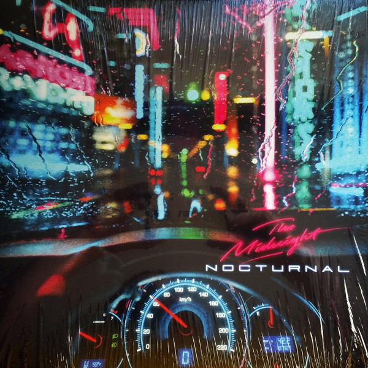

[The Midnight](http://www.themidnightofficial.com/) are a two-piece synthwave band consisting of songwriter Tyler Lyle and producer Tim McEwan. They are from the American deep south and Denmark respectively. However, they now both live in Los Angeles and make some of the coolest music of the past few years.

They are well respected, often revered, within the Synthwave community. Their music is awash with eighties retro sensibilities and an innate ability to bring back the parts of that era we often see through rose-tinted glasses.

## Nocturnal by The Midnight

Nocturnal is the third full album release by The Midnight and is as strong an album as I have come to expect from them.

We open the album with footsteps on a rainy Los Angeles street. The sirens in the background and the initial synth pads that swoon in gave me similar feels to Sarah Connor before ducking into the Tech Noir. I wasn’t to know just how close to the Terminator we were going to come with this album - more on this in a moment. This first song, ‘Shadows’, is a steady beat and synth driven tune that soon showcases singer Tyler Lyle’s awesome, almost vulnerable feeling, vocals. And you best believe there is a little bit of Saxophone sprinkled in there too. This song brings you straight into the era they are shooting for with style.

It was great to hear [Nikki Flores](http://www.nikkiflores.com/)’ return after her previous collaboration with The Midnight on the previous album’s hit ‘Jason’. This time she takes the microphone for ‘Light Years’, her voice pairing perfectly with Tyler’s. Meanwhile on 'River of Darkness', we are treating to a different kind of collaboration. Fellow Synthwave artist Timecop1983 helps out in the production of 'River of Darkness', creating a stunning mid section to the album.

## Inspired by the greatest

‘Crystalline’ is most definitely one of the stand-out songs for me on this album. It was also the first single to be shown off from Nocturnal. The vocals continue with their dreamlike delivery as we are led into what can only be described as a head nod towards Phil Collins. The drum fill that thrusts us into the wailing Saxophone solo, sounds wonderfully inspired by those infamous beats from ‘In The Air Tonight’.

The title track on this album feels like a love letter to Brad Fiedel - the composer from the Terminator. The song begins so close to one of the most iconic film themes ever written. The iconic theme I speak of is the main theme from the Terminator. Again, as with the Phil Collins flavours on Crystalline, these Terminator-esque beats are merely a jumping off point. The song soon blossoms into its own deep synth bass/beat driven beast. Noctural also featured synthesizer sounds that sounded identical to ones used in the film.

These inspirations seem to come from a place of deep love and respect for the era _and_ the artists. As opposed to simply being a popular retro vehicle for them to write on. It's the delicate touches throughout this album that put it in the upper circle.

## Summary

Even though Synthwave is one of my favourite musical genres, I don’t tend to write about it that often. This is only due to the fact that I think I’d end up repeating myself with most albums and artists. Most I’ve heard have been great, but there are those special few that warrant the time it takes. [FM-84](https://davidpeach.co.uk/2016/09/atlas-by-fm-84/) are one such band, The Midnight are another.

Not once was I awoken from their retro spell during this album. When listening, you will be transported to an idealistic moment of the eighties - if you allow yourself. A moment pieced together from your own memories of films and tv shows of the time. Those memories then bound together with the beautiful music from Nocturnal by The Midnight.
