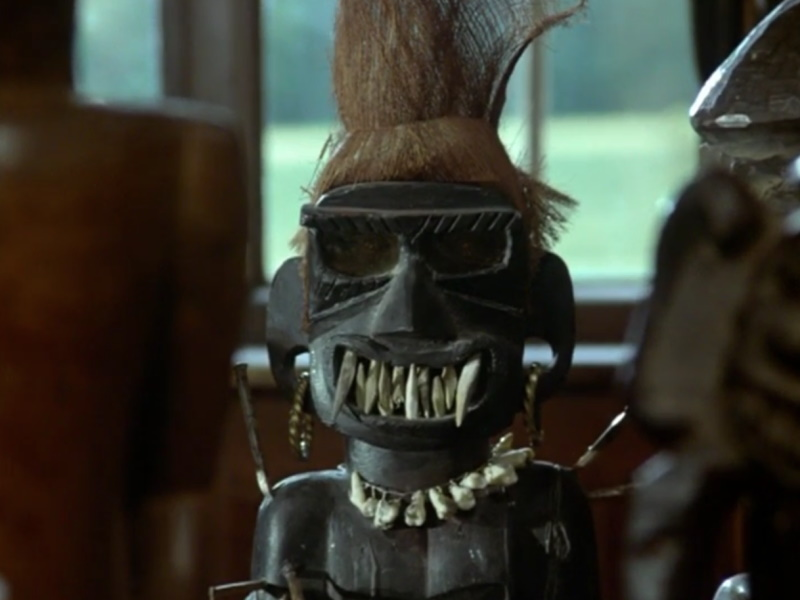
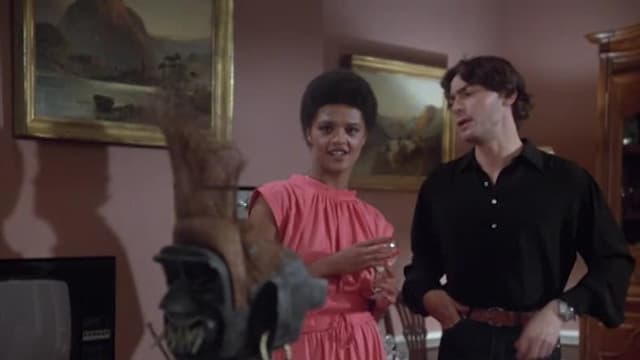

Charlie boy is about a couple, Graham and Sarah, who come into possession of an African idol after Graham's uncle dies. (Sarah gives the idol the name Charlie Boy). Unbeknown to the couple, the idol is cursed and is in fact a voodoo statue.

## What is Charlie Boy about?

Close up of Charlie Boy

After a disagreement with his brother, Graham - sitting at home nursing a drink - takes out his anger on the Statue. He does this as he is looking at a photograph of five close friends, himself and his brother included. The rest of the episode is then about the systematic killing (or accidental deaths) of all who appear in said photograph in the order they appear.

The episode had some juicy deaths in its 51 minutes including a man getting thrown off a horse and on to some plough spikes. Others I can't reveal for fear of spoiling aspects of it for you, should you choose to watch it. This story is one of the grimmest to watch overall - nobody really has a good time in this one. That being said I do enjoy a good downer of a story - there's no light without shade.

## A weaker example of the series

Charlie Boy had some potential to be a great episode but unfortunately fell a bit short for me. One big thing that let it down was the soundtrack. At times the music felt like it belonged somewhere between [Confessions of a Window Cleaner](https://en.wikipedia.org/wiki/Confessions_of_a_Window_Cleaner) and [Foxy Brown](https://en.wikipedia.org/wiki/Foxy_Brown_(film)). It's a shame because the idea itself was a sound one that fits with the rest of the series well. It just seemed to be poorly executed by people who had no real vision of what Hammer Horror is.

Graham and Sarah examine Charlie Boy

## In Summary

This is one episode of The [Hammer House of Horror](https://davidpeach.co.uk/tag/hammer-house-of-horror/) that I think you could comfortably miss. It does have _some_ redeeming qualities, such as a higher death count to previous episodes. So it isn't _all_ doom and gloom. But yer, not the best one.
