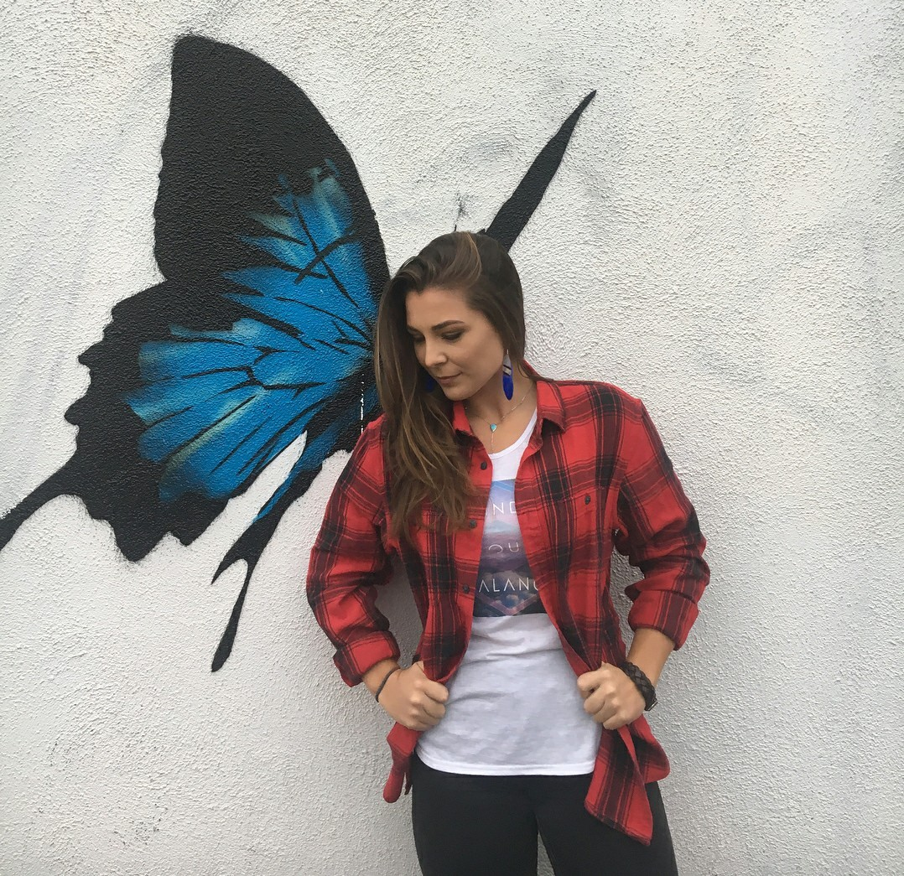

The character of Rachel Amber has been brought to life, in ways we couldn't even imagine, by the very talented Kylie Brown.

Rachel Amber was but a memory that we caught glimpses of through the eyes of Max's best friend, Chloe, in [Life Is Strange](https://davidpeach.co.uk/2017/08/review-of-life-is-strange/). But now that we have witnessed the events that brought Chloe and Rachel together in [Life Is Strange Before the Storm](https://davidpeach.co.uk/2017/09/life-strange-storm-episode-1/), we can share in those memories together.

I have been lucky enough to be able to ask Kylie Brown some questions about herself, her life and her approach to her craft.

## The Interview

Please tell us about yourself in as many or as little words as you like.

Lazily active and very passionate.

Who is your biggest influence in how you approach what you do today?

Jennifer Lawrence and Tom Hanks. I’ve always said that I want a career like Jennifer Lawrence where I go from being in movies that go to comic-con to movies that are Oscar nominated. And Tom Hanks where I can own any role that comes my way.

What inspires you?

I don’t think there’s any one thing that inspires me. There’s a lot of things that do. Like a simple walk around my home town, staring at the Hollywood sign, watching a movie in the theaters, my parents, my friends, watching BTS footage from a movie. Inspiration is everywhere for me.

What annoys you more than anything else in the world?

When people talk during a movie/tv show that I’m watching. I literally hate it ...so much... so very much. Just don’t do it.

What is the proudest moment of your career so far?

I would definitely have to say Life is Strange: Before the Storm is my proudest moment in my career right now, it was so far from my normal acting jobs and I had such a blast filming it and watching it take off.

What advice would you give to your younger self?

You’re on the right track kid, just keep going for your dreams, you’ll get there.

If you could ask any person – living or passed – any question, who would it be and what would you ask them?

I would ask Jennifer Lawrence, “What’s your favorite kind of pizza?”

Rachel Amber is someone we've known for a long time now. We've gotten to know her through word of mouth and other characters' experiences but we've never met her. Is there a lot of pressure to portray this brand new person to fit with the Rachel Amber people already feel that they know?

Well yeah! There’s a ton of pressure! Rachel was portrayed as this woman who’s out of this world, and here I am…on earth. I mean really, even her NAME is kickass. Rachel Amber. Like, what?!? My biggest fear was not doing right by the fans, and all I can say now is that I am so honored the Life is Strange community has accepted and welcomed me as their Rachel.

What is your favourite Book?

1984 by George Orwell

What is your favourite Album?

Uhhhhh, the last FULL album I’ve ever listened to was from the Jonas Brothers….so I guess the Jonas Brothers Lines, Vines and Trying Times album? If musicals count as albums, then definitely Hamilton.

What is your favourite Film?

Depends on the genre really.

- **Action (which is my favorite genre)**: any marvel movie that just came out
- **Drama**: Silver Linings Playbook
- **Comedy**: Baywatch
- **War (or historical)**: Saving Private Ryan

What is your favourite TV Show?

Will & Grace (I’m currently watching it as I write this) and Game of Thrones

Do you have a favourite film/tv/musical soundtrack?

I LOVE movie scores and I can’t pick a favorite. But probably Jurassic Park.

Is there anything that you are binge listening to / watching at the moment?

HAMILTON and I just finished binge watching a new comedy on Netflix called The Good Place

You’re walking somewhere and your mp3 player / phone has only a little battery left; You’ve only got time for one more song. What song do you play?

Hakuna Matata from the Lion King so that way if it dies in the middle off the song, I’ll still be singing it at the top of my lungs giving everyone a show.

What was the first poster you ever had on your wall?

Oh wow, I don’t know. I first moved into my house when I was two and my room was decorated like a princess room. Pink walls, princess bedding and princess posters. So I’m guessing the first poster to be on my walls was a princess one that had a princess saying on it.

Could you tell us two truths and a lie?

1. I’ve known my best friend since kindergarten and we’re still best friends.
2. I broke my leg three times in two years due to soccer, snowboarding, and climbing on my roof.
3. I grew up with three boys across the street from me and we would play army and have airsoft wars and one day I got shot right next to my tear duct and was forced to wear goggles every time after that.

\*[Answers](#truths-lie-answers) at the bottom of the page.

Do you have any announcements or causes you’d like to raise an awareness of?

I’m a huge advocate for anti-bullying. I was a safe school ambassador at my high school where we would step in and speak up if we saw bullying going on and it saddened me to see how much was going on. And it saddens me even more seeing how much bullying is going on in this world right now, I always thought it stopped when we graduated high school. Bullying is so pointless to me, we are all human beings, we all have stories that no one is aware of, **we all have pain that no one understands**. No matter what you are feeling, it is valid, no matter what you are going through, I’m here for you. I don’t care if you are halfway across the world, **you matter and you are cared for**. And if you see someone getting bullied, please speak up. **Stand up for your peer. Let them know they are not alone**. If we all do that, this world will be a happier place.

\*Answers to the two truths and a lie question

| Question | Truth or Lie? |
| --- | --- |
| 1 | Truth |
| 2 | Lie (I’ve never broken anything but my toe one time) |
| 3 | Truth |
