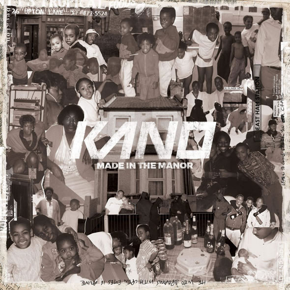

When it comes to UK rap music, few are revered in quite the same way as Kano is. Present in the Grime scene from the early days, he has had five studio albums to date. Made in the Manor is his latest and stands up, hands down, as one of the best rap albums I've heard.

This is definitely an album that has grown on me over time. The opening songs grabbed me instantly but the later, more introspective, songs took a bit longer to get their hooks in me. But now that they have, they get better and better with every listen.

## Welcome to the jungle

The opening of ‘Hail’ - the album’s first song - is sharp, loud and aggressive. This whole song is unrelenting throughout and Kano’s delivery is right up in your face forcing you to stand up and listen. The chainsaw melody that carries us along is later joined by the best sample i’ve heard for a long time. The sample is of Tempz, from his track ‘Next Hype’:

> (CLEAR!) All of your CD rack  
> Won't get none of your CD's back  
> \-- Next Hype, Tempz.

Some manner of respite comes with the next song, ‘T-shirt Weather in the Manor’, which brings with it a calm piano melody and light drumming. Kano’s vocals are no less commanding on this song with the lighter accompaniment.

‘New Banger’ and ‘Three Wheel Ups’ bring that in-your-face energy back in spades with some great featured rappers. Giggs and Wiley both feature on ‘Three Wheel Ups’ and do an excellent job of supporting Kano. Even D Double E can be heard in parts doing his signature “ooooh”.

Kano and Giggs in the Three Wheel Ups video

‘This is England’ was the song that made me first sit up and take a closer look at this album. The various layers and production on this song made me realise that this album was something special. Like Charlie Sloth said in Kano's 1 extra, this feels like a seminal record.

## All in the family

There were two songs that stood out to me for just how personal and confessional they sounded. ‘Little Sis’ and ‘Strangers’ feel like personal monologues directed to a sister and brother respectively. Although these songs initially didn’t grab me as his big tunes did, I have since come to enjoy them both in a whole different way.

Kano - full name Kane Robinson

When I first got into Kano all I wanted to hear were his big tunes - they are so addictive. But now that I'm in the habit of listening to Made In The Manor front to back, these more personal songs fit perfectly with the overall flow.

From the family you’re born with to the one you choose : all of the guest features on this album feel like they are done from a place of love. What I mean is, I imagine many rappers feature on other artists' tracks for the chance of exposure. I could be wrong about that but it does make sense. On Made in the Manor, however, each feature feels like it is Kano and his close friends, who are just making great music together.

## Summary

Whether you think you are a fan of rap or not, I urge you to listen to Made In The Manor regardless. There is so much variety in this album that I truly believe there is something for everyone. He delivers the fast-paced heavy hitters with a great level of confidence and Authority. And he delivers the more introspective songs with an honest sincerity.

> Don't be a statistic blaming ghetto physics for holding you back.  
> \-- a great line from the song 'Seashells in the East'

Along with others like [JME](https://davidpeach.co.uk/2016/10/integrity-by-jme/), Akala, and Devlin, Kano is up there as one of my favourite rappers. Like those others, Kano's sense of humour comes through in both his lyrics and his unique delivery.

He never rests on his laurels either. He could have easily delivered an hour of quick-witted, fast bars throughout and fans would have been very happy. But with Made in the Manor he has pushed himself further, whilst looking deeper within. As a result, Kano has come out the other end with a true masterpiece of an album. Not just in rap, but in all music.
