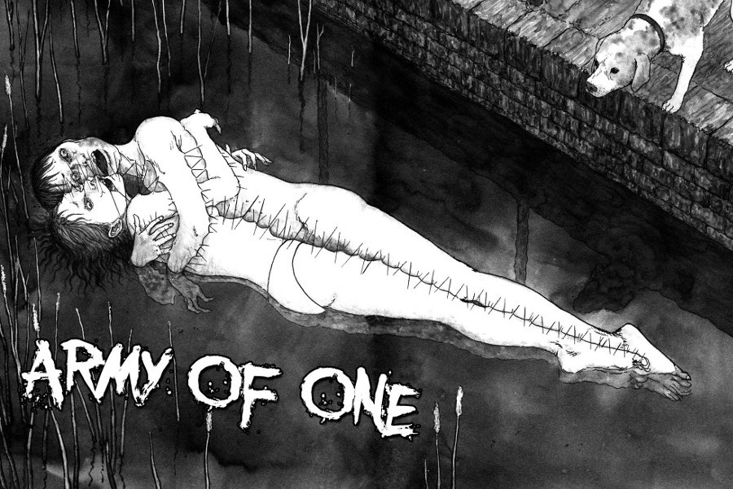

> Gather round, people. All together now! Nobody likes a lonely only. Everyone's your friend, everyone's your friend. When you join hearts and sing - Army of one, We're an army of one!
> 
> The mysterious radio broadcast

## What is Army of One about?

Army of one follows some friends trying to organise their school reunion in the midst of a new killing spree. The killing spree involves victims being found in different places all sewn together. The number of people found sewn together grows exponentially as the story quickly moves forward.

Michio is a boy who hasn't really left his bedroom for seven years. He prefers the solitary lifestyle in his family home. When he is called upon one day by a girl from his school year, he reluctantly begins mingling with his school peers once again - albeit briefly. The girl, Natsuko, is organising their school year's reunion and coming of age party, which by definition will involve a large group of people. This can only end badly.

It isn't long before some of those friends start to become victims of these "stitch murders". People quickly realise that the safest place to be is alone.

## An interesting spin on a horror trope

Normally in horror, of most kinds, the safest place to be is together. As soon as someone goes off alone, more often than not, they are picked off. Army of One spins that on its head, however, in that the victims are all people who go off in groups. It is actually safer to be alone in this world, which I think would have interesting consequences in the wider world had this been a larger story.

It is touched upon with the mention of phones soon to be cut off and networks potentially going down. If everybody was afraid to be in groups just imagine what that would do to society. Families would start becoming separated; people would cease going to work; people would be afraid to even go shopping. The world would go to hell.

## In Summary

This is one of my favourite stories by famed Mangaka Junji Ito. It has great pacing and creates an interesting world, which I'd have loved to see expanded upon. That being said, Ito does use the lesser page count - thirty seven pages by my reckoning - to great effect. He gets straight into the situation of the "Stitch Murders" and escalates it at a really good pace.

You'll never want to be in a group again.
