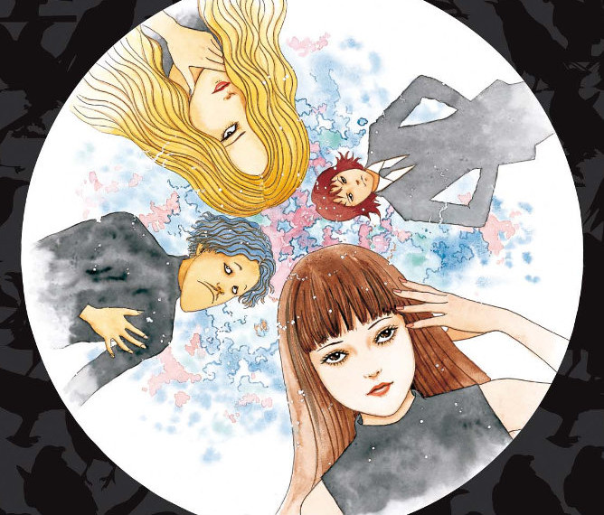

## What is Black Paradox about?

Black Paradox follows four characters who meet on a group suicide website. We join them as they are meeting in person for the first time, in preparation for performing their suicide together. After their failed attempt, one of them starts regurgitating large shiny balls that he says are from a “Dazzling world”. Yer I know - stay with me.

As the story progresses, we discover that this Dazzling World is in fact the spirit world. The shiny balls that they are able to acquire from this spirit world become very sort after in the real world. They end up calling this material ‘Paradonite’. Paradonite has huge amounts of stored energy within, as some find to their horror.

As each of them learns their own access points into the spirit world, a doctor tries to capitalise on it. He helps them to fulfil their odd destinies as a way to help the future of the human race. Within his mansion, he sets up an underground lab where these events are studied and ultimately normalised.

## Body Horror

Black Paradox is a good introduction to the body horror artwork that Junji Ito is famous for creating. It’s a bit milder than a lot of his stories, but there are still some things in here to keep the most ravenous of Ito fans placated.

Each of the four main characters accesses the spirit world through the manipulation of a particular body part. Piitan’s Pylorus, the body part that normally connects the stomach to the small intestine, connects him to the spirit world. The other characters later discover that they too can access that world, but in even more stranger ways.

One person’s face is their gateway and must have it removed before it destroys her. Another has a small tumour in their brain which must be removed. While a third accesses it through their own shadow. If I only say one thing about Junji Ito, it's that he has an imagination like no other.

## Are people just resources?

Interesting in Black Paradox is its looks into the darker sides of human nature. The side that will try to advance through the pain of others. Once the first of the four starts uncontrollably regurgitating the Paradonite, one of them immediately wants to use its high value for their own financial gain. Then later, once the doctor has them all under his roof, he uses them simply as a means to get hold of more of the material “For humanity’s sake”.

However, after seeing a vision of the world's future, one of them learns how the continued mining for Paradonite is actually detrimental to the future of humanity - real people, specifically. But with the planet's growing reliance on the material for its energy, the doctor keeps them on the path that may ultimately lead to destruction.

I couldn't help but find parallels between our own world and the future Paradonite-dependant world of Black Paradox. The way in which the materials are used for the apparent greater good, but at the expense of many real people in the process of acquiring it. Whether such parallels were intended by Junji Ito I don't know, but anything that sheds light on such things is a good thing in my mind. I wont spoil the story by saying just how they are affected, but affected they are.

## In Summary

Black Paradox was a very enjoyable read for me. Although not specifically a horror manga story, it does have many elements and drawing styles that veer on that side of the road. It felt to me to be like an origin story for this group of four, who ultimately refer to themselves collectively as Black Paradox. I'd even go so far as to say that this was Junji Ito's 'Fantastic Four'.
