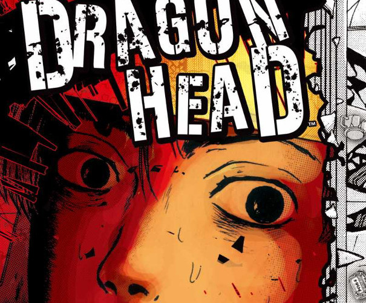

Dragon Head is a brutal, honest portrayal of a cataclysmic event and the effects it has on those left alive. Teru Aoki and Ako Sato are two such survivors, thrown into this new world crying and screaming, without a clue of where to go next.

## What is the Dragon Head manga series?

Whilst heading into a tunnel, a train is derailed and trapped inside - killing all but three of the passengers. These are the aforementioned Teru and Ako, along with a third - Nobuo Takahashi.

The story then follows these characters as they struggle to come to terms with the situation they have been placed in. Teru and Ako eventually form a partnership, whilst Nobuo quickly begins to break down. Convinced of some entity out in the darkness of the tunnels, Nobuo ultimately falls prey to his own delusions. This leaves the two friends to escape from the tunnels, leaving Nobuo to his own insanity.

From there Teru and Ako's journey takes them across very harsh landscapes and across the paths of some very violent adversaries. Although initially naive, they eventually toughen up to meet the demands of their new life. This adaption often comes at a price - the price of leaving behind the people they once were to become people they may not like to be.

## A bleak vision of a post-apocalyptic world

Minetarō Mochizuki never lets you forget the world that you are in - many of the panels throughout each issue are of rubble; debris; dust; fire. The characters don't find themselves travelling across open fields or down quiet desolate streets. No - this world is claustrophobic; it's dirty; it is bricks and mortar with shards of broken metal between. It's violent and unforgiving and all must learn to adapt.

Dragon Head can be a tough read to tell you the truth, not tough as in graphical violence as such, but instead in its dark vision of a bleak post-apocalyptic world. If you don't mind your stories dark every now and again, then this one is definitely worth your time. Just don't be expecting any smiles from these characters, unless it's the psychopathic grin of someone trying to kill them.

## In summary

Dragon head is an honest and brutal story about young people forced to come to terms with, and survive, an apocalyptic event. As you can imagine it isn't for everyone and I think you'll know if it's for you within the first couple of issues. What I will say though is at least give it a try - I'm still yet to come across anything quite like it. Despite it's darkness and apparent lack of hope, I thoroughly enjoyed it for the unique story it is.
