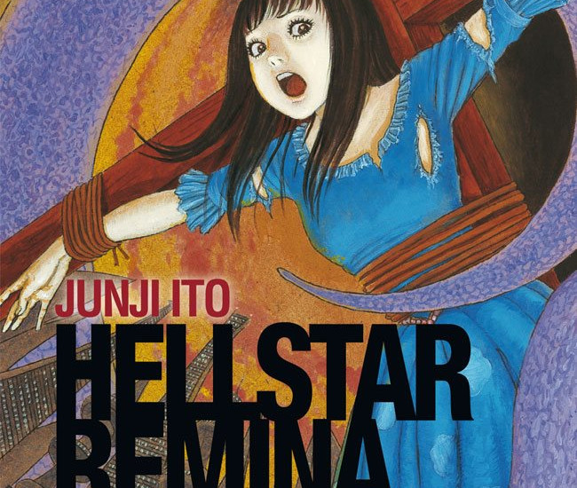

> Remina looked me right in the eye! Remina knows about us, knows we're here! That's why... it's coming for us...
> 
> One scientist is driven mad by the new planet — Hellstar Remina

## What is Hellstar Remina about?

One evening, while watching the night sky, an astronomer discovers a mysterious new planet that seems to have just appeared from nowhere. He soon believes that it has appeared from out of a distant wormhole **sixteen light years away**. He names this new planet Remina, after his only daughter -- his **sixteen years old** daughter.

The daughter Remina, who coincidentally is the same age as the planet - sixteen\* , becomes an overnight star due to her new namesake. Fan clubs are popping up all over the world and people scramble in the streets just to see her. The world is obsessed with Remina!

\*The new planet is sixteen light years away, which means it takes the light sixteen years to get to us. This means that at the point of it appearing to the astronomer, sixteen years would have passed since it actually appeared. So it must have appeared around the time of his daughters birth.

## In the night sky

While the world is obsessing over the girl, the new planet is observed as taking a very strange, irregular path across the distant sky. Not only that, but the stars it seems to come into contact with disappear as the planet approaches. It isn't long until the planet _seems_ to stop still completely, which leads the astronomers to hypothesise only one thing. They believe that this can only mean that the planet is now heading straight for Earth.

As the planet becomes larger, as it approaches the Earth at speed, the population's thirst for the girl's love quickly becomes a thirst for her blood. She becomes the sole target of a full-on witch hunt. The people believe that killing her will stop the impending doom that the new planet threatens them all.

What follows is an extremely harrowing experience for Remina and the few who are still trying to keep her safe. The growing hordes of angry people stop at nothing to get hold of the girl and hold her accountable for their fate.

## A microcosm of organised religion

What I found most interesting about Hellstar Remina, was the people's actions and beliefs towards the girl. When the new planet was a thing of awe and wonder, she was revered as such. However, once the planet seemed to pose an immediate threat, they directed their fear and anger directly at the only thing they could seemingly control -- her. All of this because her father named the planet after her.

There is no evidence to support a connection between Remina the girl and Remina the planet. However, cast-iron beliefs are held that destroying her will ultimately destroy this evil planet. Even within the mobs of people there is a small sect of believers, dressed in spiritual robes, who believe that sacrificing her in a particular way will stop the planet.

To me this story is like a microcosm of organised religion, taken to the extremes in a way that only Junji Ito knows how. That’s not to say that I believe organised religions are necessarily bad - that's not what I am saying. What I _am_ saying is it's interesting how an organised group of people come together under a common belief, to perform an act that they all believe will save them. Even though there is never any proof in this -- they are all acting on faith.

## Mob Rule

The most shocking things in this story are not necessarily what the mysterious planet does, although it does get pretty crazy. For me, the most shocking actions come from the people and what they put this girl through. Remina gets beaten, dragged through the streets and strung up on a crucifix -- as shown in the opening pages.

Whether they love her or hate her, people's emotions are always taken to the extremes by those who are near her. It's often hard to remember that Remina is a sixteen year old girl. But when you do, it makes her struggle all the more harder to endure at times.

## Summary

Another great story from Junji Ito -- one of my favourite in fact -- not that I’ve ever found a bad story of his. There is less on the usual body horror front and more of a look at the human psychology surrounding the story's events.

A world-eating planet and the things people will do to try and stop it based on nothing but their faith.

The story is told in 7 chapters and the official collection will also include a favourite one shot story of mine: [Army of One](https://junjiitomanga.com/army-of-one/).

This book would make an incredible introduction to Junji Ito's work if you are new to him. Or perhaps you have read it unofficially online and would now like to [own your own official copy](https://www.amazon.co.uk/Remina-Junji-Ito/dp/197471747X/?tag=junjiitoman0b-21). Then you could experience Hellstar Remina in the way it was always meant to be.
