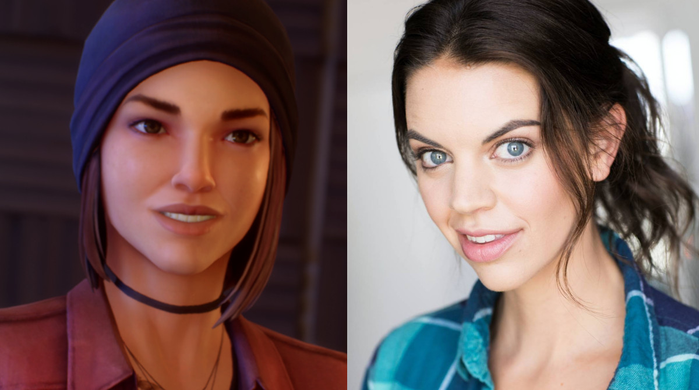

Life is Strange Before the Storm re-acquainted us with some of the characters we had come to love from the original game. But not only that, we got introduced to some new characters also. A favourite of a lot of peoples, myself included, was Steph Gingrich. She's the girl who you really need to take the time and play D&D with in [episode 1](https://davidpeach.co.uk/2017/09/life-strange-storm-episode-1/).

Steph is played brilliantly by the talented, and always-funny, Katy Bentz. Katy has been building up quite the following, which includes too [her growing YouTube channel](https://www.youtube.com/channel/UCt9oHch6tjkeKfOVzd8xSww). Every video she makes is a joy to watch. I was blessed to be able to send Katy some questions - a lot of the same questions that I also asked in my recent [Interview with Kylie Brown](https://davidpeach.co.uk/2017/12/interview-with-kylie-brown-rachel-amber-in-life-is-strange-before-the-storm/) - that she very quickly replied back with.

## The Interview

Please tell us about yourself in as many or as little words as you like.

I am an actor living in Los Angeles, California. Just passed my year mark of living in the city of hustle! I’m outgoing, independent, determined, strong-willed, caring, and passionate. I enjoy to find the simple things in life, as silly as that may sound. We can get so caught up in our day-to-day life that we forget about walks around the block, or watching the sunset. My favorite color is blue and I love Dolphins! ?

What is your favourite Book?

Not much of a reader, but I read White Oleander for one act in high school and I really enjoyed it. I do love to read self helps books though!

What is your favourite Album?

Omg! Too many. Probably a Say Anything Album. I love anything pop punk!

What is your favourite Film?

(500) Days of Summer anyone? ?

What is your favourite TV Show?

I really like That 70’s Show. The 100 and Under the Dome are some others I have really enjoyed.

Do you have a favourite film/tv/musical soundtrack?

Guardians of the Galaxy is awesome! But also The Legally Blonde Musical Soundtrack….I know I am all over the place!

What poster / posters do you remember having on your walls growing up?

I had way too many animal posters haha and these two weird ocean space posters…I know…interesting. Oh! And a Backstreet Boys poster where I circled Nick’s face and drew on the other members haha

You’re walking somewhere and your mp3 player has only a little battery left; You’ve only got time for one more song. What song do you play?

Oh man. Too many options. I get on song kicks, where I find songs and listen to them over and over until I can’t anymore haha, so I would say out of my current mix…Touch by Little Mix, such a feel good song!

Was there any defining moment in your life when you knew that you wanted to be an actor and model?

In High School when I was still finding my place amid being a teenager, I quit the dance team and joined the drama club and I’m not sure that that was when I knew I wanted to be an actor. But that was the moment where I felt like I could finally be myself and that my peers weren’t going to judge me. And that was the start of my passion for the arts and everything it stood for.

What is the proudest moment of your career so far?

Life is Strange: Before the Storm, hands down. I have never felt so amazing about a certain role and I get to see the affect this game and my character have on the players and it’s the greatest feeling.

What advice would you give to your younger self?

Works harder than you think you need to work.

Growing up, who were your heroes?

My mom and my peers around me. I never looked very far for influences in my life. My mom meant and still means a lot to me and I always look to her for guidance. One of my best friends in high school was two years older than me and in the drama club. She was someone I strived to be like. She is still my best friend to this day and someone I am riding this journey with, and it’s amazing.

Who is your biggest influence in how you approach what you do today?

My mom again haha and past and current relationships. I feel like the people I am closest with are the ones that see all of me and because they are close to me, they can be honest with me about things that I may need to do differently.

If you could ask any person – living or passed – any question, who would it be and what would you ask them?

Honestly, any elder person. And I would want to ask them what advice they’d give their 25 year old self.

In Chloe Price’s journal she writes: “I can never decide if Steph is the coolest or nerdiest person in all of Blackwell.”. What would you say to that? Coolest or Nerdiest?

Coolest!

With Steph being a new character in the already established world of Arcadia Bay, did you feel any pressure in stepping into that world for the first time?

Not at all! I didn’t know the story line prior to recording for Steph, so I came in with a fresh mind, ready to bring the character to life.

Are there any causes / projects that you would like to raise an awareness of to the readers here?

There aren’t specific projects or organizations off the top of my head, but I am a big supporter of anti-bullying projects and efforts. Bullying was a huge thing when I was growing up and I can only imagine what kids in schools are going through now.

Could you tell us a joke?

What’s a plumber’s favorite drug? Crack! I just made that up! Pretty good? haha
