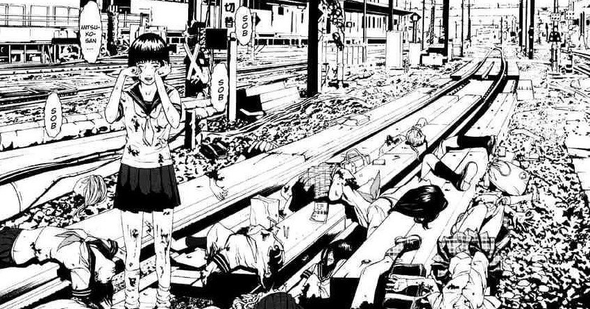

## What is Jisatsu Circle about?

Saya and Kyoko have been the best of friends since early childhood. They have seen each other grow into the young women they are today, which is where we join them.

The story opens as a large group of High School girls line up on a train platform's edge and jump together into an oncoming train. This mass-suicide is survived by only one person: the aforementioned Saya (Kyoko was not in the group). Up to this point Saya and Kyoko's friendship had become fragmented and as a result of her struggles, Saya had found solace in a girl called Mitsuko.

Mitsuko had offered comfort to Saya, as well as the other girls, and taught them to embrace their desires to self-harm. She then led the charge for the girls to all jump in front of the train.

As the story progresses we see just how much Saya's life has spiralled since her friendship with Kyoko began breaking down. Her father's mental breakdown; her self-harming; selling her body to substitute her father's income. The depiction of Saya's life is done with a brutal honesty that made me root for Saya all the way to turn it all around.

## The Suicide Contagion

The character, or persona, of Mitsuko seems to me to be a dark internal part of these girls' psyches. Almost as though 'Mitsuko' represents the point at which they have seemingly reached the point of no return in their mental state.

Mitsuko is initially represented as a single character that Saya tried following into death. However, it is later revealed to be more of a persona that was taken on by the lead girl. A persona that seemed to ensure that death's grasp was truly upon her. I remember reading about the death drive theory not long back and that's what this feels like to me.

> In classical Freudian psychoanalytic theory, the death drive (German: Todestrieb) is the drive toward death and self-destruction.
> 
> The Death Drive, Wikipedia

There is a possible supernatural flavour mid-way through the story. However, this is never expanded upon or confirmed. This is when an online forum is found discussing the group suicides, with comments seemingly added by the late victims. I was relieved, however, that the story didn't go down that route. We remain grounded in the real horrors of the story. Those horrors being the struggles of becoming an adult and dealing with any number of pressures thrust on you in life.

## Full Circle

This story doesn't have a monster to defeat or a single person to save. Instead it treats these issues as ongoing struggles that repeat themselves over time. All of the girls who have had Mitsuko "awaken" in them have all fallen to her powers. Always leaving one remaining from the current leader's group to lead the next one.

The only issue I had with the story, if I'm honest, is the lack of hope that the story seemed to have. Now I'm not naive to think that this story could have a happy ending in the classical sense. However, the deaths of certain characters, along with many faceless others, seemed to be inevitable. It would have been nice for someone to have been able to claw their way out of their seemingly-sealed fate.

## Summary

Although I'm lucky to have never had suffered with any of the illnesses represented in this story, I still appreciate it for how it treats the subject matter. The things that these girls do are never glorified. If anything, this felt almost like a warning to always watch out for your friends. Kyoko mentions about how when Saya was going through the early stages of these feelings, she was too preoccupied with a fleeting love affair.

This, she admits, was an error that she came to realise all to late.
