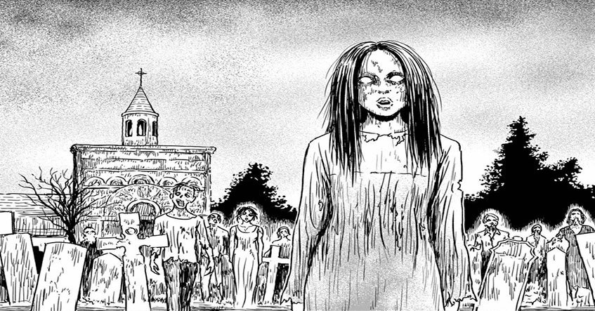

> Finally I get to board up the windows. When the zombies come, the zombie buffs will be the last standing!
> 
> Shinichi seems almost excited about the impending doom — She is a slow walker

## She is a Slow Walker — Synopsis

The story centres around Shinichi and his girlfriend Yumi. We join them in mid argument about what the best type of zombie is — slow or fast. Shinichi is of the opinion that faster moving zombies are the better ones. Whereas Yumi is a firm fan of George A. Romero and favours the classic slow-moving zombies. Not two seconds after storming out in anger, Yumi runs back in, having just been bitten by a zombie.

It turns out that the world outside has quickly evolved into chaos, with the infected attacking the living right outside their door. They lock themselves inside in the relative safe, but Yumi has already been bitten and they both suspect she'll soon turn.

Once she inevitably turns, luckily for Shinichi, she is of the slow-moving type. She would be happy with herself with that, I think. But she's not only slow, she's _extremely_ slow; taking ages to move even an inch. After Shinichi has a close call after overestimating his own safety, the two of them reach their final destination. The ending is a complete left turn and I couldn't help but smile at it.

## Part of the I am a Hero universe

When I first read 'She is a Slow Walker' I thought it was it's own story in it's own little universe. But I have since discovered that it is, in fact, part of the much larger universe from the manga 'I am a Hero'.

'[I am a Hero](https://amzn.to/32HSKh6)' is a long-running zombie manga series by Kengo Hanazawa. It is about a man finding himself trying to survive in a post-apocalyptic zombie world. I haven't read it yet but I was vaguely aware of it before hand.

What Junji Ito's story does is focus in on one couple and their particular story, within the overarching 'I am a Hero' world. Presumably this is separate from the main narrative of 'I am a Hero'. However, I haven't read it yet so can't confirm this. But what I can confirm is that this story is freakin' awesome.

## In Conclusion

It takes a special kind of person to find grotesque gore in fiction sometimes funny, and I think I may be one of those people. Although things don't go great for our characters, this story does have a great level of humour, especially in it's closing scene.

This one isn't for the faint of heart, but it's also not one of Junji Ito's most graphic works. 'She is a Slow Walker' is a fun little story that you may not have come across from Ito before now. Not only does it have the power to gross you out, but it may just have you laughing out loud at those very same panels.

You can find this story in the book "[8 Tales of the ZQN](https://amzn.to/2Aeyo2O)". However, if you don't read Japanese, you can rad a translated version [here](https://mangakakalot.com/chapter/she_is_a_slow_walker/chapter_1). (Please always support the author where you can buy purchasing his works where available — Thank You).
