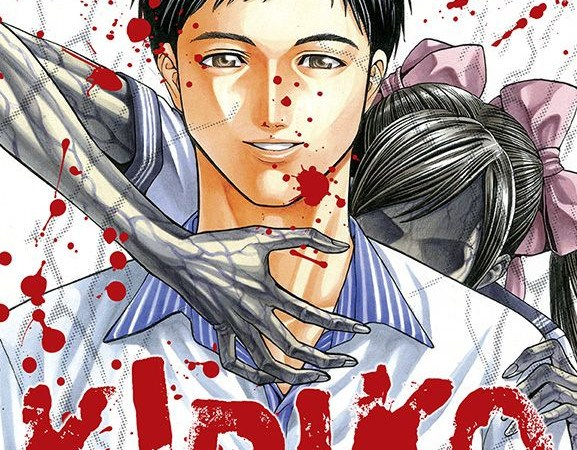

Kiriko is a five-chapter, standalone horror manga story based around a small school reunion. Its namesake comes from a person who died seventeen years previous during the classmates' formative years. This school reunion takes place in a now-closed-down school that is off the beaten track. Each of the small class of six arrive after receiving a mysterious invitation sent by someone calling themselves 'K'. This reunion, the invitation states, is to commemorate the 17th year anniversary of the death of the seventh member of their class, Okumura Kiriko.

After arriving, they each begin catching each other up on their lives since school. Some are more withdrawn than others but nonetheless they each talk amongst themselves. It isn't long, however, before the facades of each of their lives begins to crack and the truth begins seeping through those cracks.

They will soon discover that they aren't alone in this reunion; that there is in fact a seventh person attending this private reunion. Is this secret member the titular character Kiriko herself, or something else entirely?

## A fast, brutal story

I would estimate that this story takes place over the course of no more than an hour or so. There are no real time lapses - everything feels pretty real-time for the most part. And the swiftness at how those who die get killed becomes faster as the story continues. It really is a story that moves at break-neck pace.

The deaths throughout this manga are quick too. And they are brutal. Each student seems to be getting hunted by something in the shadows - something they fail to identify. The ways in which each doomed person is killed is done so in a - dare I say it - beautiful way too. There is something hauntingly gorgeous in how these bodies are shown when others find them. Each way in which they are killed seemed to me to have underlying comments on that persons character too.

I can't really go into the specifics of my theories on that here, as I don't want to spoil the story for you. But please feel free to chat in the comments below, or over in the Facebook group.

## There is a sadness there too

The best stories in my opinion, no matter how bizarre or otherworldly, are those that touch on the human condition. Kiriko does this really well. When the full story is revealed towards the end, we are shown the real sadness that anchors this whole story down. It's hard to discuss specifics without ruining the ending, but believe me when I say that there is a grounded truth with a heart and sadness that gives energy to the horror within.

This truth is revealed in what I consider to be one of the more interesting, unpredictable, twists I have read in a manga.

## In Summary

Kiriko is a fast-moving and relatively short horror manga story. Because of its short timeline and single location, I find myself running through the story in my head sometimes. I have found that each of the deaths were memorable even days after reading too. I can still picture each one with vivid detail and they still give me that little smile that only a good horror manga can.

I'd probably recommend this story to anyone who was curious about getting into reading horror manga. Yes, there are staple authors that are always good starting points - Junji Ito or Masaaki Nakayama, for example. However, this one-shot story from Honda Shingo would be as perfect a place to start as any, in my opinion.
