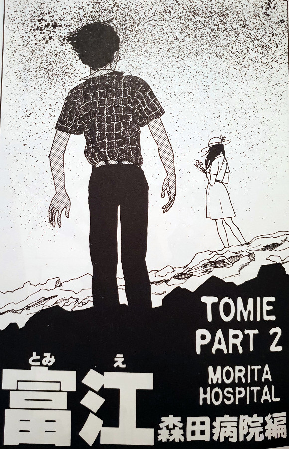
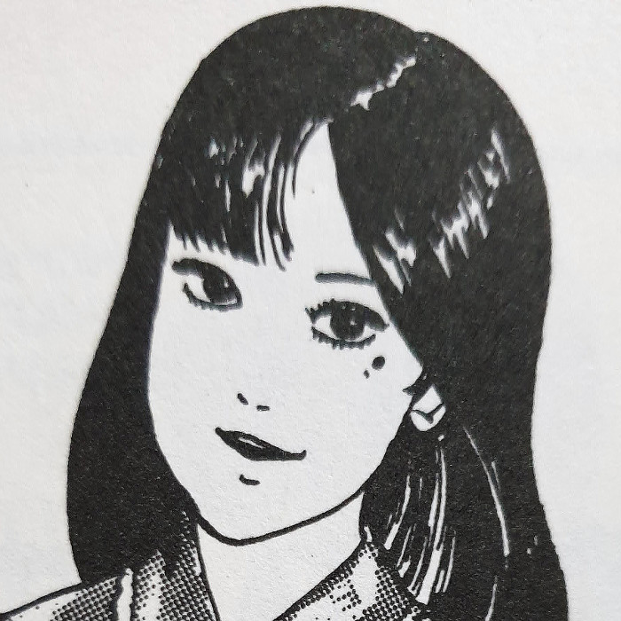
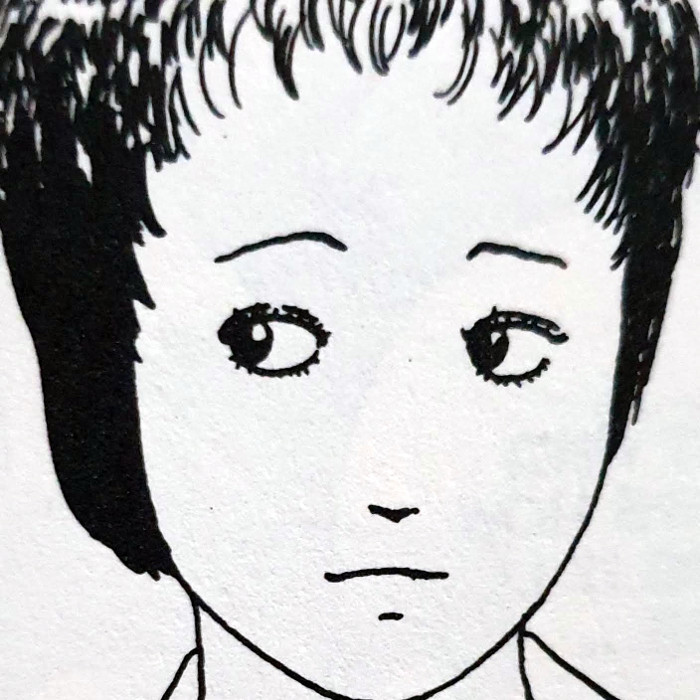
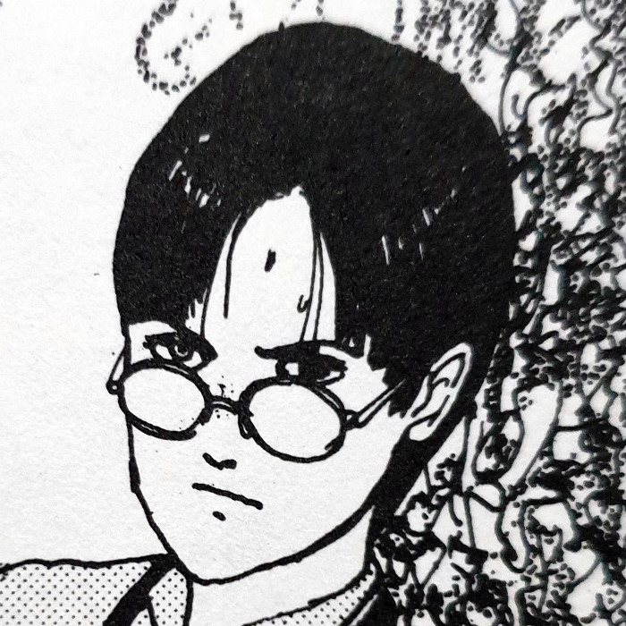
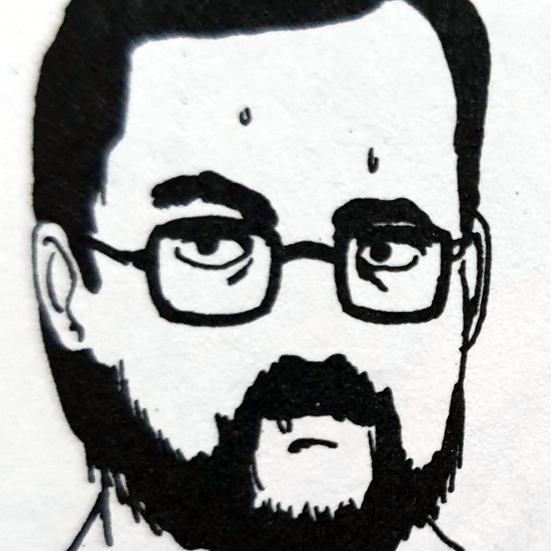
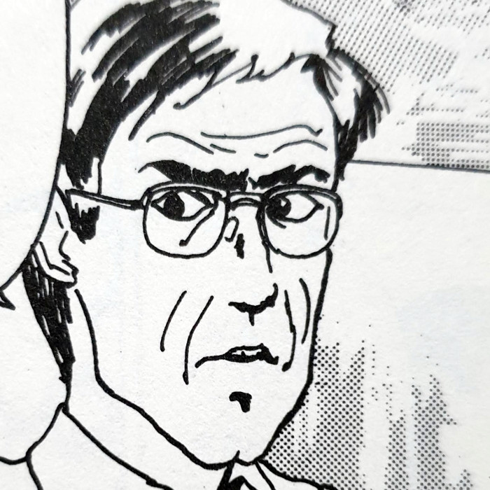
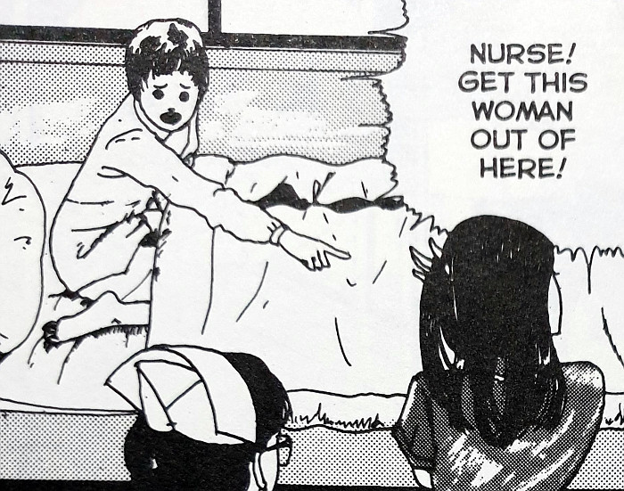
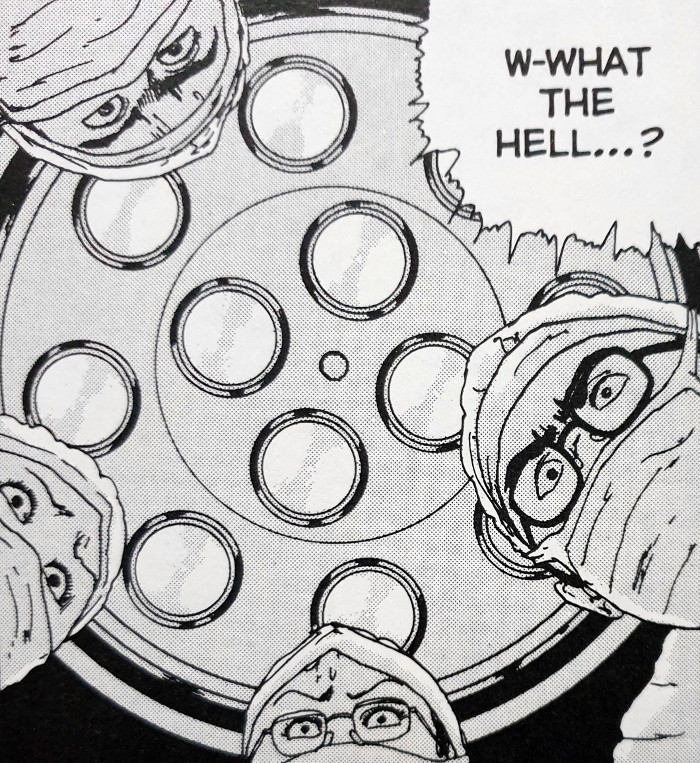
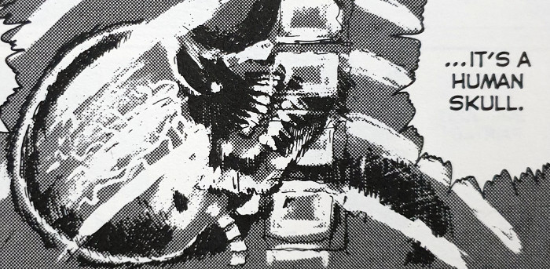
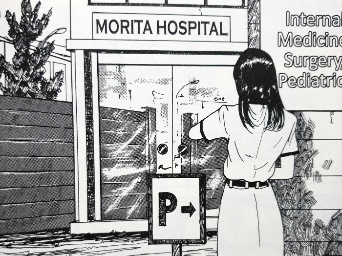

> He speaks ill of you to no end... and yet, I guess that's the kind of man I like.
> 
> Tomie — Morita Hospital

## What is Morita Hospital about?

Yuki is a school girl who is being kept at Morita Hospital awaiting a kidney transplant. She waits patiently while her condition slowly deteriorates. Often found sitting with her is her friend - a boy named Tadashi. The pair seem close, but the boy seems slightly withdrawn from the room when we join them.

As he leaves Yuki to her hospital room, she spots him out of the window walking with another girl. She knows nothing of the other girl, except for what she can see of her. This new girl is beautiful and has a distinctive mole under her left eye. We as the reader know that this is Tomie, but these people know nothing of her or what she is capable of.

Although it isn't explicitly stated, I believe that this is the Tomie that Reiko found growing beneath the cave at the end of Part 1. Tadashi reveals how he met Tomie at the beach, which in itself isn't that strange. But considering the fact that Tomie is referring to herself as Reiko, my theory is that she killed the original Reiko and assumed her identity. I can't confirm this, but I like to think that this is what would have happened.

## Main Characters

<!-- 
 -->
<ul style="display:flex;gap: 1em;justify-content: flex-start;list-style-type:none;padding-left:0;">
<li><figure>

<figcaption>Tomie</figcaption>
</figure>

<li><figure>

Yuki
</figure>

<li><figure>

Tadashi
</figure>

<li><figure>

Hospital Director
</figure>

<li><figure>

Detective
</figure>
</ul>
<!-- 
 -->

## Tomie is a spoilt brat

We start to see the spoilt brat side of Tomie in the Morita Hospital story too. When she is walking with Tadashi, she tries to get him to buy her some new earrings on a whim. Unable to afford any more financial offerings of love, Tadashi unwillingly causes her to go storming off in search of a rich man who can cater to her wants.

A common thread of her personality is the wanting to drain the men who dote after her of all of their money. She just wants to be pampered and waiting on; told she is beautiful; and never crossed or betrayed in any way. I agree with not being betrayed, but what she considers betrayal, and what normal people consider betrayal, are two completely different things.

I felt that this story went further in developing her character for us than her first outing did. Of course, that initial story we discussed last week was just the kernel of the idea. Once he had received the praise he did for Tomie part 1, I assume it gave him the conviction to go further into his imagination, leading him to really begin fleshing her story out.

## The organ donor

Due to an unfortunate encounter between Tadashi and Tomie, she ends up in hospital and ultimately dying. The doctors then, under advisement of someone claiming to be Tomie's next of kin, decide not to let her healthy body go to waste. I won't spoil who this apparent next of kin is, but it is somebody you may know from before.

It turns out that she also happens to be a perfect match for a certain patient awaiting a certain kidney transplant. The operation goes ahead and with great success. However, the spirit of Tomie is strong and she can not be killed - not easily at least. Her darkness will always find a way back to the light, squeezing through the cracks from within any living flesh.

Tomie upsets Yuki

Something strange during surgery

A very strange X-ray

Tomie arrives at Morita Hospital

## In summary

The second part in the Tomie series continues pretty much from where we left off. However, it does take the story into a new direction with new players. This seems to be a running theme throughout the series. Tomie will show up in new people's lives and pretty much just put them through hell.

Although not my favourite in the series, Morita Hospital is another layer across the character of Tomie. I think Junji Ito was really starting to find his feet with his artistic style in this chapter. Especially with the final panels and seeing just how Tomie manages to keep her spirit alive.
