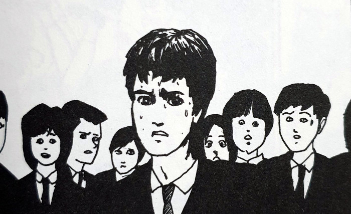

> My friend Tomie is dead. Pieces of her body were found scattered everywhere.
> 
> From Tomie (Tomie part 1)

This first entry in the Tomie series is fascinating to me for two reasons. Firstly, it is the starting point for all of the stories that follow. Perhaps not all of them are linked to this specific incarnation of her, but it is our first meeting with the young lady. And since she has gone on to have such a huge legacy within the world of Horror Manga, is worthy of discussion.

Secondly, it is the first manga story that Junji Ito completed - while he was still a dental technician. He submitted it to the Umezu Awards where he went on to earn an honourable mention for it.

## Main Characters

Tomie

Reiko

Mr Takagi

## The beginning of a legacy

In this first entry of the series, we are introduced to Tomie and how she has seamingly managed to rise back from the dead. Of course, we only know this at the start from the account of Tomie's friend, Reiko. However, we come to learn that not only did she in fact die, but that the witnesses went to some very extreme lengths to hide her body.

We learn how she has most likely been sleeping with her Teacher, who himself is also married. This in itself is a light introduction to a large facet of her character - that she really has no moral boundaries. If she wants something she goes after it. And most of the time she gets what she wants.

There isn't too much in the way of Ito's signature "body horror" in this story, save for the very last panel. But gosh how I loved how he decided to close this first chapter. We get to glimpse the genesis of Ito's flourishing talent in that very last scene.

## The start of a great artist

Junji Ito is now regarded as a titan within the horror manga community - in all manga in general, in fact. When you look back at this chapter after seeing his more recent stories, you will notice the difference in quality immediately. The detail isn't anywhere near where we now know his work to be. But that does not detract from the story's impact.

What you have to remember is that this is his first published story. It feels akin to the debut albums of great bands - like Nirvana's 'Bleach', or The White Stripes' eponymous debut. Yes, it's rough around the edges and not indicative of the quality that comes later, but it is the honest, unfiltered core from which his talent would come to grow.

Tomie has a fall

The boys of the class

Tomie walks back in

## In Summary

The opening chapter in the Tomie series is a staple in the chronology of the Horror Manga genre. It not only begins the life of the beloved Tomie, but also marks the beginning of one of the most exciting artist careers within this world.

While this won't show you the wildest imaginings of Ito, or his better artistic work, it will enrich your knowledge of the genre. I'm eternally grateful to Junji Ito for keeping Tomie's story open like he did in this one. And also for continuing this lasting saga for the years that have followed.

Welcome to the story of Tomie.

## Final thoughts with slight spoilers

I can only imagine what it must have been like to read this when it came out. Without the knowledge of Ito and his now-heavy back catalogue. That moment two thirds in when the teacher stands over Tomie's dead body with his students. All stripped down to their underwear and ready to cut her up into twenty pieces with knives and saws.

As mentioned above, the only real body horror in this story is on the closing page. And that whole regrowth from one of the parcels of Tomie's dismembered body parts was cool as hell. This was the demonic glue that brought the whole chapter together for me. Not only did she arise from the dead in some ethereal way, but that she is physically capable of regenerating from separated pieces of her body.
