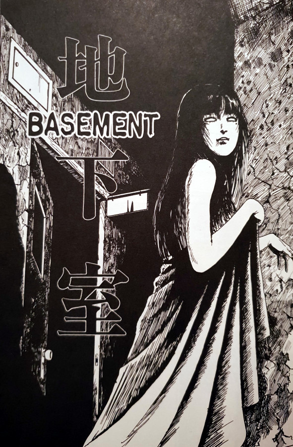
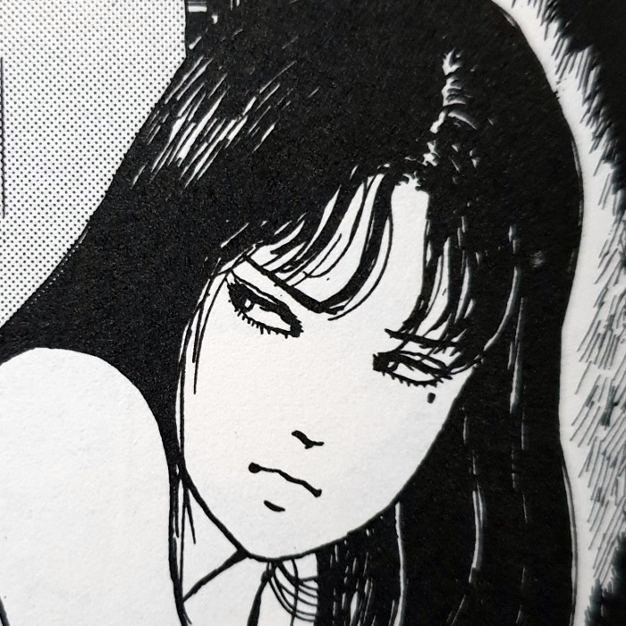
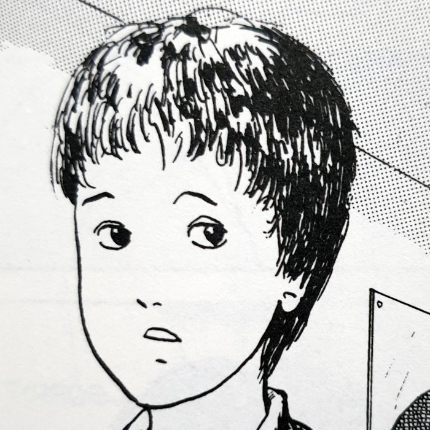
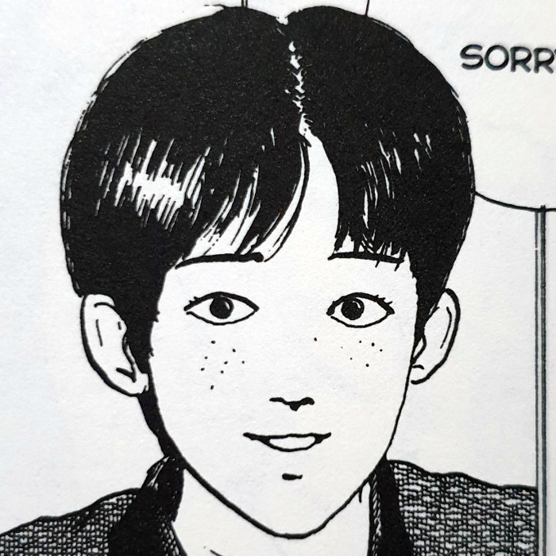
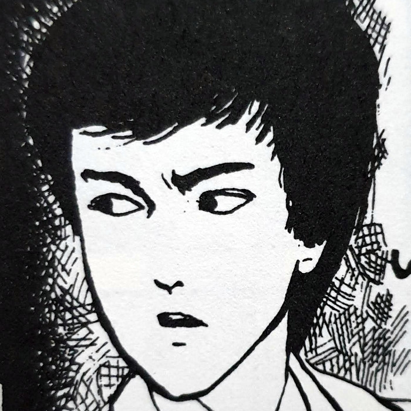
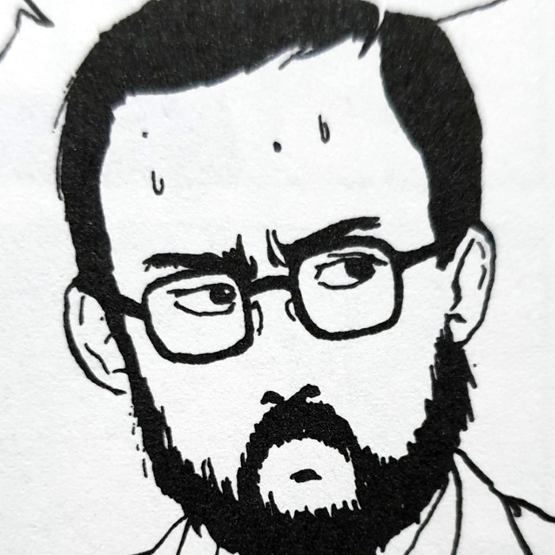
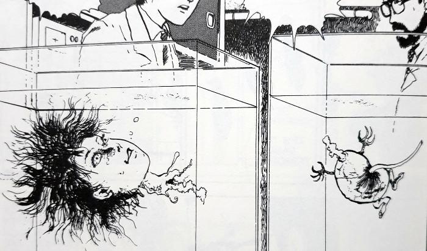
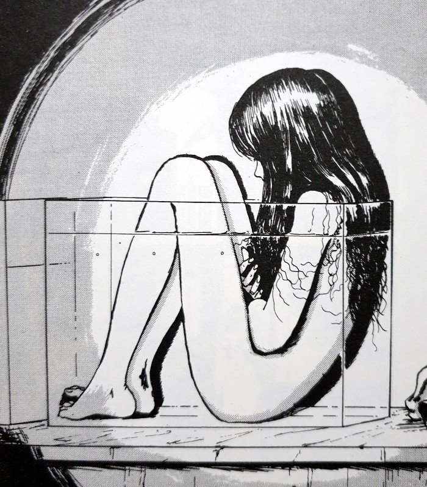
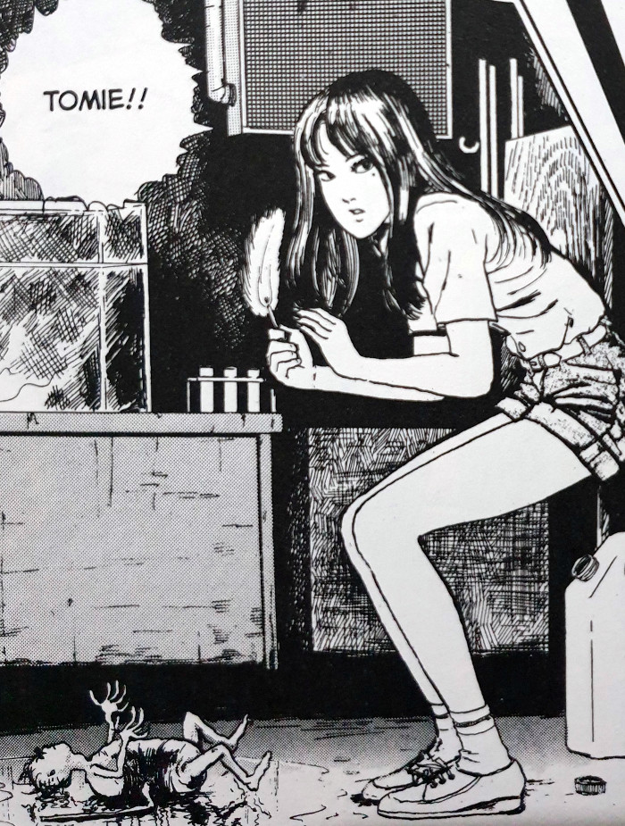

> You know he tried to kill me? I've a hunch it was your idea, though.
> 
> Tomie — Basement

## What is Basement about?

Basement follows on directly from the events of [Morita Hospital](https://davidpeach.co.uk/2018/05/17/morita-hospital-tomie-part-2/). We saw how the kidney that Yukiko received had mutated and formed a complete head - the head of its donor, Tomie. Well, the doctors managed to separate the head and remove it and the donor kidney out of Yukiko. The Doctors have now stored those pieces in a secret basement area for studying. They wish to understand how these body parts are able to regenerate. And regenerate they do - and at an alarming rate.

The main character in Basement is a young, inquisitive boy named Sato who is currently admitted to the hospital. He follows his nurse into that basement for clues to the rumours he's been hearing of a mystery in the basement. However, he will discover more than simply a mystery as he bumps into the lady on everyone's mind - Tomie. He also befriends Yukiko and starts to fall for her own unique charms. That is until Yukiko's charms become threatened by an unstoppable force from within. (Sato is apparently one of those rare people not to fall for Tomie's power - strong of heart and mind, it would seem.)

As the story continues we see how the flesh spirit of Tomie fights to return - back into the beautiful woman she was before. But now her DNA has multiple pathways within the Hospital from which to emerge. But what will happen when multiple Tomies emerge together?

## Main Characters

Tomie

Yukiko

Fumihito Sato

Dr Tamura

Hospital Director

## Changes

Basement is a story all about change and rebirth - like much of Tomie's stories to be fair. We follow her as she fights to come back to the world of the living, becoming reborn and yet still maintaining the same consciousness as her previous incarnations. This is what I meant by the term "flesh spirit" above. She seems to be able to inherit memories from the past versions of herself, even carrying grudges along with them.

And remember Yukiko from the previous story? Her continuation in this is pretty interesting too. It seems that the use of Tomie's kidney in her previous operation, although removed soon after, may have left some of its cells behind. And if Tomie gets her grip on you, no matter how slight, she takes a firm grasp and doesn't let go.

What I found perhaps most interesting in this part of the Tomie series, was yet another aspect of her character that was revealed. Although all of the replicas originate from the same flesh, there seems to be some animosity between each of them. Like rival sisters each wanting to be the favourite. Except each will stop at nothing to physically rid the others from existence. Each and every Tomie wants to be the centre of attention, and will share that limelight with no-one - not even with herself.

Strange specimins

Tomie... regenerated

Tomie tries to burn her own

## In Summary

This third entry in the [Tomie collection](https://davidpeach.co.uk/tag/tomie-collection/) delves a little deeper still into her character. Although not nearly my favourite of the stories, it does give a good conclusion to the events of Morita Hospital. As such, you will want to at least read that previous chapter before this one. Many of the Tomie stories are quite self-contained. However, there are a few, like Basement, which will need the previous entries in order to give some context to the events.
