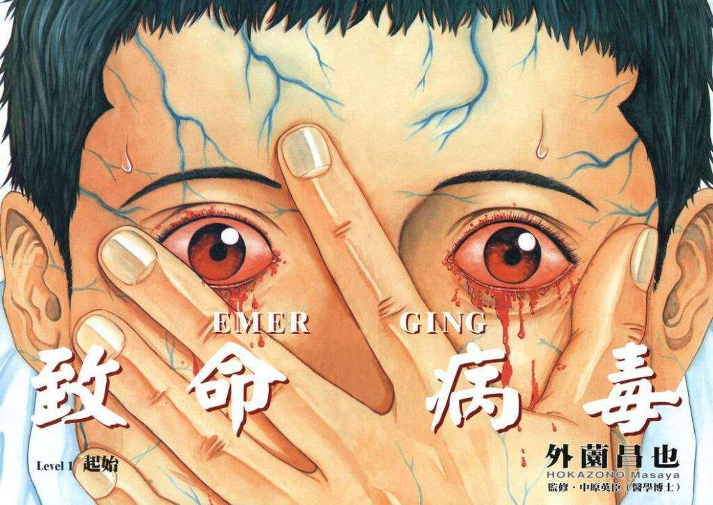

Emerging by Masaya Hokazono is the story about a relentless new virus that is working its way through Japan. The virus works quickly on its victims, essentially liquefying them from within. We join two main Doctors in the fight against this: Doctor Onotera and Doctor Sekiguchi. Onotera is the man we follow through the story for the most part. He is quite unsure of himself and his abilities at times, with Sekiguchi being a place of solid support for him.

With no clue about how to counteract the growing virus, the two Doctors head to The National Epidemic Research Center. They, with the help of the very enthusiastic Research Center office manager, try to get a hold on the outbreak. As each issue of Emerging progresses, the situation gets more and more out of control. Things become increasingly chaotic as they, along with many hospital staff, struggle to cope with the increase in infected.

Will the doctors find a way out of the mess? Can they discover the root cause of the infection in order to get some kind of answers? Will they even survive?

## Patient Zero

In stories of infections and their spreading, there is almost always a patient zero - the single place where it all begins. Emerging is no different. In this engrossing horror manga, the story begins with an already-infected businessman who is sent home early from his job. It is during his journey home that the possibly-airborne virus is shown to be spreading around the train carriage as he coughs uncontrollably.

However, it is in a chance encounter with another of the story's main characters, schoolgirl Akari, that the virus really gets its foot in the door. As crowds of people are waiting to cross the road, Akari notices the businessman's face - it looks to be very bloated and blood-shot; fit to burst, even...

...which is exactly what happens! His face explodes, throwing the contents of his liquefied flesh and blood out across the people around him. Akari is one of the many caught in the fountain of liquid flesh that ensues. This is where all the fun begins.

## All in the family

One of the two doctors I mentioned earlier, Dr Onotera, also happens to be a close family friend of Akari's. So much so that she calls him brother when meeting him in hospital. Their paths cross early on and remain tight throughout the story's course. Her growing infection from Patient Zero is a consistent anchor throughout Emerging, pushing Onotera harder to find a solution to this surprise outbreak. But if you want to find out her fate, and the fate of all others, you will have to read it for yourself.

Although the virus does begin spreading quickly, we remain with the same group of characters for most of the journey. This helps to ground the story amongst all of the chaos that is happening. I grew to like those characters and really rooted for Akari to make it through. Another character of note is Mori, the office manager, and virus fanatic, working at the Epidemic Research Center that I mentioned earlier. She seems to almost root for the virus at times, but always from a twisted kind of professional interest.

Mori was a funny person and even served as a slight comedic respite at times, in an otherwise-serious story.

## Bloody Hell!

This story has blood, and lots of it. A lot of the effects of the later stages of the virus are of the weakening of victim's bodies. To the point when skin easily tears from the bone when held. I was impressed with how the artist managed to make some of these gross scenes almost beautiful in a way. The way in which the blood almost spiralled out of Patient Zero's face at the start, was the moment when I knew this would be an enjoyable read.

Later on, there is an awesome panel that shows the silhouette of a patient violently convulsing, vomiting blood into the air. That single panel is probably my favourite from the entire story. Just the simplicity of the silhouette drawing that still contains so much energy really peaked my interest. It's these sorts of stylistic decisions that Masaya Hokazono makes throughout Emerging that helps it stand out as a truly great horror manga classic.

It is through the slow, graphic degradation of Akari's body that we get to see a close-up affect the virus has. Akari's continued efforts to help his Sister seem almost lost at times, as the real horror of the virus' powers take a hold of her. Masaya Hokazono really has no issue with putting one of his main characters through absolute hell. Her pain can be felt through the pages, with the artist leaving nothing to the imagination. But will she come out clean on the other side?

## In Summary

Emerging is a gripping horror manga story, similar in vein to Manhole by Tetsuya Tsutsui. If you enjoy the continual spread of infection that seems to always be one step ahead, you're sure to enjoy Emerging by Masaya Hokazono.
