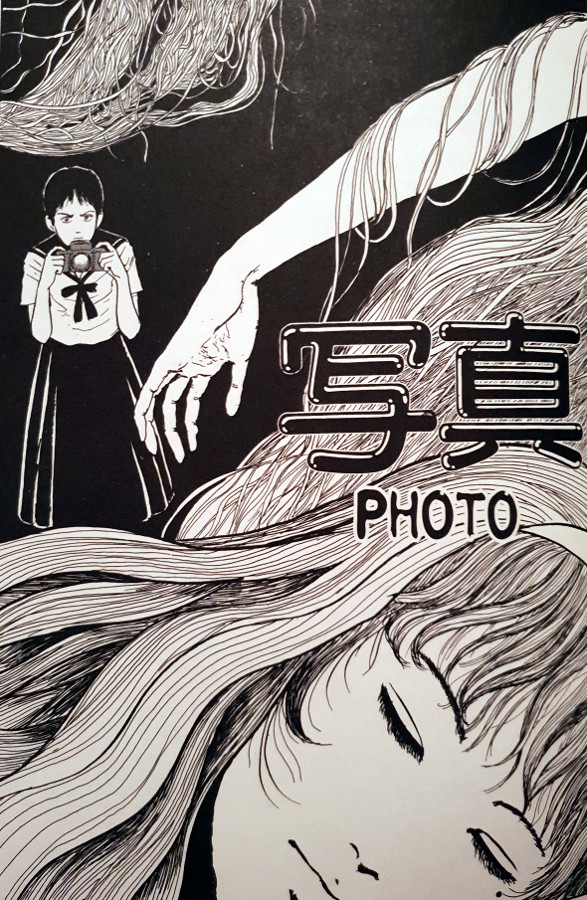
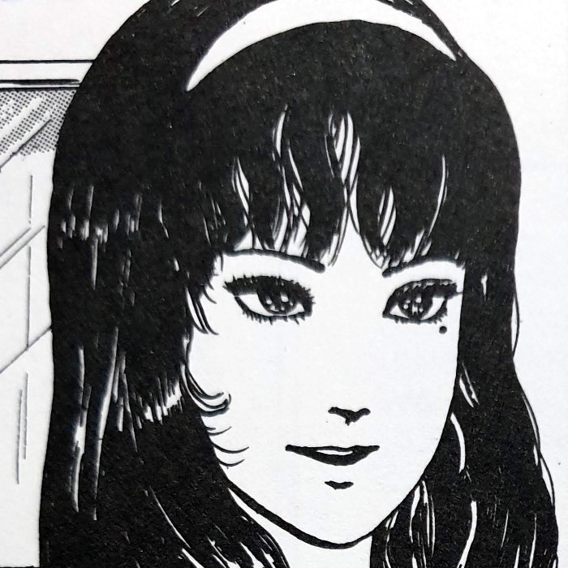
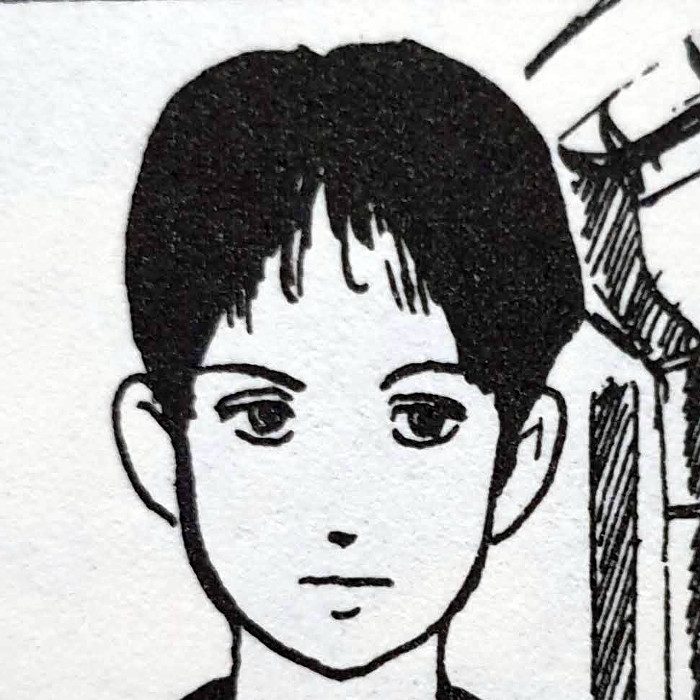
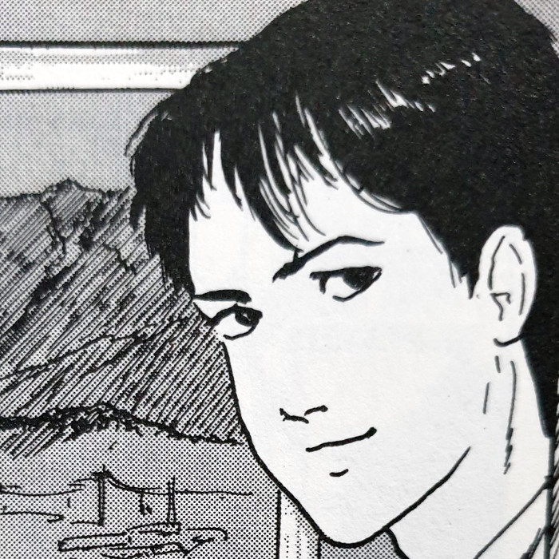
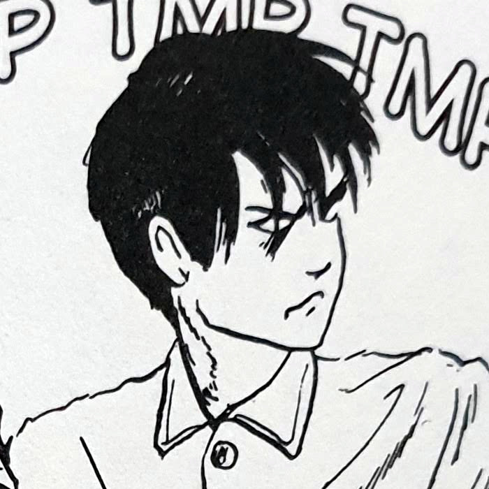
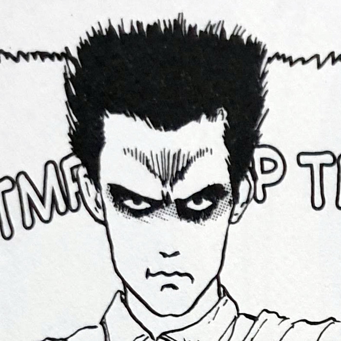
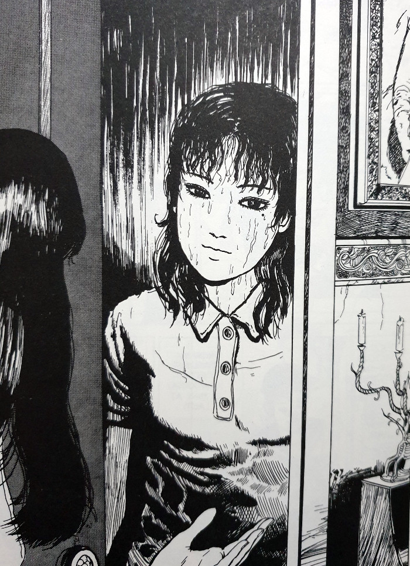
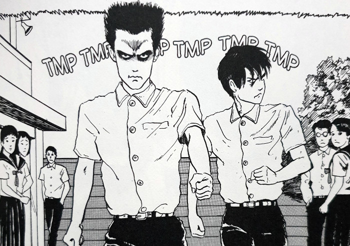
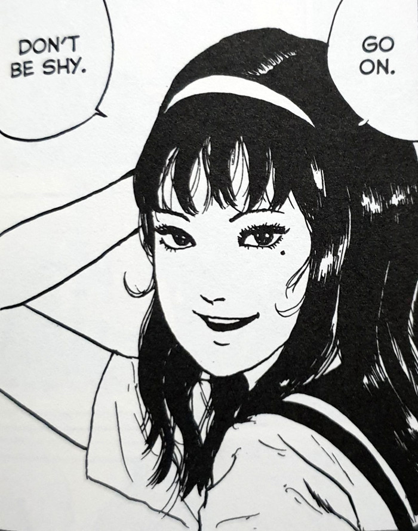
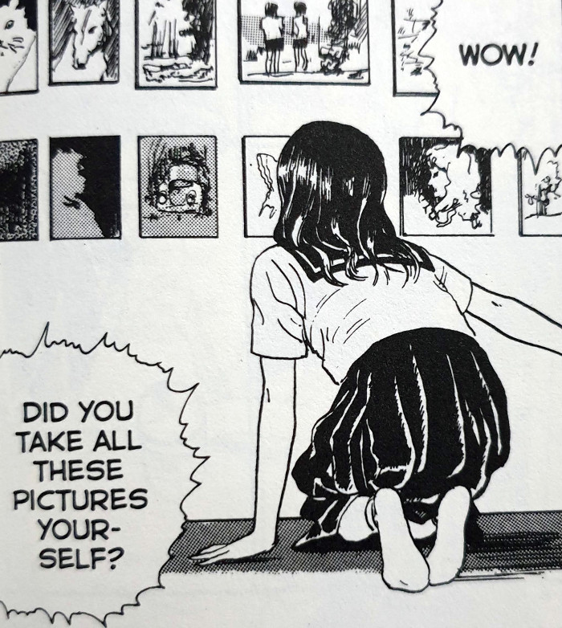

> Before I moved here, I lived in spain for a while. I was born in France, though.
> 
> Tomie offers a possible explanation as to her origin. — Photo

## What is Tomie Photo about?

Tsukiko is a girl in school, who also happens to be a member of the photography club. However, she is using her skills with the camera to turn a quick profit, whilst preying on the desires of her peers. She will take photos of certain boys in school and then sell those photos to any girls who have a crush on them.

Tomie, meanwhile, is the head of the school's ethics committee, and immediately sees an issue with Tsukiko's little business venture. She hatches an elaborate plan to entrap Tsukiko, causing her to take photos of her whilst talking about the profit to be made. Just as she planned the teacher overhears this and Tsukiko is immediately suspended from school: Tomie 1 - Tsukiko 0.

However, when Tsukiko gets those photos developed, they reveal a disturbing side of Tomie that the naked eye can't detect. Something dark hidden beneath the surface; something evil. But when she tries to use these photos to exact revenge on Tomie, things take a nasty turn for her.

As an aside, it is interesting how Tomie Photo begins. We see her in the opening pages arriving at an unknown mansion of an old man and his daughter. Once she enters, we cut forward in time to Tomie being settled into her apparent new life. This mansion will feature in future stories too, including the chapter quite aptly titled '[Tomie Mansion](https://junjiitomanga.com/mansion-tomie-part-6-by-junji-ito/)'.

## Main Characters

Tomie

Tsukiko

Yamazaki

Kimata

Taichi

## Where is the moral centre?

What I found most interesting in Tomie Photo, was the placing of the moral centre in the story. Things aren't as simple as Tsukiko good; Tomie bad. In fact, I would argue that Tomie is on the side of right for most of it - all of it perhaps, depending on how you interpret her actions. (See bottom of this post for my reasoning with some spoilers). We saw this theme a little bit in the first chapter where, although she was manipulative, didn't deserve to be killed and cut up by her teacher. Yes I know that particular death was an accident, but the disposing of the body wasn't very dignified, was it?

But no matter where you place Tomie, Tsukiko is a bit of a bad girl herself. Essentially using her customers' weaknesses in order to charge large sums of money for the photos. And at no point does she display regret for this - she's too busy trying to keep herself alive towards the end from a very pissed-off Tomie.

> I mean, really. Taking advantage of those poor girls, not to mention the boys you photograph.
> 
> Tomie seems to be on the moral high ground.

This kind of exploration of character is one of the many aspects of Junji Ito's work, specifically in this series, that make me love his stuff. Nothing is simply good and bad; black and white; light and dark. There is an unsettling shade that weaves it's way into most things throughout these stories. But don't get me wrong, there are some purely innocent people who get caught in Tomie's path along the way. But we'll come to those in due time.

Tomie arrives at a strangers house

The Ethics committee are on the move

Tomie having her photo taken

Tomie seems to admire Tsukikos photos

## In Summary

This chapter is a favourite of mine from the Tomie Collection. It has an interesting exploration of character between protagonist and antagonist. Not only that, but even a few surprise left turns that took me off guard on first reading. The world begins to open up even more with this chapter also. Not only with the introduction of new characters, but also with the mansion she arrives at in the opening pages. This mansion will be explored further later on, which helps tie these stories together even more.

Although part of a bigger story, this is actually one of the chapters that can be enjoyed completely on its own too. The last couple have been continuations of the same thread in Morita Hospital, but Tomie Photo shifts gear - opening up the world a little more for my favourite manga lady.

## Interpretation of Tomie's actions (some spoilers)

My reasoning as to why she could be considered "good" in Tomie Photo, is down to the possibility of her being possessed by an evil alternate persona. We see it time and again through this series that she has the outward appearance of a normal woman. It only tends to be once she's triggered somehow that things turn nasty. There are moments when these triggers don't necessarily show her to be unveiling her true self, but rather her true self revealing itself against her will.

We can see this in that final harrowing scene in Tsukiko's home. She calls Tomie a "monster", which triggers a reaction in her that appears to be against Tomie's wishes. This causes another head to start growing from her body. Tomie pleads to her bodyguards / lackies to cut it off of her which, in true Ito fashion, they do.

If indeed there is a foreign body within her that causes this, as opposed to her being in control of it all, it gives Tomie an even more multi-faceted personality.
