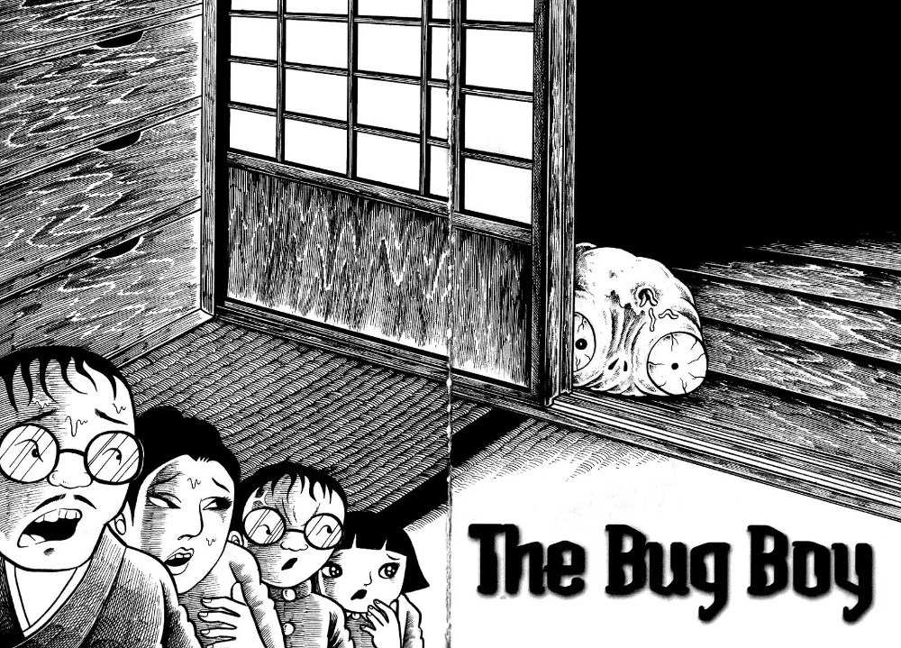

## What is Bug Boy about?

Sanpei is a young boy whose life is pretty much hell for him. Teachers and students pick on him on a daily basis; his parents treat him with contempt over his bad grades. His only respite comes in the form of stray animals and creepy crawlies that he befriends.

Outside of school he has a secret hideout in a local rubbish tip where he keeps a few of these friends of his as pets. He feels a kinship with them, so keeps them safe in his hideout. He loves them and they love him in return. For Sanpei, this is his own heaven on earth.

However, things take a drastic left turn when, after being sent to his room by his angry father, he vomits a large red bug that quickly stings him on his finger. This very odd happening starts off a series of changes in Sanpei that lead to his transformation into this horror manga's namesake - The Bug Boy.

But just what will his life be like now that he is forever changed? We follow his new life; his new journey; and ultimately his new taste for human flesh...

## Rooting for Sanpei from beginning to end

Despite where Sanpei's change takes him, both physically and mentally, I couldn't stop myself from rooting for him from beginning to end. We love the underdog as a main character - watching someone with the world seemingly against them rise up to meet it head on. This is pretty much what Sanpei does, but in that special way that only Hideshi Hino could depict.

Despite the horrors he brings down on those who meet the pointy end of his tail, I found myself always drawn towards Sanpei's innocent centre, no matter how deep and hidden it became.

Because of this, and the journey he goes through, I found this story to be quite melancholic at times. Sanpei's loneliness, and those things that would look to do him harm, made me want to bring him home to safety. He always felt like a lost little boy, alone in the world, no matter how strong he became.

## Putting the 'Gory' in allegory

Sanpei's story also works as an excellent allegory for the raising and nurturing of children. We are shown early on that his upbringing has caused him to essentially retreat into himself and his critter friends. Instead of his parents or teachers trying to address this or offer any help, they instead belittle and bully him.

We even see his father making out that he his essentially his least favourite child - something no child should have to feel. I strongly believe that Sanpei is a direct product of his environment. The idea of a bug ultimately saving him and turning him into a stronger being by stinging him, is a direct result of those bugs being his only friends in his life.

But what also interested me later on in this story was how Sanpei began looking back to his former self after a particularly traumatic event. He seemed to remember his human self as being overall happy - his father taking him to the zoo; his siblings playing with him.

So whilst this could be a lesson to guardians to pay closer attention to their children, it could also be a lesson to children to not focus in on the negativity in life. Yes, people in this story were nasty towards our hero, but they were the only things we were shown in his life. So of course, we assume him to have an abusive upbringing. But it could just simply be that from Sanpei's young perspective, the world was against him - when perhaps it wasn't so black and white when looking at the situation objectively.

Maybe it could just be that simple channels of communication needed to be opened between Sanpei and his guardians.

## In Summary

This is as great an introduction to Hideshi Hino's work as any I have read so far. It's not quite as intense as his Panorama of Hell, but still packs a good punch in its short sitting. I read it through in about twenty minutes, which made it a great companion for my commute to work.
