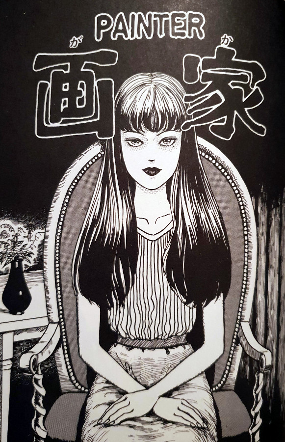
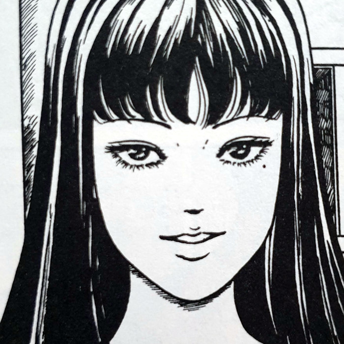
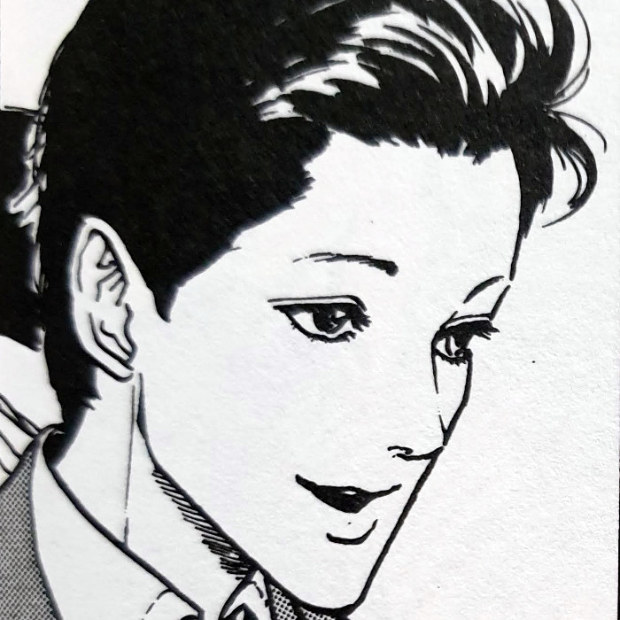
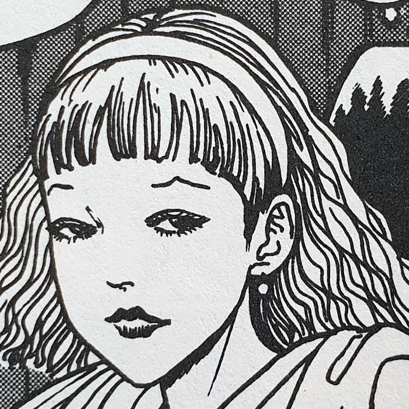
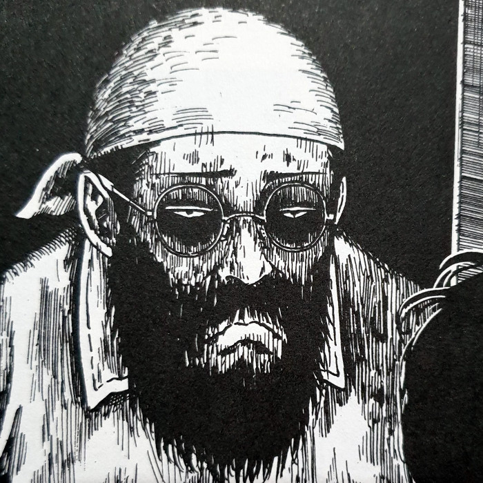
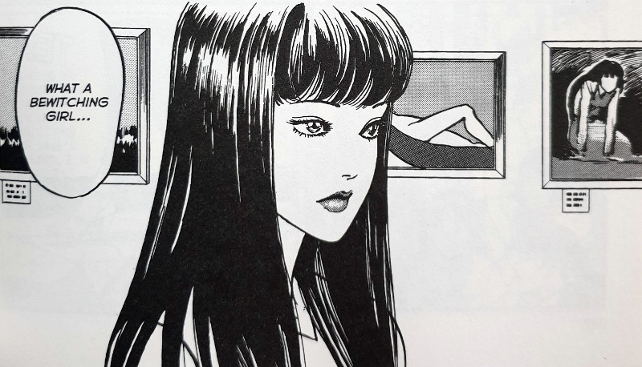
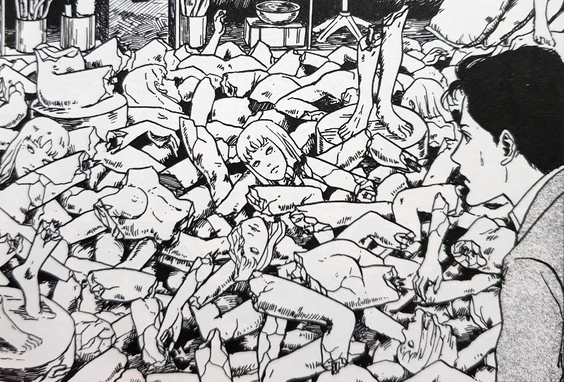
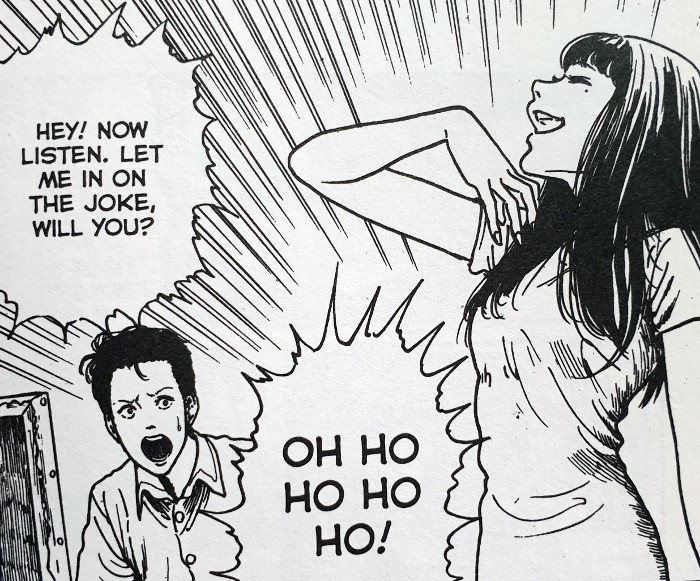

> Just look at it! You think this silly thing captures even a tenth of my beauty?
> 
> Tomie really doesn't like her portrait — Painter

## What is Painter about?

Mitsuo Mori is a Painter whose exhibition opening is where we begin this story. He is a Painter who is known for his collection of works containing a model called Nana. During this exhibition he meets a lone girl - Tomie - who seems to completely disregard his current model. Later, she follows him home and essentially forces Mitsuo's model - Nana - out, and herself in as the replacement.

As we know by now, Tomie isn't the most photogenic person in the world, with each photo bringing her hidden demonic visage to the surface. So her plan is to enlist this Painter in order to "record her beauty", as she puts it, making it immortal. He does his very best to paint her portrait and, despite him being proud of that work, Tomie just laughs him off before leaving him. According to her, he hasn't managed to capture even "10%" of her beauty.

After their fleeting relationship ends, Mitsuo starts becoming increasingly obsessed with Tomie. Or rather the memory of her. Things that would have once inspired him, no longer do so. Nothing will do it for him now - nothing but that exceptional young woman with whom he came to meet briefly. But how far will Mitsuo's increasing obsessiveness take him down the spiral of madness? What will he do when he discovers that Tomie has found yet another artist to try and capture her image?

Will he finally manage to capture the true essence of Tomie and, more importantly, will she like the result?

## Main Characters

Tomie

Mitsuo Mori

Nana

Iwata

## Obsession

Painter really focuses in on the mental instability that Tomie manages to create within the men around her. Mitsuo, like most others who come into contact with her, becomes completely intoxicated by her, especially after she leaves him. His life is slowly consumed by the memory of their single painting session, which ultimately leads him into trying to track her down in a frenzied state of mind. I think of Tomie as a train that passes through the stations of these men's hearts and minds. She taints them with her insanity before moving on to the next.

It is sometimes hard to know if she is being sincere when she acts vulnerable towards people as well. Towards the end of this story, she is discovered in a state of somewhat fear, but it's unclear whether this is real or yet another method of manipulation from her. Going by her previous actions she has taken when either crossed or assaulted, I'm inclined to believe it's all a ploy. Just one of many methods to get what she wants from her large bag of tricks.

## A Fragment of Horror

I actually first discovered this chapter within Junji Ito's Fragments of Horror. And I think I can see why this chapter was chosen over others to represent Tomie within that collection. The artwork in Painter is amongst the best from all of the chapters within the Tomie Collection. Not only that, but the story itself is pretty well rounded too, whilst also being completely standalone. No former knowledge of the character is needed to fully enjoy this.

Within Painter we get a good taste of most of Tomie's signature characteristics as well. It almost manages to wrap up all of the important aspects of her character into one easy to explore bundle. We hear about the hypnotic effect that she has over men from her own lips; we learn about the distortions beneath the visible layers of her skin; and we get a good sense of her as a person. She is self-centred, egotistical and lacks any form of empathy towards those she hurts.

I feel that the ending manages to capture the same feeling for the first-time reader as the first chapter did as well. And it does so in an even more grotesque way than before.

Tomie arrives at the gallery

A sculptures attempts at Tomie

Tomie finds the painters skills laughable

## Closing Thoughts

Painter will live on as one of my top favourite Tomie stories - possibly due to it being the first one I ever read. It has probably the best introduction to the lady herself than all of the other chapters in the Tomie Collection. But of course, that is only my opinion. If you have never read a Tomie story, you would do well to start here. Although not the first to be published, it is probably the best opening to the large collection of stories about my favourite manga lady.
