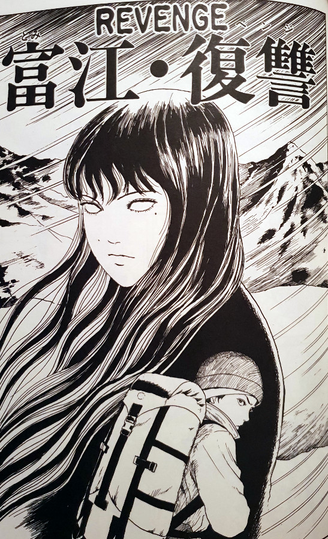
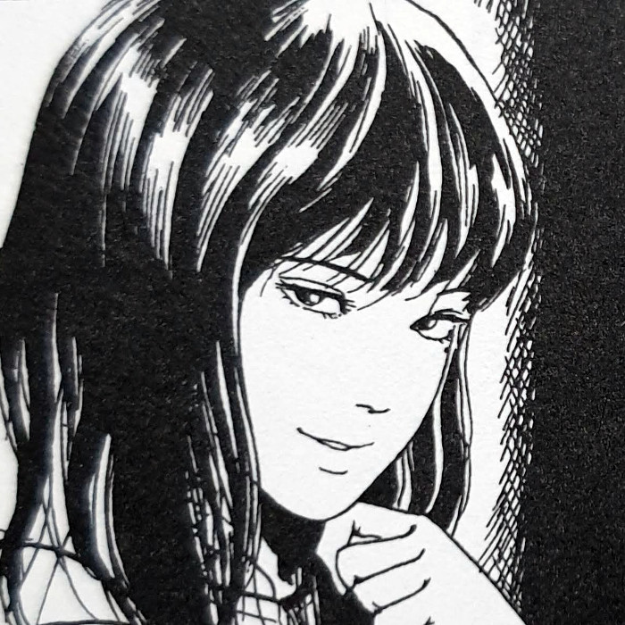
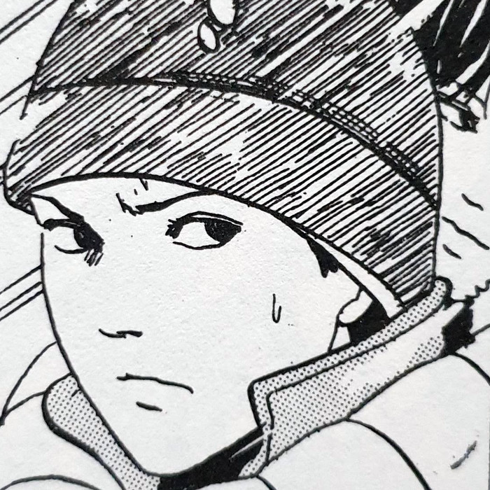
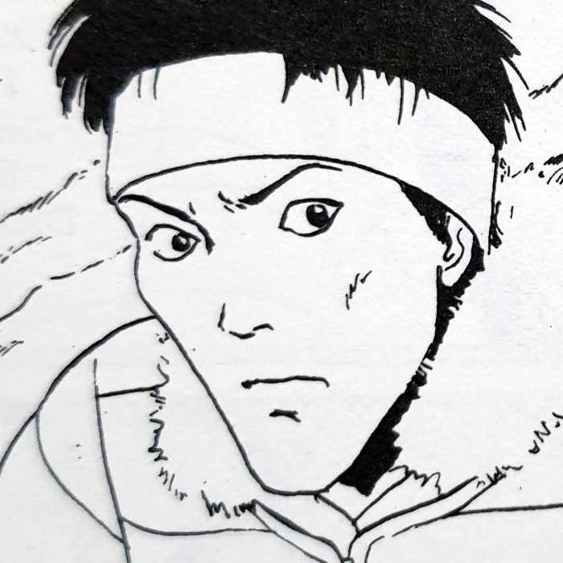
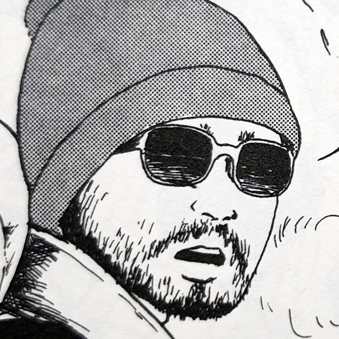
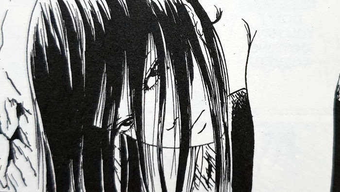
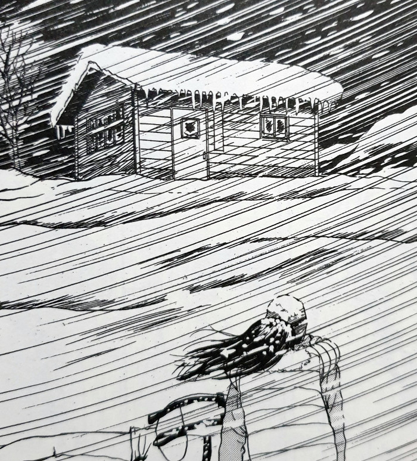
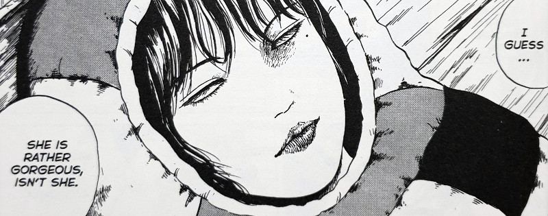
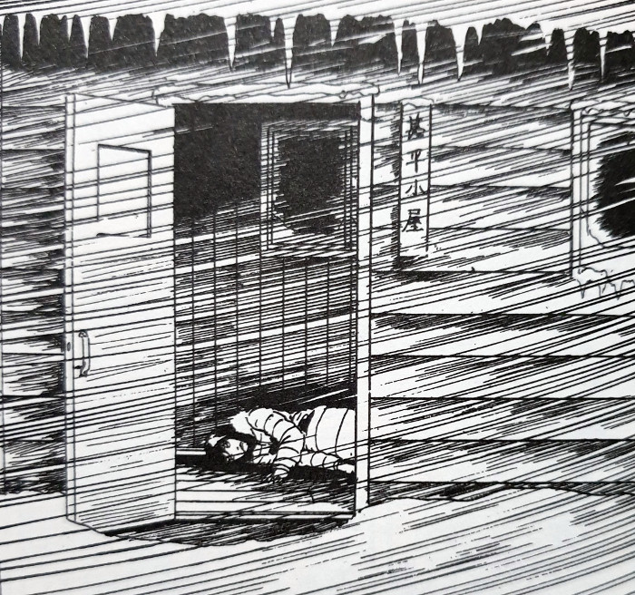

> Such a beautiful woman... having her on your back... does it excite you?
> 
> The Captain's jealousy over Tomie grows — Revenge

## What is Revenge about?

Revenge is the first standalone chapter in the Tomie Collection that I have come across, excluding the very first one. It takes place in a single afternoon and evening up in the snowy peaks of an unnamed mountain range. We travel with a group of three people who are hiking across this landscape - their reason unknown. During their journey, they come across a body buried within the snowy rocks. It's the naked body of a young woman who, amazingly to them, is still alive. That girl, in case you hadn’t guessed it, is Tomie.

After helping her out of the rocks and into one of their sleeping bags, they start carrying her towards shelter. But it isn't long until Tomie gets a mental hold over the captain of the expedition. Under her control, he gifts her all of his clothes and suffers the sub zero temperatures in just his underwear. Circumstances then lead to Tomie being left with a single member of the group, Tanimura. I wont ruin those circumstances for the people who are yet to read this chapter.

Later in the evening, Tomie and Tanimura make it to a cabin safely. Once inside, they each begin warming up together from the harsh conditions outside. But it isn’t long at all before Tanimura’s true purpose for the expedition is revealed. Not only that, but it seems that his presence is in fact linked to Tomie’s current situation and previously-buried state on the mountain. But how long will his mind stand against the will of Tomie, and what fates await him once their stories are revealed to each other?

## Main Characters

Tomie

Tanimura

Hamaguchi

Doi

## Standing on it’s own in a single time and place

Revenge is a chapter that stands completely on its own in the Tomie universe. And we get just enough background information to be able to understand the situation. I found that this approach to telling a particular part of Tomie’s life was very effective. I love how even though it is isolated from the main story lines so far, it still fits comfortably into the world as a whole.

Tomie, as a force of nature, has many strands of life and versions of herself floating around in the world. As we know, each time she is killed or cut up, she is able to grow back from the smallest molecule of flesh or blood. For this reason, it is entirely feasible for there to be countless – perhaps even unlimited – stories out there centred around any of these incarnations of the girl.

Also of interest, is that this chapter takes place at a single point in time – the mountain journey of the exploration team across one fateful afternoon. This, along with its single location in the snowy peaks of the harsh mountain landscape, give this story a claustrophobic feel. At least for me. The Kiss chapter had a similar tone with it being set mostly within Tsukiko’s apartment, but this is the first time within the collection that this idea has been expanded more fully.

Tomie hanging out of a mountainside

A cabin in the blizzard

Tomie wrapped in a sleeping bag

Open cabin

## Closing thoughts (with some minor spoilers)

Revenge is one of my favourite Tomie chapters, mainly because it poses more questions than it answers. Like what happened to the other pieces of Tomie that were scattered on the mountain by Tanimura's brother? What drove that former boyfriend of hers to take her to that mountain in the first place? What was the ultimate fate of all three of the exploration team? We can always surmise their fates from what we see in the chapter. But I think it's still left pretty open for the stories of each to possibly continue.

I'd probably list this chapter as one of the best ones from which to dip one's toes into the story of Tomie. There isn’t any real extreme horror or gore in this one, aside from the last panels perhaps. But even those are pretty light from the pen of Junji Ito.

All in all an enjoyable read, and one that I often go back to from time to time.
