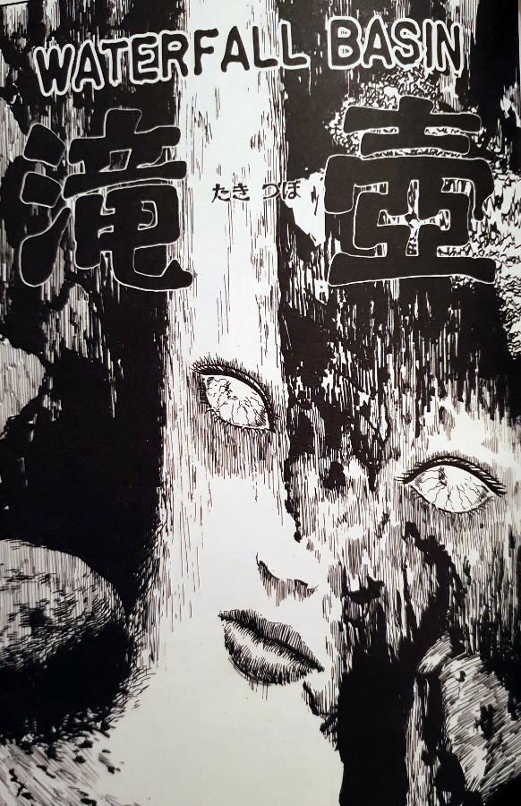
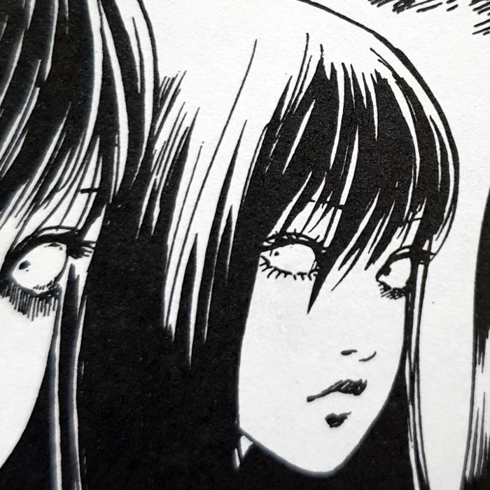
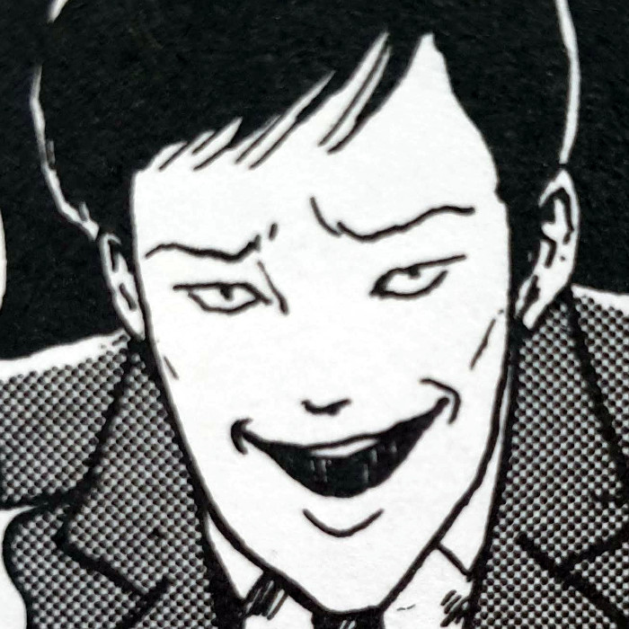
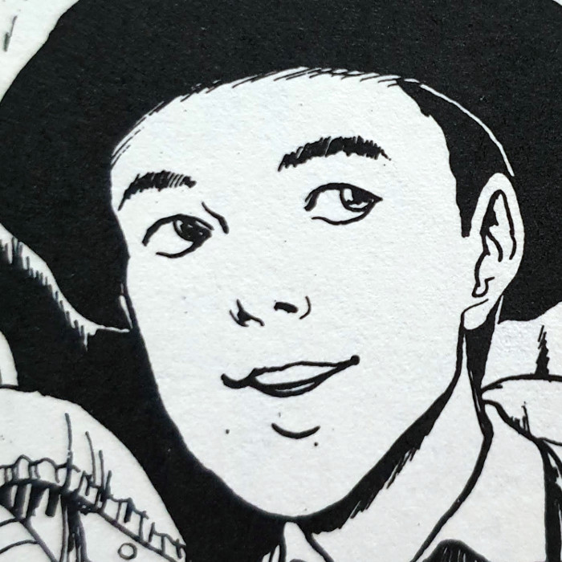
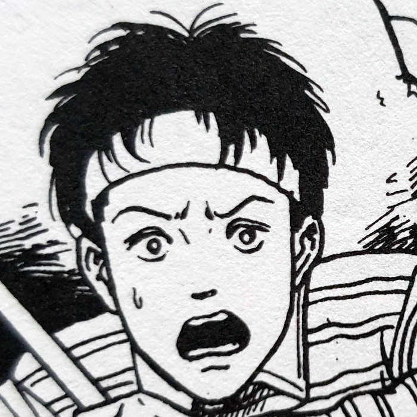
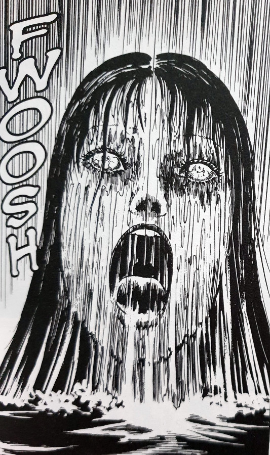
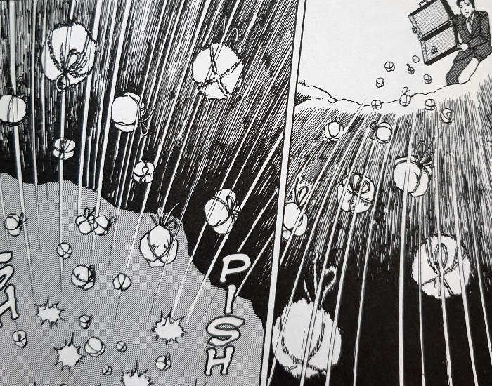
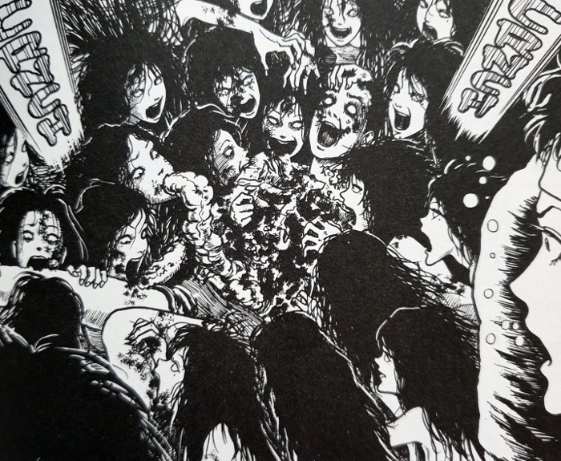
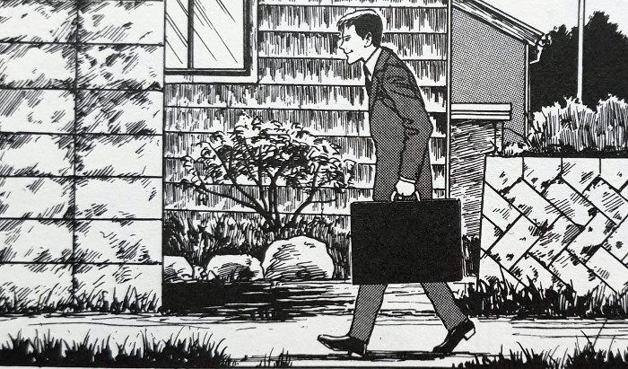

> You have a wonderful garden. Why not take this bundle and plant it somewhere? Water it periodically, tend to it, and eventually you will be blessed with a lovely new daughter.
> 
> The Salesman tries to sell his wares to the villagers — Waterfall Basin

## What is Waterfall Basin about?

In this eighth chapter from the [Tomie Collection](https://junjiitomanga.com/tag/tomie-collection/), Waterfall Basin, we encounter a very strange man - the travelling salesman. This salesman enters a small mountain village one day, carrying a very strange product indeed. Within his briefcase, he carries a selection of small, neatly-tied packages. These packages, one of the villagers discovers, contain pieces of flesh.

Yes, it is safe to assume that the flesh is that of Tomie's.

The villagers quickly tire of the salesman and his vile product, and chase him out of their village. He is chased up to the edge of a nearby waterfall, where he soon begs for his life. He requests his safe escape in exchange for him dumping his entire stock into the waterfall. They accept his plea and allow him to leave empty-handed. However, the villagers have no idea about the horrors that they have unknowingly brought upon themselves.

Soon after the Salesman’s escape, a very strange thing begins to happen. The bodies of young men start being discovered in the mornings, after having committed suicide off the side of the same waterfall. But what is summoning them to their deaths? And will there ever be an end to the deaths of these young men?

## Main Characters

Tomie

The Salesman

Shin

Shin's Friend

## Who is the mystery Salesman?

This was a strange story indeed. The idea of a random salesman turning up at a village to sell pieces of flesh (Tomie's flesh) is one of Junji Ito’s weirdest ideas yet, in my opinion.

But do you know what? It works!

Within the context of the world of Tomie, this adds yet more interesting dimensions to the ever-winding tale. And the fact that Tomie herself almost takes a back seat to the story as a whole, was equally as interesting for me. Despite it being a story about her, it feels more centred around the events that she causes.

There is no single Tomie character here; there is only the legion of her that emerge from the water.

The most interesting question posed in Waterfall Basin, is who this travelling salesman actually is. Is he a former lover of Tomie’s who has cut her up like so many before him? Was he driven by madness to decide to distribute pieces of her to unknowing people? Or is he in fact conducting some kind of research into the effects that she could have on an isolated community? These are questions that we may never get answers to, and maybe that’s not a bad thing.

Some mystery can be a good thing, after all.

## What to show and what to hide

The gruesome factor got turned up to eleven in this chapter. It also helped to solidify a big facet of Tomie’s character. It shows how she has no problem feeding on human flesh in order to regenerate. We saw this a little bit at the end of [Revenge](https://junjiitomanga.com/revenge-tomie-part-7/), but Ito has gone even further with that idea here.

Her power over the compulsions of others took on a whole new level too. She was able to summon people to their deaths from afar, ultimately to feed herself back to life. I wonder whether there is some kind of enhanced power that she is able to harness when there is a big enough group of her in one place? Or perhaps the village use that waterfall basin as their main source of water?

I really love how, even though Junji Ito isn't afraid to show us visual horrors in his work, he equally isn't afraid to leave some of it to our imagination.

A strange catch

The Packages are dumped off the waterfall

Underwater feast

The Salesman arrives

Some panels from Waterfall Basin -- Tomie part 8

## In Summary

A strange one to write about for me, this was. To be honest the story feels very short, but is no less interesting than many of the former chapters. The introduction of the mysterious salesman raised yet more questions for me. However, I’m not worried about not finding out their answers. One of my favourite aspects of the artists I admire, is in the deep mysteries that they leave buried for us to imagine.

I think that Waterfall Basin would be an interesting introduction to the unique imagination of Junji Ito. There is good mystery, grotesque imagery and a haunting closing to the story.

Conversely though, I probably wouldn't advise this as an introduction to _Tomie_. This is mainly down to the fact that some backstory is needed here I think. It really helps to know who she is in order to get a grasp of what is going on as a whole. Plus the fact that she isn't really featured heavily in this story - at least not in the more traditional ways that she is in other chapters.

A great entry into the mythology, with some very iconic imagery, but perhaps best experienced in its proper order within the Tomie Collection.
